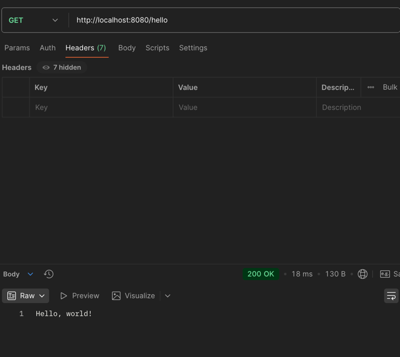
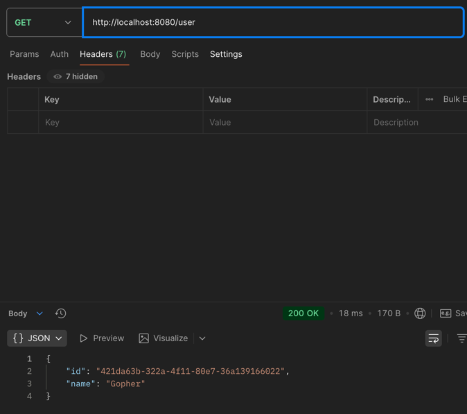
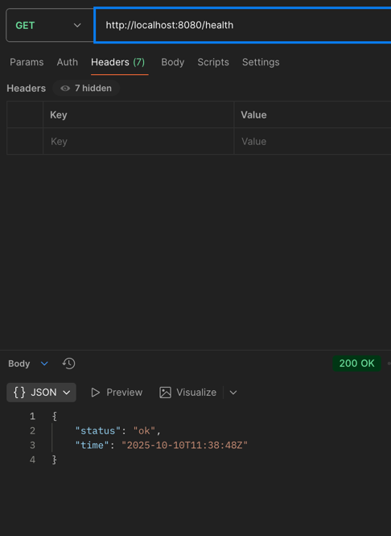

# Практическое задание № 1. Чебыкин Д.К. ПИМО-01-21

---

# Минимальный HTTP-сервис на Go

**Цель**

Развернуть рабочее окружение Go на Windows, создать минимальный HTTP-сервис на net/http, подключить и использовать внешнюю зависимость, собрать и проверить приложение.

**Задание**

-         Установить Go и Git, проверить версии.

-         Инициализировать модуль Go в новом проекте.

-         Реализовать HTTP-сервер с маршрутами /hello (текст) и /user (JSON).

-         Подключить внешнюю библиотеку (генерация UUID) и использовать её в /user.

-         Запустить и проверить ответы curl/ браузером.

-         Собрать бинарник .exe и подготовить README и отчёт.

---

## Зависимости

- github.com/google/uuid

## Функционал

Сервис реализует два маршрута:

- `/hello` — возвращает текстовый ответ **Hello, world!**
- `/user` — возвращает JSON с уникальным `id` (UUID) и именем `"Gopher"`
- `/health` — возвращает JSON со статусом `status` (`"ok"`) и текущем временем `time` в формате RFC3339

Пример ответа `/user`:

```json
{
  "id": "3f1c1c5c-9a1b-4a6a-8a26-7b3f2f7d8b0b",
  "name": "Gopher"
}
```

Проект имеет следующую структуру

```
Prak_1/  
├── cmd/  
│   └── server/  
│       └── main.go  
├── go.mod  
└── go.sum
```

## Установка и запуск


Запуск сервера:

```
go run ./cmd/server
```

Сборка бинарника:

```
go build -o helloapi ./cmd/server
./helloapi
```

------

## Примеры запросов

```
curl http://localhost:8080/hello
```



```
curl http://localhost:8080/user
```



```
curl http://localhost:8080/health
```



------

## Конфигурация

Порт сервера задаётся переменной окружения `APP_PORT` (по умолчанию 8080).

Пример:

(Для винды)
```
$env:APP_PORT="8081"
go run ./cmd/server
```

(Для мака и динукс)
```
export APP_PORT="8081"
go run ./cmd/server
```