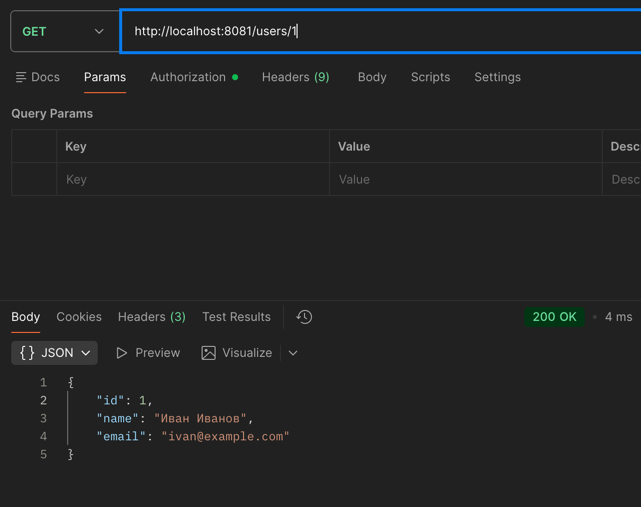
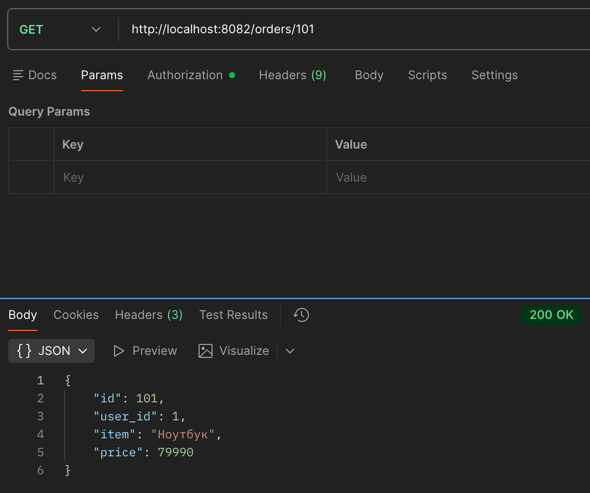
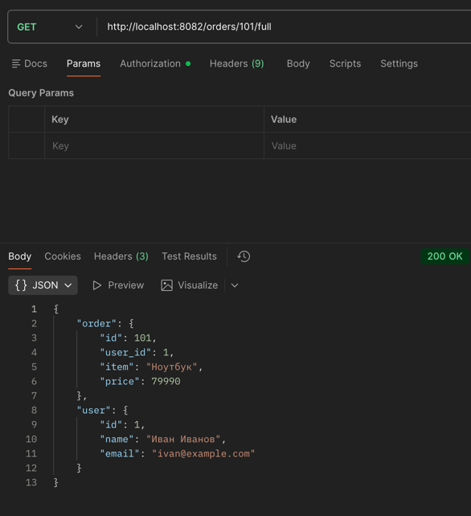
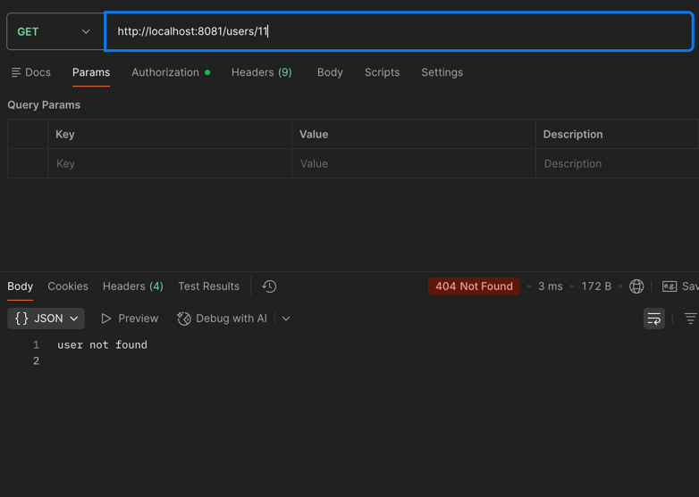
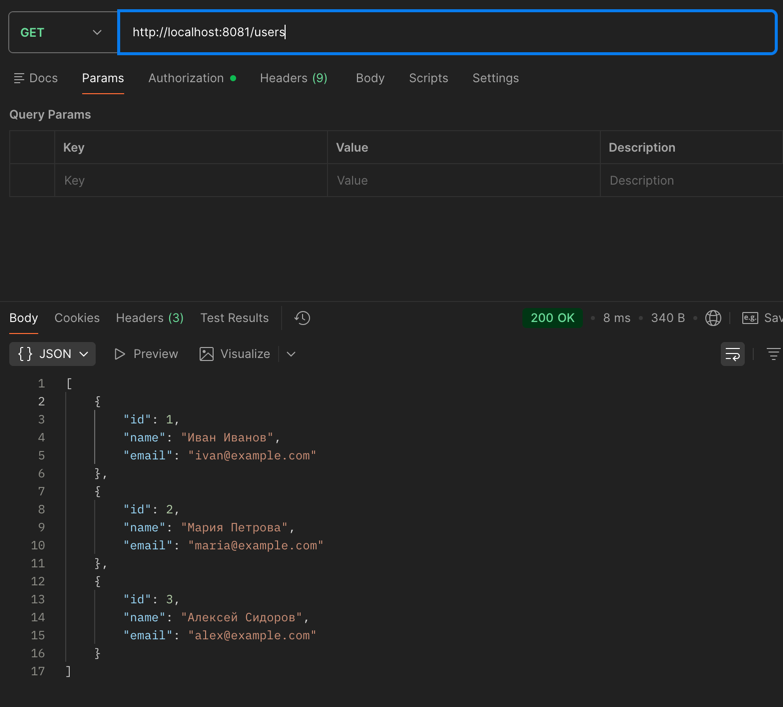

# Практическое занятие №1 — Разделение монолита на 2 микросервиса. Взаимодействие через HTTP

## Описание

Два независимых микросервиса на Go, взаимодействующих по HTTP:

- **user-service** (порт `8081`) — хранит и отдаёт информацию о пользователях
- **order-service** (порт `8082`) — хранит заказы и агрегирует данные пользователей из user-service

## Структура проекта

```
Prak_1/
├── user-service/
│   ├── cmd/server/main.go
│   ├── internal/user/
│   │   ├── model.go
│   │   ├── repo.go
│   │   └── handler.go
│   └── go.mod
└── order-service/
    ├── cmd/server/main.go
    ├── internal/order/
    │   ├── model.go
    │   ├── repo.go
    │   ├── client.go
    │   └── handler.go
    └── go.mod
```

## Запуск

### Терминал 1 — user-service

```bash
cd user-service
go run ./cmd/server
# user-service started on :8081
```

### Терминал 2 — order-service

```bash
cd order-service
go run ./cmd/server
# order-service started on :8082
```

## Проверка

```bash
# Получить пользователя
curl http://localhost:8081/users/1
```



```bash
# Получить заказ
curl http://localhost:8082/orders/101
```


```bash
# Получить заказ с данными пользователя (межсервисный вызов)
curl http://localhost:8082/orders/101/full
```



```bash
# Несуществующий пользователь → 404
curl http://localhost:8081/users/11
```



```bash
# Получить всех пользователей
curl http://localhost:8081/users
```


## API

### user-service

| Метод | Путь        | Описание                    |
|-------|-------------|-----------------------------|
| GET   | /users      | Получить всех пользователей |
| GET   | /users/{id} | Получить пользователя по ID |

### order-service

| Метод | Путь               | Описание                              |
|-------|--------------------|---------------------------------------|
| GET   | /orders/{id}       | Получить заказ                        |
| GET   | /orders/{id}/full  | Заказ + данные пользователя из user-service |

## Ключевые концепции

- **Монолит vs микросервисы** — разделение ответственности между независимыми процессами
- **HTTP-взаимодействие** — order-service вызывает user-service по HTTP
- **Обработка ошибок** — таймауты клиента (3 сек.), статус 502 при недоступности сервиса
- **JSON-сериализация** — структуры данных передаются в формате JSON
