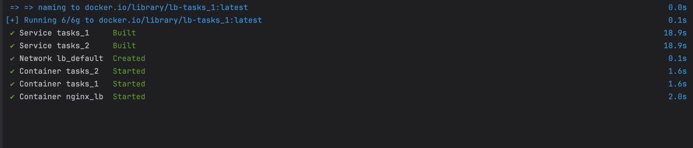
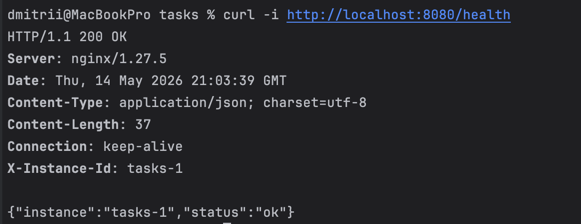
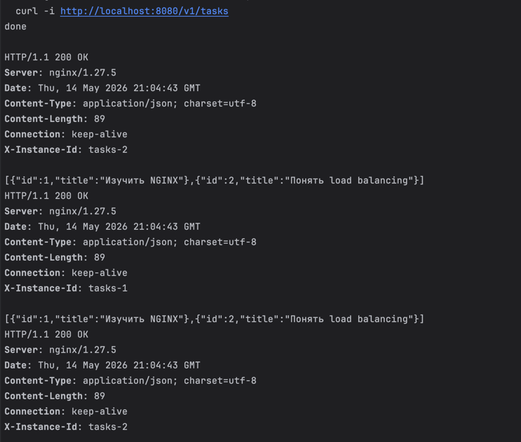
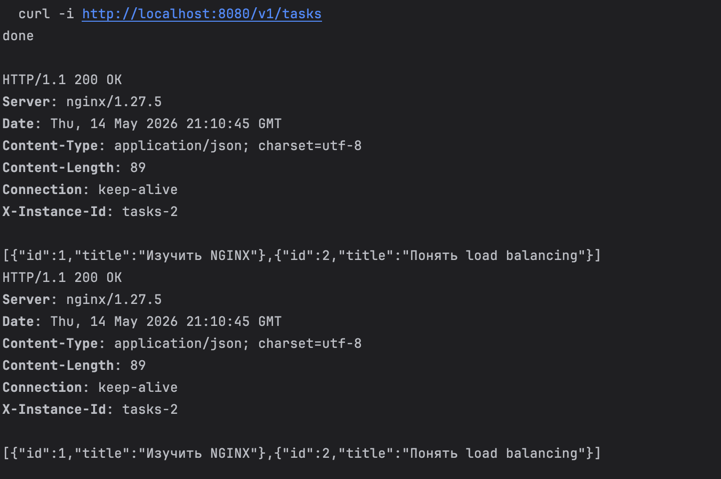
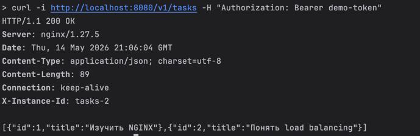
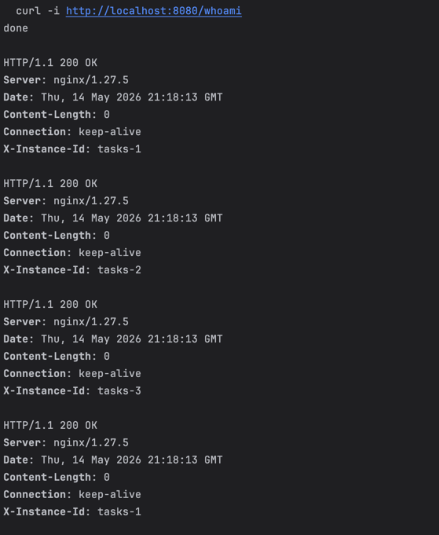

# Практическое занятие №10 — Горизонтальное масштабирование: NGINX Load Balancer

## Структура проекта

```
Prak_10/
├── services/tasks/
│   ├── cmd/server/main.go    # Читает INSTANCE_ID и APP_PORT из ENV
│   ├── go.mod
│   └── Dockerfile
└── deploy/lb/
    ├── nginx.conf            # upstream с двумя репликами
    └── docker-compose.yml    # tasks_1, tasks_2, nginx
```

## Запуск стенда

```bash
cd deploy/lb
docker compose up -d --build
docker compose ps
```


Ожидаемый результат: tasks_1, tasks_2, nginx_lb — все Up.

## Проверка health endpoint

```bash
curl -i http://localhost:8080/health
```



Ответ содержит заголовок `X-Instance-ID` — показывает какая реплика ответила.

## Проверка балансировки

```bash
# macOS/Linux — 10 запросов подряд
for i in {1..10}; do curl -s http://localhost:8080/tasks done

# PowerShell
1..10 | ForEach-Object { curl -i http://localhost:8080/v1/tasks }
```


В заголовке `X-Instance-ID` должны чередоваться `tasks-1` и `tasks-2` (round-robin).

## Проверка отказоустойчивости

```bash
# Остановить одну реплику
docker compose stop tasks_1

# Запросы всё равно проходят через tasks_2
curl -i http://localhost:8080/tasks
```


```bash
# Вернуть реплику
docker compose start tasks_1
```

## Проверка передачи заголовков через NGINX

```bash
curl -i http://localhost:8080/v1/tasks -H "Authorization: Bearer demo-token"
```



## Добавить третью реплику (доп. задание)

В `docker-compose.yml` добавить:

```yaml
  tasks_3:
    build:
      context: ../../services/tasks
    container_name: tasks_3
    environment:
      APP_PORT: "8082"
      INSTANCE_ID: "tasks-3"
```

В `nginx.conf` в блок upstream добавить:

```nginx
server tasks_3:8082;
```




## Ключевые концепции

| Концепция                | Пояснение                                                  |
|--------------------------|------------------------------------------------------------|
| Горизонтальное масштабирование | Несколько реплик одного сервиса вместо усиления одного |
| upstream (NGINX)         | Группа backend-серверов для распределения трафика          |
| Round-robin              | По умолчанию NGINX чередует запросы между серверами        |
| X-Instance-ID            | Заголовок для наблюдения за балансировкой                  |
| Stateless сервис         | Не хранит состояние в памяти — все реплики идентичны       |
| /health endpoint         | Позволяет проверить доступность конкретного инстанса       |

## Почему сервис должен быть stateless

Если реплики хранят данные только в памяти — каждая видит свои данные. При балансировке один запрос попадает в tasks-1, следующий в tasks-2, и данные «прыгают». В production данные хранятся в общей БД или общем Redis.


## Ответы на контрольные вопросы — Практическое занятие №10

### 1. Что такое горизонтальное масштабирование?

Горизонтальное масштабирование (scale out) — это увеличение числа экземпляров (реплик) сервиса для распределения нагрузки. Вместо усиления одного сервера запускается несколько одинаковых копий приложения:

```
Без масштабирования:    С горизонтальным масштабированием:
┌─────────────┐         ┌──────────┐  ┌──────────┐  ┌──────────┐
│  tasks (1×) │         │ tasks_1  │  │ tasks_2  │  │ tasks_3  │
│  CPU: 8     │    →    │ CPU: 2   │  │ CPU: 2   │  │ CPU: 2   │
│  RAM: 16GB  │         │ RAM: 4GB │  │ RAM: 4GB │  │ RAM: 4GB │
└─────────────┘         └──────────┘  └──────────┘  └──────────┘
```

Новые реплики добавляются при росте нагрузки и убираются при её снижении.

### 2. Чем оно отличается от вертикального масштабирования?

**Вертикальное масштабирование (scale up)** — увеличение ресурсов одного сервера (больше CPU, RAM, диска).

| | Горизонтальное | Вертикальное |
|---|---|---|
| Принцип | Больше серверов | Мощнее один сервер |
| Предел | Практически не ограничен | Ограничен железом |
| Отказоустойчивость | Высокая — реплики дублируют друг друга | Низкая — один сервер = одна точка отказа |
| Стоимость | Линейная | Экспоненциальная на больших мощностях |
| Сложность | Требует stateless-архитектуры | Проще в реализации |

В современных cloud-системах горизонтальное масштабирование предпочтительнее — оно дешевле и надёжнее.

### 3. Зачем нужен load balancer?

Load balancer (балансировщик нагрузки) — компонент, который принимает входящие запросы и распределяет их между репликами сервиса. Без него клиент должен знать адреса всех реплик и сам решать к какой обратиться.

Load balancer решает несколько задач:
- **Распределение нагрузки** — запросы равномерно распределяются между репликами, ни одна не перегружается
- **Единая точка входа** — клиент обращается по одному адресу, не зная сколько реплик за ним
- **Отказоустойчивость** — если реплика упала, балансировщик перестаёт отправлять ей запросы
- **Health checking** — периодически проверяет доступность реплик

### 4. Какую роль в этой работе выполняет NGINX?

В данной практике NGINX выступает в роли reverse proxy и load balancer. Он:

- слушает порт `8080` и принимает все входящие запросы от клиентов
- распределяет запросы между `tasks_1:8082` и `tasks_2:8082` по алгоритму round-robin
- передаёт заголовки оригинального запроса (`Host`, `X-Forwarded-For`, `Authorization`) на backend
- добавляет `X-Request-ID` к каждому запросу

Реплики `tasks_1` и `tasks_2` не имеют открытых портов наружу — с ними общается только NGINX внутри Docker-сети.

### 5. Что такое upstream в NGINX?

`upstream` — это именованная группа backend-серверов в конфигурации NGINX. В неё включаются адреса всех реплик, между которыми нужно балансировать:

```nginx
upstream tasks_backend {
    server tasks_1:8082;
    server tasks_2:8082;
}

server {
    listen 8080;
    location / {
        proxy_pass http://tasks_backend;
    }
}
```

По умолчанию NGINX использует алгоритм **round-robin** — запросы распределяются поочерёдно: первый на `tasks_1`, второй на `tasks_2`, третий снова на `tasks_1` и так далее. Можно настроить другие алгоритмы: `least_conn` (к наименее загруженному), `ip_hash` (клиент всегда попадает на одну реплику).

### 6. Почему для горизонтального масштабирования желательно делать сервис stateless?

**Stateless** — сервис не хранит пользовательское состояние в памяти между запросами. Каждый запрос самодостаточен и может быть обработан любой репликой.

Если сервис **stateful** (хранит состояние в памяти):
```
Запрос 1 → tasks_1: сохранил данные в памяти
Запрос 2 → tasks_2: данных нет → ошибка
```

Если сервис **stateless** (состояние в общем хранилище):
```
Запрос 1 → tasks_1: прочитал из БД/Redis
Запрос 2 → tasks_2: прочитал из той же БД/Redis → успех
```

Stateless-сервис можно масштабировать добавлением реплик без изменения архитектуры. Состояние при этом хранится в общих хранилищах — БД, Redis, S3.

### 7. Зачем нужен health endpoint?

Health endpoint (`/health`) — маршрут который возвращает состояние сервиса. Он используется:

- **Load balancer** — периодически опрашивает `/health` каждой реплики. Если реплика не отвечает или возвращает ошибку — балансировщик исключает её из ротации
- **Оркестраторы** (Kubernetes, Docker Swarm) — определяют жив ли контейнер и нужно ли его перезапустить
- **Мониторинг** — Prometheus, Grafana, Uptime-сервисы проверяют доступность

Без health endpoint балансировщик не знает упала ли реплика и продолжает отправлять ей запросы — клиенты получают ошибки.

### 8. Почему полезно добавлять X-Instance-ID?

`X-Instance-ID` — заголовок ответа, содержащий идентификатор реплики которая обработала запрос. Это полезно для:

- **Отладки балансировки** — можно убедиться что запросы действительно распределяются между репликами
- **Диагностики проблем** — если один из инстансов ведёт себя аномально, можно определить какой именно
- **Трейсинга** — связать запрос с конкретной репликой в логах

```bash
curl -i http://localhost:8080/health
# X-Instance-ID: tasks-1

curl -i http://localhost:8080/health
# X-Instance-ID: tasks-2
```

В production такой заголовок обычно не возвращают клиенту, но используют внутри для логирования.

### 9. Что происходит при остановке одной из реплик?

При остановке реплики (например `tasks_1`) NGINX не сразу это замечает. По умолчанию:

1. NGINX отправляет запрос на `tasks_1` — получает ошибку соединения
2. NGINX помечает `tasks_1` как недоступную и переключается на `tasks_2`
3. Все последующие запросы идут только на `tasks_2`
4. При восстановлении `tasks_1` NGINX снова включает её в ротацию

Клиент при этом может получить одну ошибку в момент переключения (на тот запрос который попал на упавшую реплику). Для устранения этого настраивают `proxy_next_upstream` — NGINX повторяет запрос на другую реплику при ошибке:

```nginx
proxy_next_upstream error timeout;
```

### 10. Почему клиенту удобнее работать с одной точкой входа, а не с несколькими адресами реплик?

Если клиент общается напрямую с репликами — он должен:

- **Знать адреса всех реплик** — и получать их обновление при добавлении/удалении реплик
- **Самостоятельно балансировать** — реализовывать логику выбора реплики
- **Следить за состоянием реплик** — определять какие живы, какие упали
- **Обновлять конфигурацию** при масштабировании — каждый клиент нужно перенастроить

С единой точкой входа (NGINX):
- клиент знает один адрес и один порт — всегда
- масштабирование прозрачно — добавили реплику, обновили upstream в NGINX, клиент ничего не знает
- отказоустойчивость на стороне балансировщика — клиент не получает ошибки при падении реплики
- все клиенты автоматически получают обновлённую конфигурацию без перенастройки