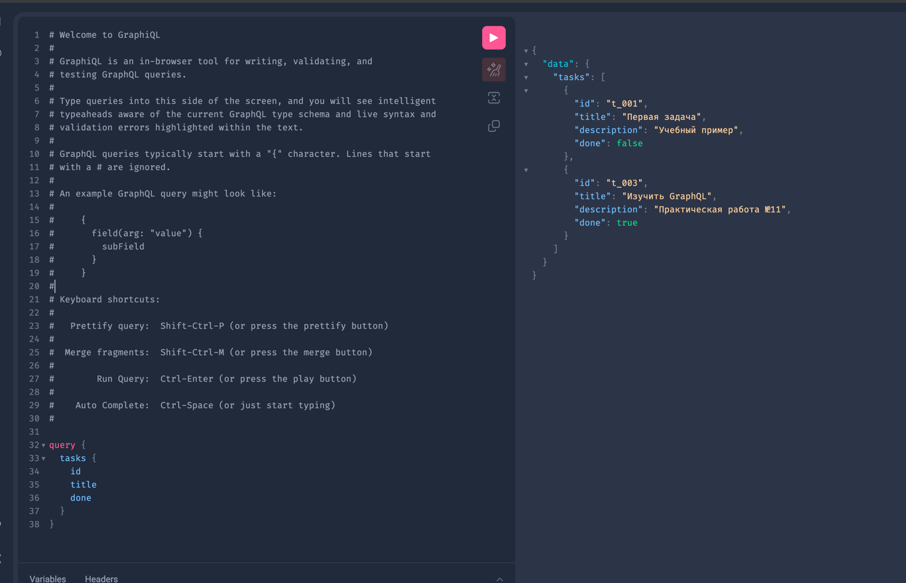
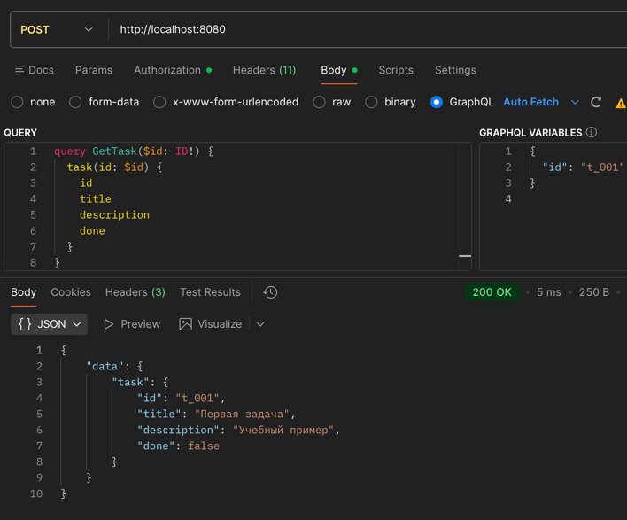
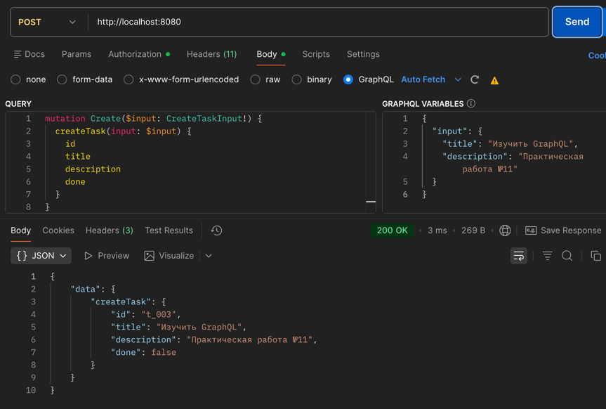
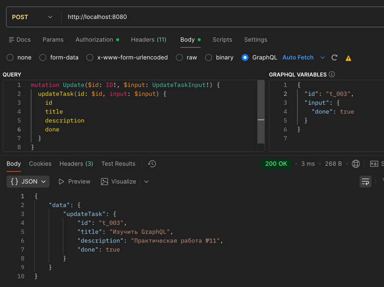
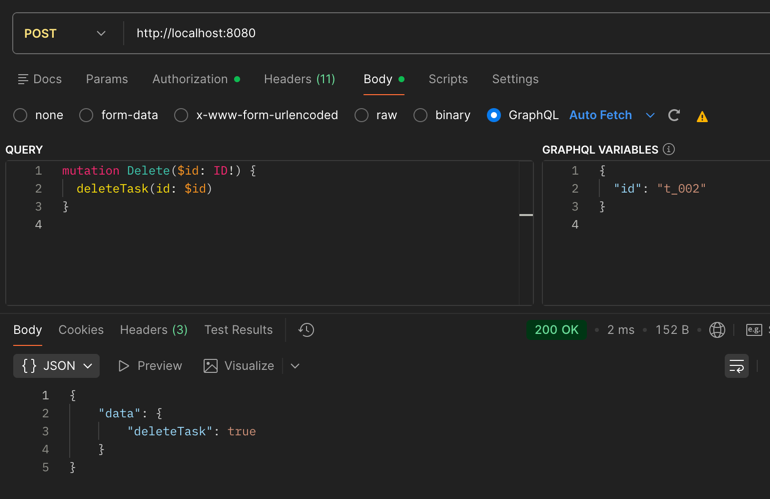
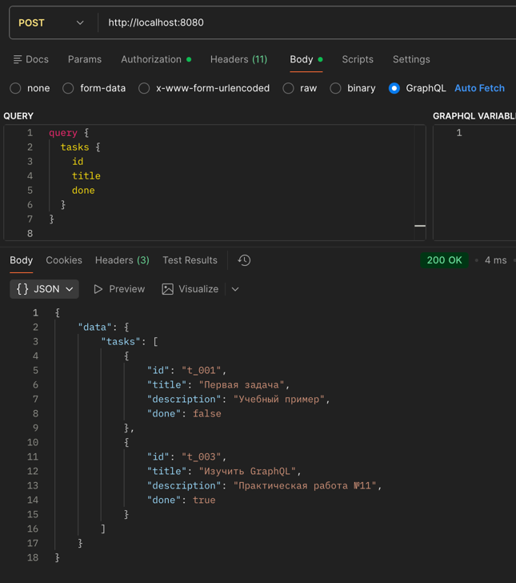

# Практическое занятие №11 — GraphQL API с gqlgen. Запросы и мутации

## Структура проекта

```
Prak_11/
├── cmd/graphql/main.go          # Точка входа, HTTP + minimal Playground
├── graph/
│   ├── schema.graphqls          # GraphQL-схема
│   ├── resolver.go              # Корневой резолвер
│   └── schema.resolvers.go      # Реализация Query и Mutation
├── internal/store/store.go      # In-memory хранилище задач
├── gqlgen.yml                   # Конфигурация кодогенерации
└── go.mod
```

## Запуск

```bash
go mod tidy
go run ./cmd/graphql
```

Откройте http://localhost:8080 — GraphQL Playground.

## GraphQL-запросы для Playground
### (Программа реализованна без авторизации)

### Получить список задач
```graphql
query {
  tasks {
    id
    title
    done
  }
}
```


### Получить задачу по ID
```graphql
query GetTask($id: ID!) {
  task(id: $id) {
    id
    title
    description
    done
  }
}
```
Переменные: `{"id": "t_001"}`



### Создать задачу
```graphql
mutation Create($input: CreateTaskInput!) {
  createTask(input: $input) {
    id
    title
    description
    done
  }
}
```
Переменные: `{"input": {"title": "Изучить GraphQL", "description": "ПЗ 11"}}`



### Обновить задачу
```graphql
mutation Update($id: ID!, $input: UpdateTaskInput!) {
  updateTask(id: $id, input: $input) {
    id
    title
    done
  }
}
```
Переменные: `{"id": "t_001", "input": {"done": true}}`



### Удалить задачу
```graphql
mutation Delete($id: ID!) {
  deleteTask(id: $id)
}
```
Переменные: `{"id": "t_002"}`



#### Проверка удаления



## Использование gqlgen (кодогенерация)

```bash
go get github.com/99designs/gqlgen
go run github.com/99designs/gqlgen init   # первый раз
go run github.com/99designs/gqlgen generate  # после изменения схемы
```

---

## Ответы на контрольные вопросы

### 1. Что такое GraphQL и в чём его основное отличие от REST API?

GraphQL — язык запросов к API и среда выполнения этих запросов на сервере. В отличие от REST, где каждый endpoint возвращает фиксированную структуру данных, в GraphQL клиент сам описывает какие поля он хочет получить. REST использует множество URL (один на ресурс), GraphQL — единственный endpoint. Клиент контролирует состав ответа, а не сервер.

### 2. Для чего используется GraphQL-схема?

Схема — это центральный контракт API. Она описывает все типы данных (`type Task`), входные параметры (`input CreateTaskInput`), доступные операции чтения (`Query`) и записи (`Mutation`). Схема является единственным источником истины: клиент знает что можно запросить, сервер знает что реализовывать, инструменты генерируют код из неё автоматически.

### 3. Чем Query отличается от Mutation?

`Query` — операции чтения данных (GET-аналог). Не изменяют состояние системы. Примеры: `tasks`, `task(id)`.

`Mutation` — операции изменения состояния (POST/PATCH/DELETE-аналог). Создают, обновляют или удаляют данные. Примеры: `createTask`, `updateTask`, `deleteTask`.

Разделение делает API явным: клиент всегда знает меняет ли операция данные или только читает их.

### 4. Что такое резолвер и какую роль он выполняет?

Резолвер — это функция на сервере, которая фактически выполняет GraphQL-операцию. Каждый query и mutation имеет свой резолвер. Резолвер получает аргументы из запроса, обращается к сервисному слою или репозиторию, и возвращает данные в нужном формате. Резолверы связывают GraphQL-схему с реальной бизнес-логикой приложения.

### 5. Почему GraphQL позволяет уменьшить over-fetching данных?

В REST сервер возвращает фиксированный набор полей независимо от того, что нужно клиенту. В GraphQL клиент явно перечисляет нужные поля в запросе, и сервер возвращает только их. Например, для списка задач можно запросить только `id, title, done` вместо всех полей включая `description` — ненужные данные не передаются по сети.

### 6. Для чего используется библиотека gqlgen в Go-проекте?

`gqlgen` — генератор кода для GraphQL-серверов на Go. Разработчик описывает схему в `.graphqls`-файле, запускает `gqlgen generate`, и библиотека автоматически создаёт: типы данных Go, интерфейсы резолверов, HTTP-обработчик, маршаллинг/анмаршаллинг. Разработчику остаётся только дописать прикладную логику в заготовки резолверов. Схема становится единственным источником истины.

### 7. Почему желательно использовать общий сервисный или репозиторный слой для REST и GraphQL?

Если REST и GraphQL реализуют бизнес-логику независимо, возникает дублирование кода. При изменении правил валидации или логики нужно менять код в двух местах, что приводит к рассинхронизации. Общий сервисный слой содержит логику один раз, а REST-обработчики и GraphQL-резолверы просто вызывают его методы. Это упрощает поддержку и обеспечивает единое поведение.

### 8. Что произойдёт если GraphQL-запрос попытается получить слишком большой объём данных?

Без защиты сервер выполнит запрос и может вернуть огромный ответ или упасть с нехваткой памяти. В production GraphQL-серверах применяют несколько механизмов: ограничение глубины вложенности запроса (query depth limit), ограничение сложности запроса (query complexity), пагинацию для коллекций, rate limiting. В gqlgen эти механизмы добавляются через middleware и директивы схемы.

### 9. Какие преимущества даёт Playground при тестировании API?

GraphQL Playground — интерактивная среда в браузере. Преимущества: автодополнение запросов на основе схемы, подсветка синтаксиса, встроенная документация по всем типам и операциям, возможность передавать переменные отдельно от текста запроса, история запросов. Это удобнее чем curl для GraphQL, потому что не нужно вручную формировать JSON с query и variables.

### 10. В каких случаях GraphQL особенно удобен на практике?

GraphQL даёт наибольшие преимущества когда: несколько типов клиентов (мобильный, веб, IoT) нуждаются в разных наборах полей; есть сложные иерархические данные которые нужно получать в одном запросе; фронтенд активно развивается и часто меняет состав запрашиваемых полей; нужна самодокументируемость API через схему. Для простых CRUD-сервисов с одним клиентом REST часто практичнее.
