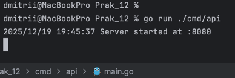
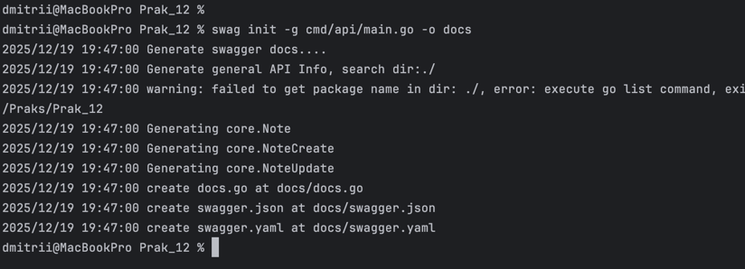
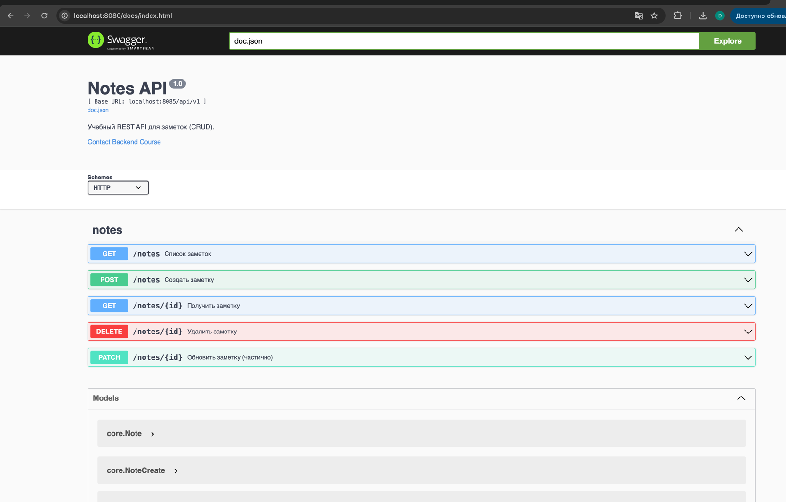

### Практика №12. Чебыкин Д.К. ПИМО-01-25. Подключение Swagger/OpenAPI. Автоматическая генерация документации.


### Цели на практику:

1.	Освоить основы спецификации OpenAPI (Swagger) для REST API.
2.	Подключить автогенерацию документации к проекту из ПЗ 11 (notes-api).
3.	Научиться публиковать интерактивную документацию (Swagger UI / ReDoc) на эндпоинте GET /docs.
4.	Синхронизировать код и спецификацию (комментарии-аннотации → генерация) и/или «schema-first» (генерация кода из openapi.yaml).
5.	Подготовить процесс обновления документации (Makefile/скрипт).

### Краткое описание подхода:

Подход **code-first** означает что разработка API начинается с написания кода приложения а документация и спецификация генерируются автоматически на основе комментариев и аннотаций в исходных файлах разработчик описывает маршруты модели и обработчики прямо в коде а затем инструмент вроде swaggo создает swagger json и интерфейс Swagger UI таким образом документация всегда соответствует актуальному состоянию реализации и обновляется при изменениях в коде что упрощает поддержку и снижает риск рассинхронизации между описанием и фактическим поведением сервиса

### Структура проекта

```
Prak_12/
 ├─ cmd/api/main.go
 ├─ internal/
 │   ├─ http/
 │   │   ├─ router.go
 │   │   └─ handlers/notes.go
 │   ├─ core/
 │   │   ├─ note.go
 │   │   └─ service/note_service.go
 │   └─ repo/
 │       └─ note_mem.go
 ├─ docs/
 │   ├─ api/
 │   │   ├─ openapi.yaml
 │   ├─ docs.go
 │   ├─ swagger.json
 │   └─ swagger.yaml
 ├─ api/openapi.yaml
 └─ go.mod
```


### Подготовка проекта

```
# в корне проекта notes-api
go get github.com/swaggo/http-swagger
go install github.com/swaggo/swag/cmd/swag@latest
```

### Aрагмент аннотаций над 2 методами (ListNotes, CreateNote).


### Запуск проекта
```
go run ./cmd/api
```


### Генерация документов
```
swag init -g cmd/api/main.go -o docs
```


### Работающая страница Swagger UI



### Ответы на контрольные вопросы

1. Чем отличается OpenAPI от Swagger?  
   OpenAPI это спецификация для описания REST API а Swagger это набор инструментов для работы с этой спецификацией включая генерацию документации тестирование и клиентские библиотеки

2. В чём различие подходов code first и schema first Плюсы минусы  
   Code first означает что сначала пишется код а документация генерируется автоматически из аннотаций плюсы это простота и синхронизация с кодом минусы возможная неполнота описания Schema first означает что сначала создается спецификация а затем по ней пишется код плюсы это четкое проектирование и согласование API минусы необходимость поддерживать соответствие реализации

3. Какие обязательные разделы содержит спецификация OpenAPI  
   Обязательные разделы включают информацию о версии спецификации блок info с метаданными API список paths с описанием маршрутов и методов а также базовый сервер или servers для указания адреса

4. Для чего нужны components.schemas и как их переиспользовать в responses  
   Components.schemas содержат определения моделей данных которые можно переиспользовать в разных местах спецификации например в responses или parameters путем ссылки на них через ref что позволяет избежать дублирования

5. Что описывают аннотации Param Success Failure Router Security  
   Аннотация Param описывает параметры запроса Success описывает успешный ответ Failure описывает ошибочный ответ Router задает путь и метод для эндпоинта Security описывает требования к авторизации и тип используемой схемы безопасности

6. Как опубликовать Swagger UI на отдельном префиксе docs и ограничить к нему доступ  
   Swagger UI можно подключить к маршруту например docs и настроить роутер чтобы отдавать интерфейс по этому пути доступ можно ограничить через middleware проверяющий авторизацию или IP адреса

7. Как поддерживать актуальность документации при изменениях кода  
   Необходимо регулярно запускать генерацию документации например swag init после изменений в коде и следить за корректностью аннотаций чтобы документация всегда соответствовала реализации

8. Как подключить Bearer аутентификацию в спецификации и что изменится в UI  
   В разделе securitySchemes спецификации добавляется схема типа http с параметром bearerAuth после этого в UI появится возможность вводить токен авторизации и все запросы будут выполняться с заголовком Authorization Bearer