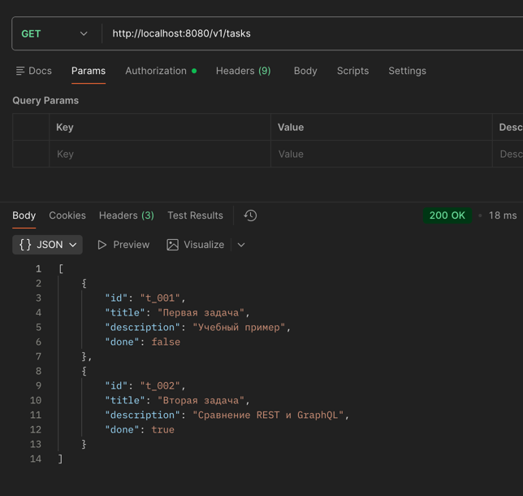
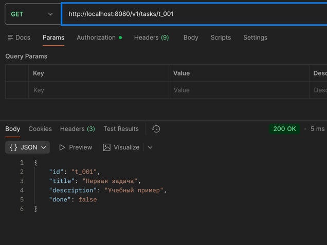
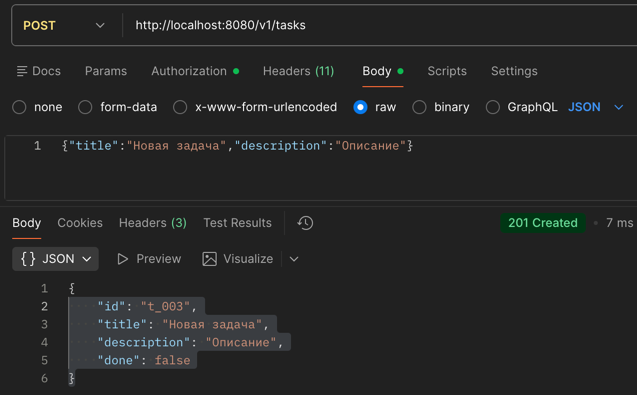
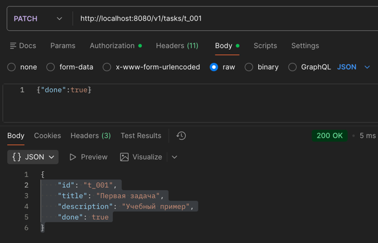
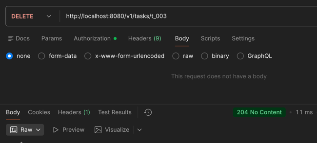
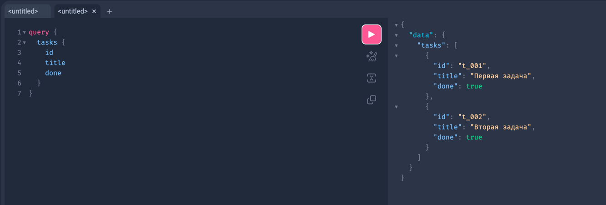
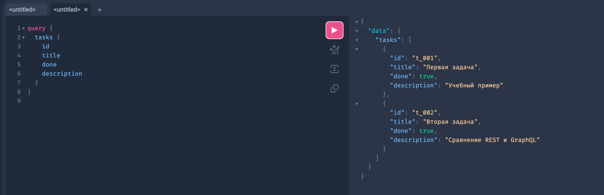
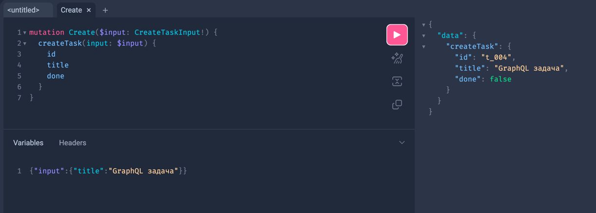
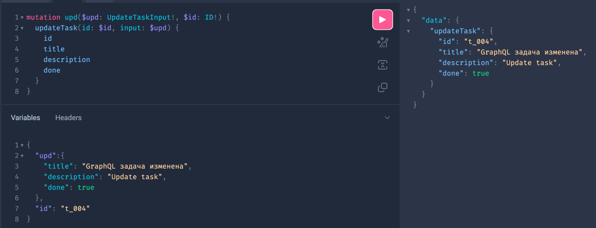
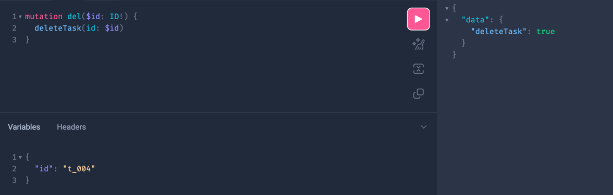

# Практическое занятие №12 — REST + GraphQL + OpenAPI на одном сервисе

## Архитектура

Один сервис, одно хранилище (`internal/store`), два API-слоя:

```
http://localhost:8080
├── /v1/tasks          ← REST API (CRUD)
├── /v1/tasks/{id}     ← REST API (одна задача)
├── /v1/graphql        ← GraphQL (GET = Playground, POST = запросы)
└── /swagger/          ← Swagger UI с OpenAPI-спецификацией
```

## Структура проекта

```
Prak_12/
├── cmd/server/main.go            # точка входа, регистрация маршрутов
├── internal/
│   ├── store/store.go            # общее хранилище (shared между REST и GraphQL)
│   └── rest/handler.go           # REST-обработчики со swag-аннотациями
├── docs/
│   ├── swagger.json              # OpenAPI 2.0 спецификация
│   └── swagger_ui.go            # встроенный Swagger UI (без swag generate)
├── graph/
│   ├── schema.graphqls           # GraphQL-схема
│   ├── resolver.go               # корневой резолвер
│   ├── schema.resolvers.go       # заготовка (заполнить после gqlgen generate)
│   └── gqlgen.yml
└── go.mod
```

## Запуск

```bash
go mod tidy
go run ./cmd/server
```

Открыть:
- REST: http://localhost:8080/v1/tasks
- GraphQL Playground: http://localhost:8080/v1/graphql
- Swagger UI: http://localhost:8080/swagger/

## REST — примеры запросов

```bash
# Список задач
curl http://localhost:8080/v1/tasks
```


```bash
# Одна задача
curl http://localhost:8080/v1/tasks/t_001
```


```bash
# Создать
curl -X POST http://localhost:8080/v1/tasks \
  -H "Content-Type: application/json" \
  -d '{"title":"Новая задача","description":"Описание"}'
```



```bash
# Обновить
curl -X PATCH http://localhost:8080/v1/tasks/t_001 \
  -H "Content-Type: application/json" \
  -d '{"done":true}'
```




```bash
# Удалить
curl -X DELETE http://localhost:8080/v1/tasks/t_001
```




## GraphQL — примеры запросов

Открыть http://localhost:8080/v1/graphql или через curl:

```bash
# Только id и title — description НЕ придёт
curl -X POST http://localhost:8080/v1/graphql \
  -H "Content-Type: application/json" \
  -d '{"query":"query { tasks { id title done } }"}'
```



```bash
# Все поля включая description
curl -X POST http://localhost:8080/v1/graphql \
  -H "Content-Type: application/json" \
  -d '{"query":"query { tasks { id title description done } }"}'
```




```bash
# Создать задачу
curl -X POST http://localhost:8080/v1/graphql \
  -H "Content-Type: application/json" \
  -d '{"query":"mutation Create($input: CreateTaskInput!) { createTask(input: $input) { id title done } }","variables":{"input":{"title":"GraphQL задача"}}}'
```




```bash
# Обновить задачу задачу
curl -X POST http://localhost:8080/v1/graphql \
  -H "Content-Type: application/json" \
  -d '{"query":"mutation upd($id: ID!, $input: UpdateTaskInput!) { updateTask(id: $id, input: $input) { id title description done } }","variables":{"input":{"title":"GraphQL задача изменена","description":"Update task","done":true},"id:"t_004"}}'
```




```bash
# Удалить задачу
curl -X POST http://localhost:8080/v1/graphql \
  -H "Content-Type: application/json" \
  -d '{"query":"mutation del($id: ID!) { deleteTask(id: $id)","variables":{"id":"t_004"}'
```



## OpenAPI — регенерация документации

Спецификация уже готова в `docs/swagger.json`. Если нужно перегенерировать из swag-аннотаций:

```bash
go install github.com/swaggo/swag/cmd/swag@latest
swag init -g cmd/server/main.go -o docs
```

## Ключевое отличие

| | REST | GraphQL                |
|---|---|------------------------|
| Маршрут | `/v1/tasks`, `/v1/tasks/{id}` | `/v1/graphql`          |
| Поля ответа | Все поля всегда | Только запрошенные     |
| Документация | OpenAPI/Swagger | Self-documented schema |
| Тестирование | curl, Swagger UI | curl, Playground       |

---

## Ответы на контрольные вопросы

### 1. В чём принципиальное отличие REST и GraphQL?

REST строится вокруг HTTP-ресурсов: каждый URL соответствует ресурсу, HTTP-метод определяет операцию, сервер возвращает фиксированную структуру. GraphQL использует единственный endpoint, клиент сам описывает какие поля и в какой структуре хочет получить. В REST контракт — набор URL и методов, в GraphQL — типизированная схема.

### 2. Что такое over-fetching и under-fetching?

**Over-fetching** — сервер возвращает больше данных, чем нужно. `GET /v1/tasks` всегда возвращает все поля включая `description`, даже если экрану нужны только `id, title, done`.

**Under-fetching** — одного запроса недостаточно. Нужно сначала `GET /v1/tasks`, затем для каждой задачи `GET /v1/tasks/{id}` чтобы получить детали.

### 3. Почему GraphQL позволяет клиенту точнее выбирать поля ответа?

Клиент явно перечисляет нужные поля в теле запроса. Сервер разбирает этот список и возвращает ровно запрошенное. Запрос `{ tasks { id title done } }` не вернёт `description` — это проверяется на уровне обработчика через парсинг selection set.

### 4. Почему REST проще кэшировать стандартными средствами HTTP?

Каждый ресурс имеет уникальный URL. HTTP-кэши (CDN, браузер) кэшируют GET-запросы по URL: `/v1/tasks/t_001` кэшируется отдельно. В GraphQL все запросы POST на один URL — стандартный HTTP-кэш не работает, нужны persisted queries или client-side cache.

### 5. Чем отличается обработка ошибок в REST и GraphQL?

REST: ошибки через HTTP-статусы (404 Not Found, 400 Bad Request). Клиент сразу видит тип ошибки по статусу. GraphQL: почти всегда HTTP 200, ошибки в поле `errors` внутри JSON. Мониторинг стандартными HTTP-инструментами сложнее.

### 6. В каких случаях REST оказывается более практичным решением?

REST предпочтителен для: простых CRUD-сервисов, публичных API для внешних разработчиков, когда важно HTTP-кэширование, когда команда хорошо знает OpenAPI/Swagger, для machine-to-machine взаимодействия с предсказуемой структурой.

### 7. В каких случаях GraphQL может дать преимущества?

GraphQL выгоден когда: несколько типов клиентов нуждаются в разных наборах полей, фронтенд активно меняет состав запросов, есть сложные вложенные данные, нужна самодокументируемость через схему.

### 8. Почему корректное сравнение требует одного и того же сценария?

Сравнение разных сущностей или сценариев вносит дополнительные переменные — сложность данных влияет на результат. Только при одинаковом функционале (те же данные, те же операции) можно объективно оценить разницу в количестве запросов и объёме данных.

### 9. Какие сложности возникают при сопровождении GraphQL API?

Схема требует поддержки и кодогенерации при изменениях. N+1 проблема при вложенных запросах требует DataLoader. Мониторинг ошибок сложнее (все HTTP 200). Ограничение сложности запросов нужно настраивать отдельно. Backward compatibility схемы сложнее чем версионирование REST.

### 10. Почему для учебных CRUD-сервисов REST часто оказывается проще?

Учебный CRUD имеет простые сущности и один тип клиента. REST понятен сразу: URL описывает ресурс, метод — действие. Swagger UI генерируется автоматически из аннотаций. GraphQL оправдывает сложность только когда клиент реально нуждается в выборке полей.
