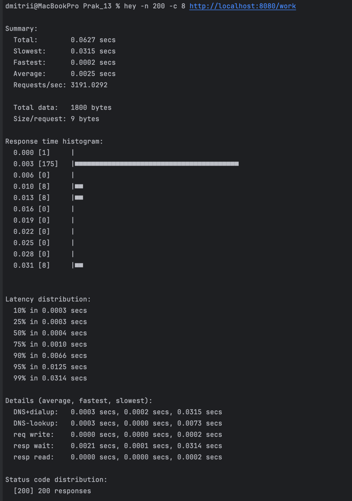
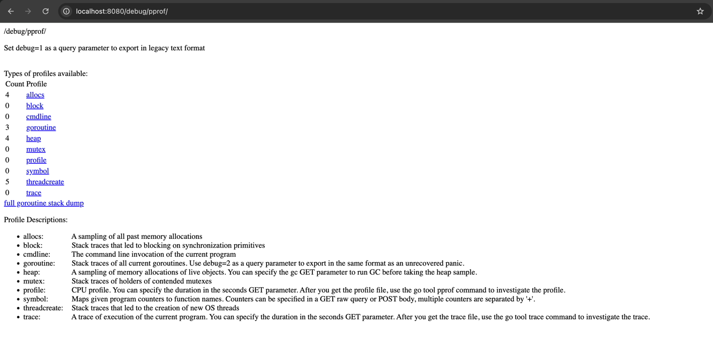
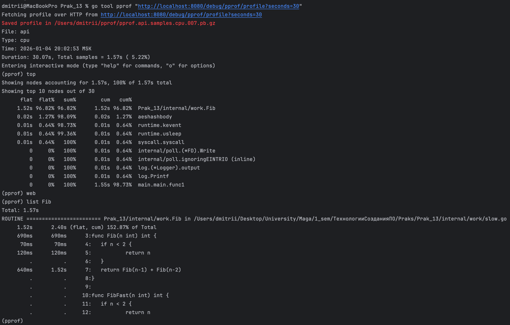
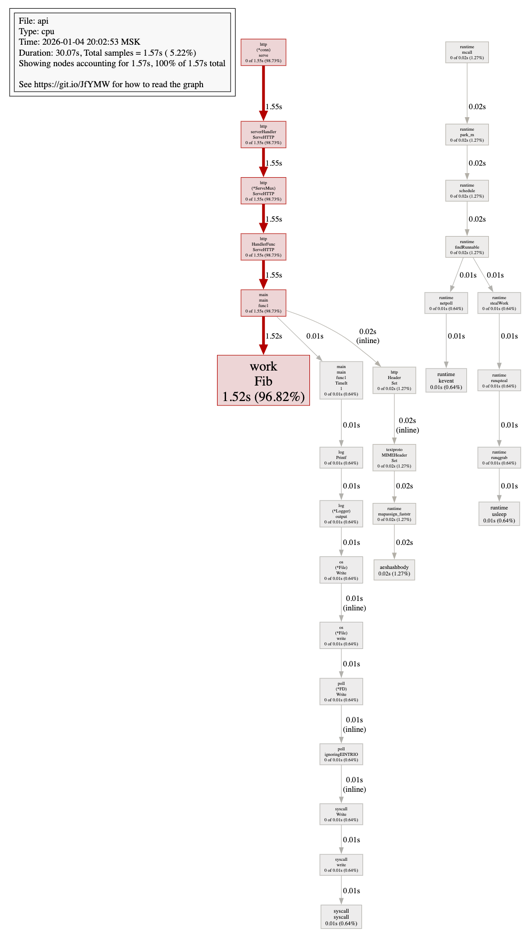
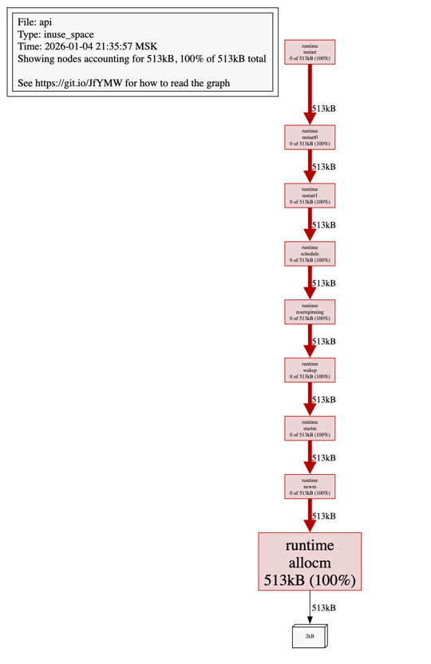
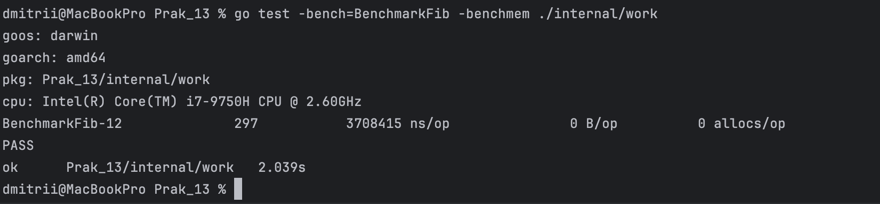
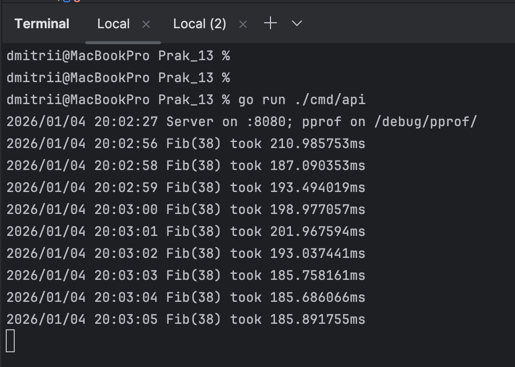
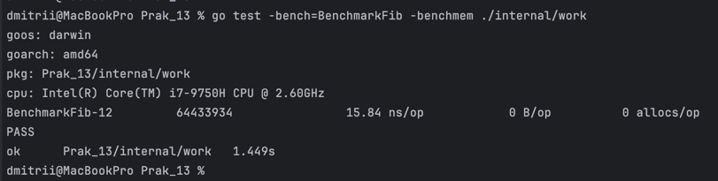
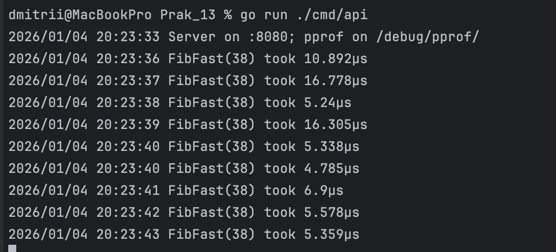

# Практическая работа № 13 - Чебыкин Д.К. ПИМО-01-25

Тема: Профилирование Go-приложения (pprof). Измерение времени работы функций

## Цель работы и описание стенда

**Цели работы:**
1.	Научиться подключать и использовать профилировщик pprof для анализа CPU, памяти, блокировок и горутин.
2.	Освоить базовые техники измерения времени выполнения функций (ручные таймеры, бенчмарки).
3.	Научиться читать отчёты go tool pprof, строить графы вызовов и находить “узкие места”.
4.	Сформировать практические навыки оптимизации кода на основании метрик


**Структура проекта:**
```
Prak_13/
├── cmd/
│   └── api/
│       └── main.go
├── internal/
│   └── work/
│       ├── slow.go   
│       ├── slow_test.go
│       └── timer.go
└── go.mod
```

Версия Go - 1.25.1


## CPU-профиль (до оптимизации)

Команда для нагрузки на сервер
```bash
hey -n 200 -c 8 http://localhost:8080/work
```


Сбор информации и просмотр списка компонентов, которые потребляли CPU больше всех

Просмотр в браузере



Просмотр в терминале
```bash
go tool pprof "http://localhost:8080/debug/pprof/profile?seconds=30"
(pprof) top
(pprof) web
```



## Heap-профиль

### Анализ использования памяти:

```bash
go tool pprof "http://localhost:8080/debug/pprof/heap"
```

### Результаты анализа heap:



### Интерпретация heap-профиля:

1. Общий объем аллокаций: 513KB
2. Основной аллокатор: `runtime.allocm` (100%)
3. Вывод: Все аллокации памяти происходят в рантайме Go для создания потоков (M), пользовательский код (`Fib`) не аллоцирует дополнительную память.

## Логи таймеров и результаты бенчмарков

**Бенчмарки до оптимизации:**

```bash
go test -bench=BenchmarkFib -benchmem ./internal/work
```


**Логи до оптимизации:**



**Бенчмарки после оптимизации:**

```bash
go test -bench=BenchmarkFib -benchmem ./internal/work
```


**Логи после оптимизации:**



## Описание внесенных изменений

Первоначальный вариант функции `Fib` был реализован через рекурсию и имел экспоненциальную временную сложность O(2^n). При значении n = 38 происходило порядка 78 миллионов рекурсивных вызовов, что приводило к значительной нагрузке на процессор.

Рекурсивный подход был заменён на итеративный алгоритм с линейной сложностью O(n):

**До оптимизации (рекурсивная версия):**

```go
func Fib(n int) int {
	if n < 2 {
		return n
	}
	return Fib(n-1) + Fib(n-2)
}
```

**После оптимизации (итеративная версия):**

```go
func FibFast(n int) int {
	if n < 2 {
		return n
	}
	a, b := 0, 1
	for i := 2; i <= n; i++ {
		a, b = b, a+b
	}
	return b
}
```

### Обоснование:

* Рекурсивный вариант характеризуется экспоненциальной сложностью O(2^n)
* Итеративный алгоритм работает за линейное время O(n)
* При n = 38 вычисление сокращается с десятков миллионов операций до 37 итераций цикла


## Сравнительная таблица метрик до/после оптимизации

| Метрика | До оптимизации | После оптимизации | Улучшение     |
|---------|----------------|-------------------|---------------|
| Время выполнения (ns/op) | 3700415        | 15.84             | в 233612 раз  |
| Количество операций в бенчмарке | 297 | 64433934 | в 216949 раз  |
| Потребление памяти (B/op) | 0 B            | 0 B               | без изменений |
| Аллокации (allocs/op) | 0              | 0                 | без изменений |


## Выводы

Ключевым узким местом исходной сборки приложения являлась функция вычисления чисел Фибоначчи, реализованная рекурсивным способом с экспоненциальной временной сложностью O(2^n). При значении n = 38 она порождала порядка 78 миллионов рекурсивных вызовов.

Переход от рекурсивного решения к итеративному алгоритму обеспечил кратный прирост производительности.


## 8. Ответы на контрольные вопросы:

### 1. Чем профилирование отличается от логирования и простых таймеров?

**Профилирование** - это систематический сбор статистики о выполнении программы: какие функции потребляют процессорное время, где выделяется память, где происходят блокировки. Оно показывает объективную картину работы всего приложения.

**Логирование и простые таймеры** - это инструменты для точечного измерения конкретных участков кода, которые разработчик заранее предположил как потенциально проблемные. Они субъективны и могут пропустить реальные узкие места.

**Ключевые отличия:**
- Профилирование автоматически собирает данные по всей программе, логирование требует ручной расстановки
- Профилирование показывает объективную статистику, логирование - только то, что решил залогировать разработчик
- Профилирование позволяет найти неожиданные узкие места, логирование проверяет гипотезы
- Профилирование имеет меньшие накладные расходы при сборе данных

### 2. Что показывает CPU-профиль и как его интерпретировать (top, list, graph)?

**CPU-профиль** показывает распределение процессорного времени между функциями программы за период сбора профиля.

**Интерпретация команд:**
- **top** - показывает таблицу функций, отсортированных по времени выполнения (flat - время в самой функции, cum - время с учетом вызванных функций)
- **list [функция]** - показывает исходный код функции с указанием, сколько времени тратится на каждую строку
- **graph** - генерирует граф вызовов, где узлы - функции, а ребра - вызовы, с указанием времени выполнения

**Пример чтения вывода top:**
```
flat  flat%   sum%   cum   cum%  function
10s   50%     50%    10s   50%   main.Fib
5s    25%     75%    5s    25%   runtime.malloc
```
- `flat` - время, потраченное в самой функции
- `cum` - время с учетом всех вызванных из нее функций
- Процент показывает долю от общего времени профилирования

### 3. В чём разница allocs и inuse в Heap-профиле?

**Allocs (alloc_space)** - показывает общий объем памяти, выделенный за время работы программы. Это кумулятивная метрика, которая включает память, которая уже была освобождена сборщиком мусора.

**Inuse (inuse_space)** - показывает объем памяти, который удерживается (не освобожден) на момент снятия профиля. Это моментальный снимок использования памяти.

**Практическое применение:**
- **alloc_space** помогает найти функции, которые создают много временных объектов (возможность оптимизации через пулы)
- **inuse_space** помогает выявить утечки памяти - объекты, которые не освобождаются
- Разница между ними показывает эффективность работы сборщика мусора

### 4. Как включить и для чего анализировать block и mutex профили?

**Включение профилей блокировок:**
```go
import "runtime"

// Включение block профиля (записывает каждую блокировку)
runtime.SetBlockProfileRate(1)

// Включение mutex профиля (записывает 1 из N событий конкуренции за мьютекс)
runtime.SetMutexProfileFraction(1)
```

**Для чего анализировать:**
- **Block профиль** показывает, где горутины блокируются на операциях ввода-вывода, каналах, системных вызовах
- **Mutex профиль** показывает конкуренцию за мьютексы, помогает найти "горячие" блокировки, которые тормозят параллельное выполнение

**Практическое применение:**
- Выявление чрезмерной конкуренции за общие ресурсы
- Поиск deadlock-ситуаций
- Оптимизация параллелизма (замена мьютексов на каналы, разделение блокировок)

### 5. Какие метрики дают бенчмарки testing.B, что означает ns/op, B/op, allocs/op?

**Метрики бенчмарков testing.B:**
- **ns/op** - наносекунды на одну операцию. Основная метрика производительности, показывает время выполнения
- **B/op** - байты на одну операцию. Показывает объем памяти, выделяемый за одну итерацию бенчмарка
- **allocs/op** - количество аллокаций на одну операцию. Показывает, сколько раз выделяется память

**Пример интерпретации:**
```
BenchmarkFib-10    150,685,246    7.643 ns/op    0 B/op    0 allocs/op
```
- Функция выполняется 150 миллионов раз
- Каждое выполнение занимает 7.643 наносекунды
- Не выделяет дополнительной памяти (0 байт, 0 аллокаций)

### 6. Почему важно сравнивать оптимизации на одинаковой нагрузке и фиксировать "до/после"?

**Причины:**
1. **Объективность сравнения** - разная нагрузка дает разные метрики, сравнение будет некорректным
2. **Воспроизводимость** - одинаковые условия позволяют повторить измерение и убедиться в результатах
3. **Исключение внешних факторов** - системная загрузка, работа сборщика мусора, кэширование могут влиять на результаты
4. **Доказательство эффективности** - четкие метрики "до/после" доказывают, что оптимизация работает
5. **Избежание регрессий** - фиксация исходного состояния позволяет обнаружить ухудшение в будущем

**Практика:** Сохранять профили и результаты бенчмарков до изменений, затем сравнивать с результатами после оптимизации.

### 7. Какой порядок действий при поиске узкого места в производительности?

**Пошаговый алгоритм:**

1. **Определение проблемы** - замер базовых метрик (время ответа, потребление памяти, CPU)
2. **Воспроизведение** - создание стабильной нагрузки, воспроизводящей проблему
3. **Сбор профилей** - получение CPU, heap, goroutine профилей под нагрузкой
4. **Анализ профилей** - поиск аномалий:
    - Функции с высоким CPU (top)
    - Большие аллокации (heap)
    - Блокировки (block/mutex)
    - Утечки горутин (goroutine)
5. **Локализация проблемы** - определение конкретной функции/метода через list, graph
6. **Понимание причины** - анализ кода, выявление алгоритмических проблем
7. **Разработка решения** - замена алгоритма, оптимизация структур данных, кэширование
8. **Тестирование решения** - повторный сбор профилей под той же нагрузкой
9. **Сравнение метрик** - проверка улучшения производительности
10. **Внедрение и мониторинг** - деплой изменений и наблюдение за метриками в продакшене

**Важный принцип:** "Измеряй, не гадай" - всегда основывать оптимизации на данных профилирования, а не на предположениях.