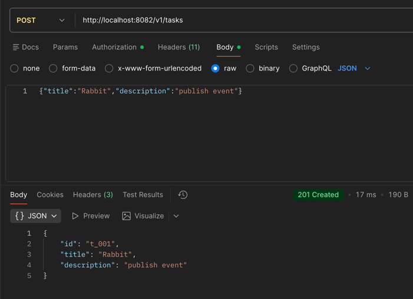
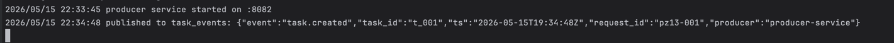

# Практическое занятие №13 — RabbitMQ. Отправка и получение сообщений

## Структура проекта

```
Prak_13/
├── deploy/rabbit/
│   └── docker-compose.yml          # RabbitMQ
├── services/
│   ├── producer/                      # Producer
│   │   ├── cmd/server/main.go
│   │   ├── internal/
│   │   │   ├── amqp/publisher.go
│   │   │   ├── events/event.go
│   │   │   └── http/handler.go
│   │   └── go.mod
│   └── consumer/                     # Consumer
│       ├── cmd/server/main.go
│       └── go.mod
```

## Запуск

### 1. RabbitMQ
```bash
cd deploy/rabbit
docker compose up -d
# Management UI: http://localhost:15672 (guest/guest)
```

### 2. Consumer (Терминал 1)
```bash
cd services/consumer
go mod tidy
go run ./cmd/sever
```


### 3. Producer service (Терминал 2)
```bash
cd services/producer
go mod tidy
go run ./cmd/server
```


### 4. Создать задачу
```bash
curl -i -X POST http://localhost:8082/v1/tasks \
  -H "Content-Type: application/json" \
  -H "X-Request-ID: pz13-001" \
  -d '{"title":"Rabbit","description":"publish event"}'
```




В терминале consumer появится:
```
received event=task.created task_id=t_001 ts=2026-05-15T19:34:48Z request_id=pz13-001
```


В терминале producer появится:

```
published to task_events: {"event":"task.created","task_id":"t_001","ts":"2026-05-15T19:34:48Z","request_id":"pz13-001","producer":"producer-service"}
```



## Формат события

```json
{
  "event": "task.created",
  "task_id": "t_001",
  "ts": "2026-05-15T19:34:48Z",
  "request_id": "pz13-001",
  "producer": "producer-service"
}
```

---

## Ответы на контрольные вопросы

### 1. Зачем нужен брокер сообщений если между сервисами можно использовать HTTP?

HTTP — синхронный протокол: вызывающий сервис блокируется и ждёт ответа. Если вызываемый сервис недоступен — запрос теряется. Брокер сообщений позволяет реализовать асинхронное взаимодействие: producer публикует сообщение и продолжает работу, не ожидая ответа. Consumer обрабатывает его позже, когда готов. Это удобно для долгих операций (отправка email, генерация отчёта), сглаживания пиков нагрузки и повышения надёжности.

### 2. Что такое producer и consumer?

**Producer** — компонент, который публикует сообщения в очередь. В данной работе это сервис `tasks`: после создания задачи он отправляет событие `task.created` в очередь `task_events`.

**Consumer** — компонент, который читает и обрабатывает сообщения из очереди. В данной работе это отдельный `worker`: он подписывается на очередь, получает события и логирует факт обработки.

### 3. Почему сообщение нужно публиковать только после успешного создания задачи?

Если опубликовать событие до создания задачи и затем создание провалится — consumer получит событие о задаче которой не существует. Это создаст рассинхронизацию между системами. Публикация после успешного создания гарантирует что событие соответствует реальному состоянию данных.

### 4. Что такое ack и зачем он нужен?

`ack` (acknowledgement) — подтверждение успешной обработки сообщения. Когда consumer отправляет ack, RabbitMQ удаляет сообщение из очереди и считает его обработанным. Без ack сообщение остаётся в состоянии "unacked" и при разрыве соединения будет повторно доставлено другому consumer. Это гарантирует что ни одно сообщение не потеряется без подтверждения обработки.

### 5. Почему возможна повторная доставка сообщения?

Если consumer получил сообщение, начал обработку, но не успел отправить ack до сбоя (разрыв соединения, краш процесса) — с точки зрения RabbitMQ сообщение не подтверждено. После восстановления соединения или при наличии другого consumer RabbitMQ доставит сообщение снова. Поэтому обработчики должны быть готовы к повторам (идемпотентность).

### 6. Что делает параметр prefetch?

`prefetch` (или `QoS`) ограничивает число неподтверждённых сообщений, которые RabbitMQ может одновременно передать одному consumer. При `prefetch=1` consumer получает следующее сообщение только после отправки ack за предыдущее. Это предотвращает ситуацию когда медленный consumer накапливает у себя много неподтверждённых сообщений, а другие consumer простаивают.

### 7. Чем durable queue отличается от non-durable queue?

**durable=true** — очередь переживает перезапуск RabbitMQ. Метаданные очереди сохраняются на диске. После рестарта брокера очередь восстанавливается.

**durable=false** — очередь существует только пока работает брокер. При перезапуске очередь исчезает вместе со всеми сообщениями в ней.

Для надёжности в production используют `durable=true` вместе с `DeliveryMode=Persistent` для сообщений.

### 8. Почему JSON удобен как учебный формат сообщения?

JSON читаем визуально — сообщение понятно без специальных инструментов, удобно анализировать в логах. В Go сериализация/десериализация делается стандартным пакетом `encoding/json` без зависимостей. JSON гибок — поля можно добавлять без поломки старых consumer (если они игнорируют неизвестные поля). Это продолжает стиль REST API где уже используется JSON.

### 9. Что означает режим best effort при публикации события?

В режиме **best effort** задача считается успешно созданной независимо от того, удалось ли опубликовать событие в RabbitMQ. Если публикация провалилась — ошибка только логируется, клиент получает успешный ответ. Это упрощает код и повышает доступность основного функционала, но означает что некоторые события могут теряться при недоступности RabbitMQ.

Альтернатива — **strict** режим: ошибка публикации возвращается клиенту как ошибка создания задачи.

### 10. Почему worker лучше выносить в отдельный процесс а не смешивать с HTTP-обработчиками?

Разные процессы имеют разные жизненные циклы: HTTP-сервис должен быть максимально быстрым и не блокироваться, worker может обрабатывать задачи медленно. Раздельные процессы масштабируются независимо: можно запустить 5 worker и 2 HTTP-сервиса. При сбое worker HTTP-сервис продолжает работать. Разделение ответственности делает код проще и понятнее.
