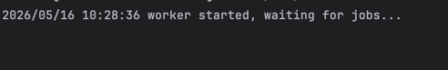
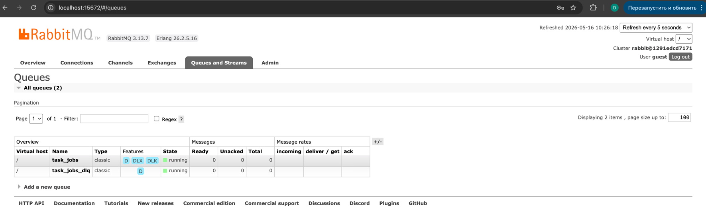
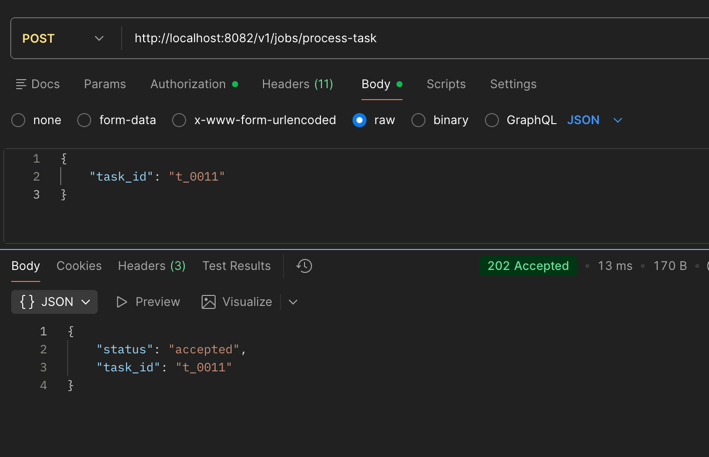
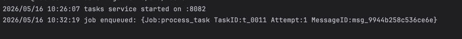
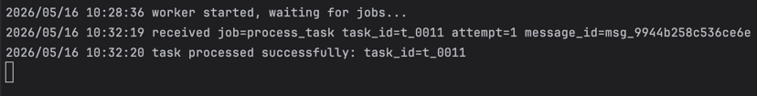
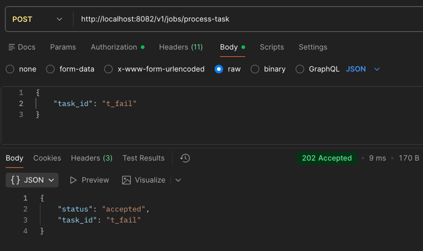
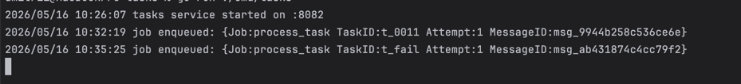
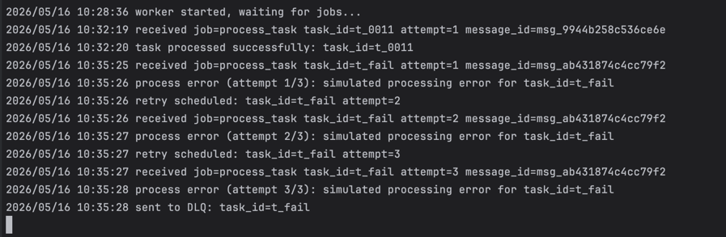
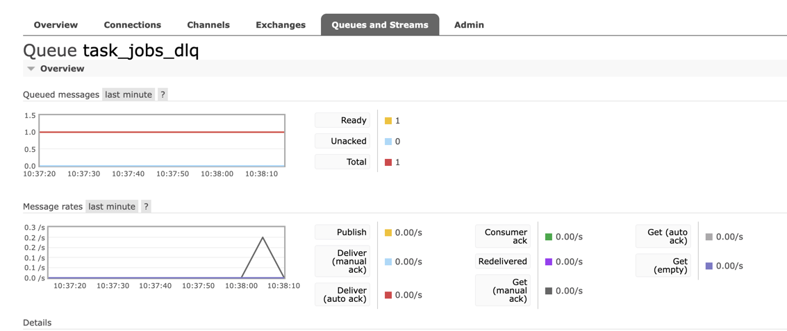
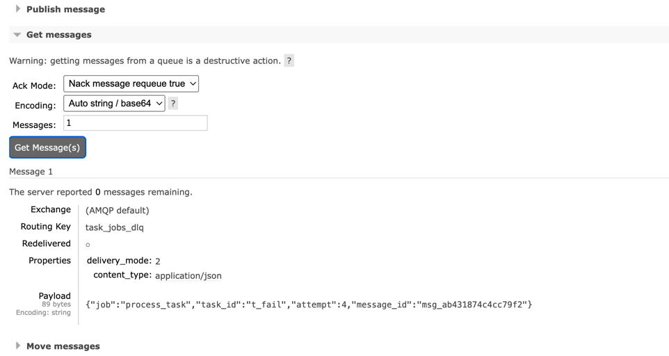

# Практическое занятие №14 — Очередь задач (producer–consumer). DLQ, retries, идемпотентность

## Структура проекта

```
Prak_14/
├── deploy/rabbit/docker-compose.yml
├── services/
│   ├── tasks/                        # Producer
│   │   ├── cmd/tasks/main.go
│   │   ├── internal/
│   │   │   ├── amqp/publisher.go     # Объявление очередей + публикация
│   │   │   ├── http/handler.go       # POST /v1/jobs/process-task
│   │   │   └── jobs/job.go           # Структура TaskJob
│   │   └── go.mod
│   └── worker/                       # Consumer
│       ├── cmd/worker/main.go        # Обработка + retries + DLQ
│       ├── internal/store/processed.go  # Идемпотентность
│       └── go.mod
```

## Запуск
### 1. Запуск RabbitMQ
```bash
# 1. RabbitMQ
cd deploy/rabbit && docker compose up -d
```

### 2. Запуск consumer(worker) сервиса
```bash
# 2. Worker (Терминал 1)
cd services/worker && go mod tidy && go run ./cmd/worker
```



### 3. Запуск producer(tasks) сервиса
```bash
# 3. Tasks (Терминал 2)
cd services/tasks && go mod tidy && go run ./cmd/tasks
```


### 4. Проверка конфигурации очередей




### 5. Отправка успешной задачи
```bash
# 5. Успешная задача
curl -i -X POST http://localhost:8082/v1/jobs/process-task \
  -H "Content-Type: application/json" \
  -d '{"task_id":"t_001"}'
```


producer(tasks) service

consumer(worker) service



### 6. Отправка неуспешной задачи
```bash
# 6. Задача с ошибкой → retries → DLQ
curl -i -X POST http://localhost:8082/v1/jobs/process-task \
  -H "Content-Type: application/json" \
  -d '{"task_id":"t_fail"}'
```


producer(tasks) service

consumer(worker) service

#### Проверка ошибки в очереди `task_jobs_dlq` 




## Очереди

| Очередь        | Назначение                            |
|----------------|---------------------------------------|
| `task_jobs`    | Основная очередь задач                |
| `task_jobs_dlq`| Задачи, превысившие лимит попыток     |

---

## Ответы на контрольные вопросы

### 1. Чем задача в очереди отличается от простого события?

**Событие** — уведомление о том что что-то уже произошло (`task.created`). Оно короткое, обрабатывается быстро, не ожидает результата. **Задача** (job) — это команда выполнить работу. Она может быть долгой, может завершиться ошибкой и потребовать повторного запуска. Задача несёт в себе контекст выполнения (номер попытки, ID для идемпотентности), чего у события обычно нет.

### 2. Зачем нужны retries?

Некоторые ошибки временные: внешний сервис был недоступен, соединение оборвалось, ресурс оказался занят. Повторная попытка через некоторое время может успешно завершить обработку. Без retries любая временная ошибка означает потерю задачи. С retries система автоматически восстанавливается после кратковременных сбоев без вмешательства человека.

### 3. Почему нельзя бесконечно возвращать ошибочное сообщение в основную очередь?

Если ошибка не временная (баг в коде, некорректные данные), сообщение будет бесконечно цикловать: получено → ошибка → возвращено → получено. Это засоряет очередь, блокирует обработку нормальных сообщений и создаёт бесполезную нагрузку. Нужно ограничить число попыток и перевести проблемное сообщение в DLQ для анализа.

### 4. Что такое DLQ и зачем она используется?

**DLQ (Dead Letter Queue)** — очередь проблемных сообщений. Сюда попадают сообщения, которые не удалось обработать после допустимого числа попыток. DLQ позволяет: не терять проблемные сообщения, не блокировать основную очередь, сохранить возможность ручного анализа и повторной обработки после исправления бага. DLQ не исправляет проблему автоматически, но даёт время разобраться.

### 5. Почему в системах очередей возможна повторная доставка одного и того же сообщения?

Системы очередей обычно работают в режиме **at-least-once delivery**. Если consumer получил сообщение, обработал его, но не успел отправить ack до сбоя — RabbitMQ не знает об успешной обработке. После восстановления соединения или при наличии другого consumer сообщение будет доставлено снова. Это фундаментальное свойство надёжных очередей.

### 6. Что такое идемпотентность обработчика?

Идемпотентный обработчик выдаёт одинаковый результат независимо от того, сколько раз вызван с одними и теми же входными данными. В контексте очередей: обработка одного и того же сообщения дважды не приведёт к двойному эффекту (двойному списанию, двойной отправке email). Идемпотентность защищает от повторных доставок.

### 7. Зачем нужен message_id?

`message_id` — уникальный идентификатор сообщения. Он позволяет worker проверить: было ли это сообщение уже обработано? Если `message_id` уже есть в хранилище обработанных — сообщение пропускается без повторного выполнения. Без `message_id` невозможно реализовать идемпотентность, так как нечем идентифицировать конкретное сообщение.

### 8. Почему хранение обработанных message_id даже в памяти полезно для учебного примера?

In-memory хранилище защищает от повторов в рамках одного запуска worker. Это демонстрирует принцип идемпотентности: при повторной доставке в течение сессии сообщение не обрабатывается дважды. Ограничение: после перезапуска worker память очищается и повторная доставка старых сообщений снова пройдёт обработку. В production используют Redis или БД для персистентного хранения.

### 9. Что произойдёт если worker выполнит обработку но не успеет отправить ack?

RabbitMQ будет считать сообщение неподтверждённым. После таймаута или разрыва соединения сообщение вернётся в очередь и будет доставлено снова. Это приведёт к повторной обработке — именно поэтому обработчик должен быть идемпотентным. Важно: ack нужно отправлять после успешного завершения обработки, а не до.

### 10. Почему модель producer–consumer удобна для тяжёлых фоновых задач?

HTTP-запрос должен ответить быстро (секунды или миллисекунды). Тяжёлая операция (генерация отчёта, обработка файла, синхронизация данных) может занять минуты. Producer принимает запрос, кладёт задачу в очередь и сразу отвечает клиенту `202 Accepted`. Consumer обрабатывает задачу в фоне без ограничений по времени. Клиент не блокируется, HTTP-сервис остаётся отзывчивым.
