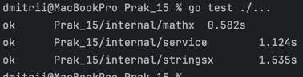
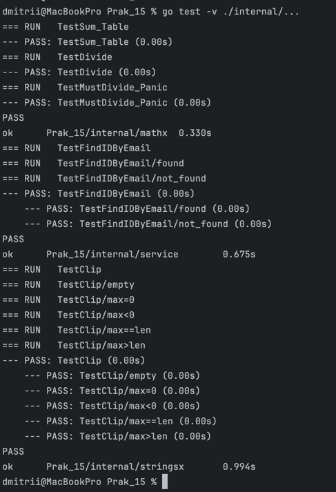
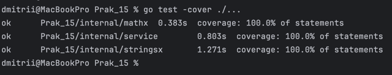
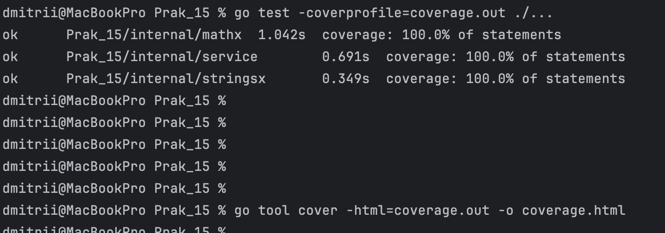
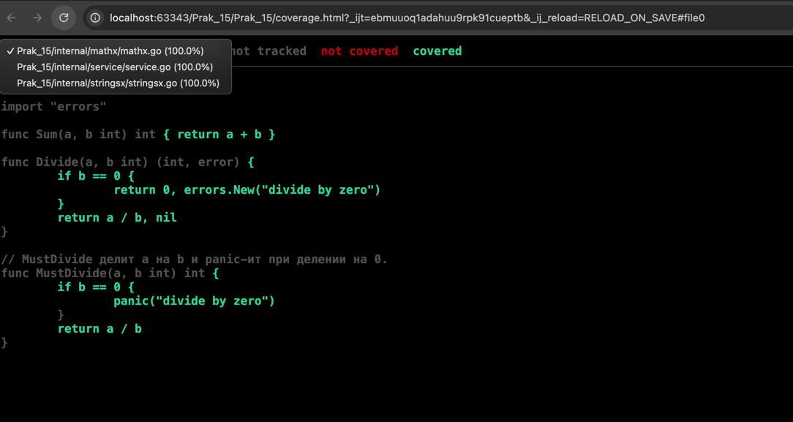
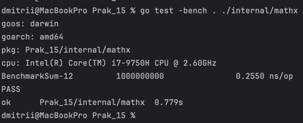

# Практическая работа № 15 - Чебыкин Д.К. ПИМО-01-25

Тема: Unit-тестирование функций (testing, testify)

## Цели
-	Освоить базовые приёмы unit-тестирования в Go с помощью стандартного пакета testing.
-	Научиться писать табличные тесты, подзадачи t.Run, тестировать ошибки и паники.
-	Освоить библиотеку утверждений testify (assert, require) для лаконичных проверок.
-	Научиться измерять покрытие кода (go test -cover) и формировать html-отчёт покрытия.
-	Подготовить минимальную структуру проектных тестов и общий чек-лист качества тестов.


### Запуск тестов:

```
go test ./...
```



### Запуск тестов в подробном режиме:

```
go test -v ./internal/...
```


### Запуск тестов с процентом покрытия:

```
go test -cover ./...
```


- Сгенерировать профиль покрытия (coverage.out) и HTML-отчёт:

```
go test -coverprofile=coverage.out ./...
go tool cover -html=coverage.out -o coverage.html
```





- Запустить бенчмарки:

```
go test -bench . ./internal/mathx
```



## Краткие выводы

- Были покрыты юнит-тестами функции сложения (`Sum`), деления (`Divide`, `MustDivide`), функции работы со строками (`Clip`) и сервис `Service` с заглушечным репозиторием.
- Покрыты ветвления ошибок: проверка деления на ноль (ошибка и паника), случай отсутствующего пользователя (возврат `ErrNotFound`), а также поведение `Clip` при разных значениях `max` (включая `max < 0`).
- Ничего критически сложного не встретилось: код небольшой и логичный, наиболее «чувствительным» местом — обработка ошибок/паник, что и проверено тестами.

## Бенчмарки (результат и интерпретация)

- В репозитории присутствует бенчмарк `BenchmarkSum` в пакете `internal/mathx`.
- Инструкции для запуска бенчмарка приведены выше; бенчмарк измеряет простую операцию сложения — ожидаемо очень малое время на операцию (несколько наносекунд) и отсутствие аллокаций.
- Интерпретация: низкие значения ns/op и 0 аллокаций указывают на то, что функция `Sum` оптимальна для этого контекста; при необходимости можно сравнить результаты на разных машинах или после рефакторинга.

## Контрольные вопросы

### 1. Чем unit-тест отличается от интеграционного и почему важна изоляция зависимостей?

Unit-тест проверяет корректность работы отдельной функции или метода в изоляции от внешних систем (баз данных, API, файловой системы). Интеграционный тест проверяет взаимодействие нескольких компонентов системы вместе.

Изоляция зависимостей важна по нескольким причинам:
- Тесты становятся быстрее, так как не требуют подключения к внешним ресурсам
- Результаты тестов предсказуемы и не зависят от состояния внешних систем
- Упрощается отладка — при падении теста очевидно, что проблема в логике тестируемого компонента
- Тесты можно запускать в любой среде, включая CI/CD пайплайны

### 2. Как устроены табличные тесты в Go и когда они особенно полезны?

Табличные тесты в Go организуются через срез структур, где каждый элемент содержит входные параметры и ожидаемый результат. Основная структура выглядит так:

```go
func TestFunction(t *testing.T) {
    tests := []struct {
        name    string
        input   int
        want    int
        wantErr bool
    }{
        {"положительный кейс", 1, 2, false},
        {"негативный кейс", -1, 0, true},
    }
    
    for _, tt := range tests {
        t.Run(tt.name, func(t *testing.T) {
            got, err := Function(tt.input)
            if (err != nil) != tt.wantErr {
                t.Errorf("ошибка: %v, ожидалась ошибка: %v", err, tt.wantErr)
            }
            if got != tt.want {
                t.Errorf("получено: %v, ожидалось: %v", got, tt.want)
            }
        })
    }
}
```

Табличные тесты особенно полезны когда:
- Нужно проверить множество похожих случаев с разными входными данными
- Требуется легко добавлять новые тест-кейсы
- Важно обеспечить читаемость и структурированность тестов
- Необходимо тестировать граничные значения и особые случаи

### 3. В чём преимущества testify по сравнению с «чистым» testing, и когда достаточно стандартного пакета?

Преимущества testify:
- Более читаемые и лаконичные проверки через `assert.Equal(t, expected, actual)` вместо `if actual != expected { t.Errorf(...) }`
- Встроенные проверки для ошибок: `require.NoError(t, err)`, `assert.ErrorIs(t, err, ErrNotFound)`
- Разделение assert (продолжает тест после неудачи) и require (останавливает тест)
- Дополнительные проверки: `assert.Len`, `assert.Contains`, `assert.Panics` и другие
- Лучшие сообщения об ошибках с детализацией различий

Стандартного пакета testing достаточно когда:
- Проект небольшой и простой
- Команда предпочитает минималистичный подход без внешних зависимостей
- Нужно избегать дополнительных зависимостей в проекте
- Тесты достаточно просты и не требуют сложных проверок

### 4. Что проверяет go test -cover и почему высокий процент покрытия не гарантирует качество тестов?

Команда `go test -cover` измеряет процент строк кода, которые были выполнены при запуске тестов. Она показывает, какие части кода никогда не вызываются в тестах.

Высокий процент покрытия не гарантирует качество тестов по следующим причинам:
- Можно достичь 100% покрытия, вызывая код без смысловых проверок
- Покрытие не учитывает корректность проверок — тест может пройти, но не проверять то, что нужно
- Не учитываются комбинации входных данных и состояний
- Можно пропустить важные граничные случаи и условия гонок
- Покрытие не измеряет качество тестовых данных и сценариев

Качество тестов определяется не процентами, а тем, насколько хорошо они проверяют требования, обрабатывают ошибки и граничные случаи.

### 5. Как тестировать функции, которые возвращают ошибки? Примеры хороших негативных кейсов.

Для тестирования функций, возвращающих ошибки, нужно:
1. Проверять, что ошибка возвращается в ожидаемых случаях
2. Проверять тип или текст ошибки
3. Проверять, что при ошибке возвращаются корректные значения по умолчанию

Пример хороших негативных кейсов:
- Передача нулевого значения в функцию деления
- Передача отрицательного значения в функцию, требующую положительное число
- Передача строки неправильного формата в функцию парсинга
- Передача несуществующего идентификатора в функцию поиска
- Передача данных, превышающих допустимые лимиты
- Тестирование таймаутов и сетевых ошибок
- Проверка обработки некорректных кодировок или специальных символов

Пример теста:
```go
func TestDivide_Error(t *testing.T) {
    _, err := Divide(10, 0)
    require.Error(t, err)
    assert.ErrorContains(t, err, "divide by zero")
}
```

### 6. Как использовать интерфейсы и стабы/моки, чтобы тестировать бизнес-логику без БД?

Для тестирования бизнес-логики без БД нужно:
1. Определить интерфейс для зависимостей
2. Создать тестовую реализацию (стаб или мок)
3. Внедрить зависимость через конструктор или поле

Пример интерфейса репозитория:
```go
type UserRepository interface {
    FindByID(id int) (*User, error)
    Save(user *User) error
}
```

Пример стаба для тестирования:
```go
type StubUserRepo struct {
    users map[int]*User
    saveError error
}

func (s *StubUserRepo) FindByID(id int) (*User, error) {
    user, exists := s.users[id]
    if !exists {
        return nil, ErrNotFound
    }
    return user, nil
}

func (s *StubUserRepo) Save(user *User) error {
    return s.saveError
}
```

Пример мока с проверками:
```go
type MockUserRepo struct {
    mock.Mock
}

func (m *MockUserRepo) FindByID(id int) (*User, error) {
    args := m.Called(id)
    return args.Get(0).(*User), args.Error(1)
}

func TestService_GetUser(t *testing.T) {
    mockRepo := new(MockUserRepo)
    expectedUser := &User{ID: 1, Name: "Test"}
    
    mockRepo.On("FindByID", 1).Return(expectedUser, nil)
    
    service := NewService(mockRepo)
    user, err := service.GetUser(1)
    
    require.NoError(t, err)
    assert.Equal(t, expectedUser, user)
    mockRepo.AssertExpectations(t)
}
```

Такой подход позволяет:
- Тестировать бизнес-логику в изоляции
- Симулировать любые сценарии (ошибки, таймауты, отсутствие данных)
- Проверять, что методы вызываются с правильными аргументами
- Запускать тесты быстро и без внешних зависимостей