# Практическое занятие №15 — Деплой на VPS. Настройка systemd

## Структура

```
Prak_15/
├── deploy/
│   ├── systemd/
│   │   ├── tasks.service         # Unit-файл systemd
│   │   └── tasks.env.example     # Пример конфигурации
│   ├── deploy.sh                 # Скрипт деплоя
│   └── rollback.sh               # Скрипт отката
```

## Пошаговый деплой на VPS

### 1. Подключиться к VPS
```bash

ssh user@<VPS_IP>
```
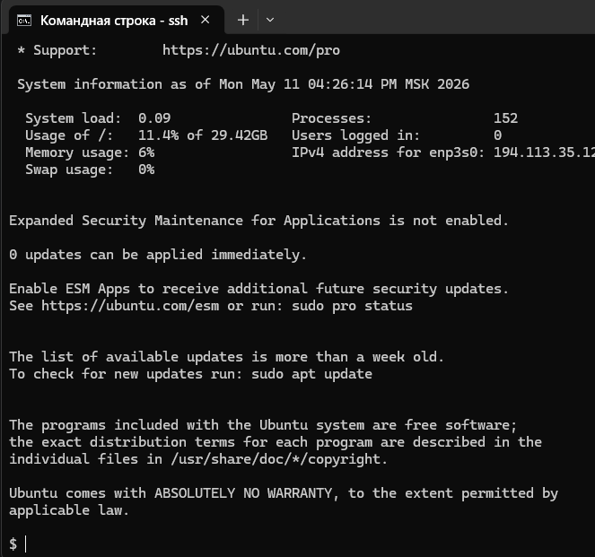

### 2. Обновить пакеты
```bash

sudo apt update && sudo apt upgrade -y
```
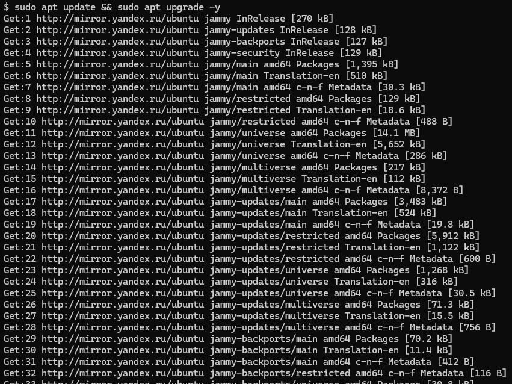


### 3. Создать системного пользователя
```bash

sudo useradd --system --no-create-home --shell /usr/sbin/nologin tasksuser
```

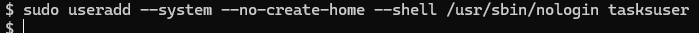


### 4. Создать директорию приложения
```bash

sudo mkdir -p /opt/tasks
sudo chown -R tasksuser:tasksuser /opt/tasks
```
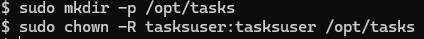


### 5. Создать env-файл
```bash

sudo mkdir -p /etc/tasks
sudo nano /etc/tasks/tasks.env
# (содержимое из tasks.env.example)
sudo chown root:root /etc/tasks/tasks.env
sudo chmod 600 /etc/tasks/tasks.env
```

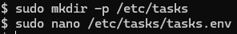

После сохранения задайте безопасные права
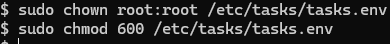


### 6. Собрать бинарник (локально)
```bash

GOOS=linux GOARCH=amd64 go build -o bin/tasks ./cmd/server
```

### 7. Скопировать на VPS
```bash

scp bin/tasks <user>@<VPS_IP>:/tmp/tasks
```

### 8. На VPS: переместить и установить права
```bash

sudo mv /tmp/tasks /opt/tasks/tasks
sudo chown tasksuser:tasksuser /opt/tasks/tasks
sudo chmod 755 /opt/tasks/tasks
```

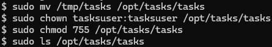


### 9. Установить unit-файл
```bash

sudo nano /etc/systemd/system/tasks.service
```

Создайте файл службы:


Добавьте следующий текст:

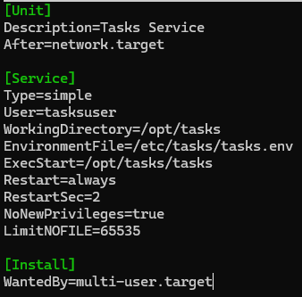

### 10. Перечитать конфигурацию systemd

```bash

sudo systemctl daemon-reload
```


### 11. Запустить и включить автозапуск
```bash

sudo systemctl start tasks
sudo systemctl enable tasks
```

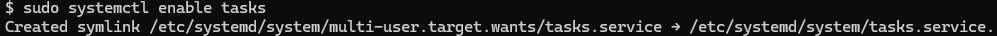


### 12. Посмотреть логи через journalctl

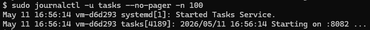

### 13. Проверить
```bash

sudo systemctl status tasks
curl -i http://127.0.0.1:8082/health
```

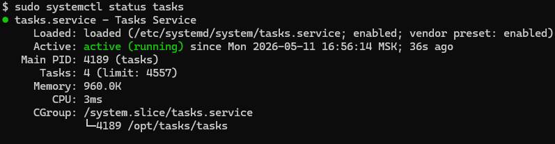
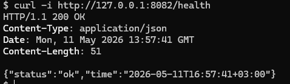

### 14. Обновление

либо запустить скрипт
```bash
# Деплой новой версии
./deploy/deploy.sh <user> <VPS_IP>
```
либо выполнить вручную:
#### 1) Остановить сервис и переместить эту версия в папку `/opt/tasks/tasks.old`
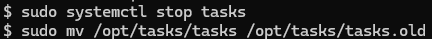
#### 2) Собрать локально и перенести бинарник на сервер в папку `/tmp/tasks`
#### 3) Переместить `/tmp/tasks` в `/opt/tasks/tasks`, поменять права и запустить
```bash
  sudo mv /tmp/tasks /opt/tasks/tasks
  sudo chown tasksuser:tasksuser /opt/tasks/tasks
  sudo chmod 755 /opt/tasks/tasks
  sudo systemctl start tasks
  sudo systemctl status tasks
```
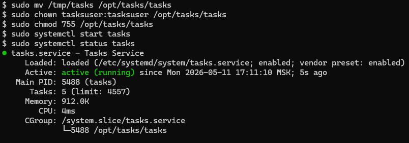


### 15. Откат
либо запустить скрипт
```bash

./deploy/rollback.sh <user> <VPS_IP>
```
либо выполнить вручную:
```bash
  sudo systemctl stop tasks
  sudo mv /opt/tasks/tasks.old /opt/tasks/tasks
  sudo systemctl start tasks
  sudo systemctl status tasks
```
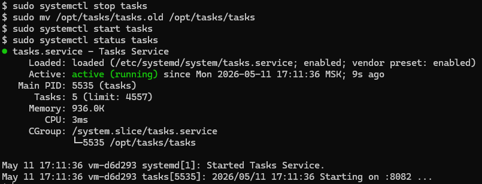

### 16. Проверить замечание по портам и безопасности

Открывать наружу следует только те порты, которые действительно нужны. В реальной эксплуатации часто используется схема: • приложение слушает локальный адрес, например 127.0.0.1:8082; • снаружи работает NGINX на 80/443; • NGINX проксирует запросы к приложению. В учебной работе допускается прямое открытие порта приложения, но вы должны понимать, что в промышленной практике чаще используется reverse proxy.

## Команды управления сервисом

```bash

sudo systemctl start tasks      # запустить
sudo systemctl stop tasks       # остановить
sudo systemctl restart tasks    # перезапустить
sudo systemctl status tasks     # статус
sudo systemctl enable tasks     # включить автозапуск
sudo systemctl disable tasks    # отключить автозапуск
sudo journalctl -u tasks -n 50  # последние 50 строк логов
sudo journalctl -u tasks -f     # следить за логами
```

---

## Ответы на контрольные вопросы

### 1. Что такое VPS и зачем он нужен backend-разработчику?

VPS (Virtual Private Server) — виртуальный сервер с выделенными ресурсами, которым разработчик управляет полностью самостоятельно. Он нужен чтобы: разместить сервис в сети и сделать его доступным, отделить среду разработки от производственной, обеспечить постоянную работу приложения, настроить конфигурацию независимо от локальной машины.

### 2. Почему запуск приложения на VPS отличается от локального запуска?

Локально достаточно просто запустить `go run`. На VPS нужно: собрать бинарник под Linux, скопировать его на сервер, настроить конфигурацию через файл окружения, организовать автозапуск при старте сервера, обеспечить автоматический перезапуск при сбоях, настроить права доступа. Если запустить бинарник вручную в терминале, он остановится при закрытии SSH-сессии.

### 3. Для чего используется systemd?

systemd — стандартная система инициализации Linux. Она позволяет: запускать сервисы автоматически при старте системы, перезапускать при аварийном завершении, управлять сервисами через `systemctl`, просматривать логи через `journalctl`, устанавливать зависимости между сервисами (например, запускать после сети).

### 4. Почему не рекомендуется запускать серверное приложение от root?

Root имеет неограниченные права в системе. Если приложение содержит уязвимость или ошибку, запущенная под root программа может повредить всю систему. Злоумышленник, получив управление над процессом root, получает полный контроль над сервером. Отдельный системный пользователь (`tasksuser`) имеет минимально необходимые права — только на свои файлы.

### 5. Зачем выносить конфигурацию в отдельный env-файл?

Env-файл позволяет: менять конфигурацию без пересборки и перекомпиляции приложения, использовать один бинарник в разных средах (dev, staging, production) с разными настройками, не хранить секреты в репозитории, разграничить доступ к конфигурации через права файловой системы (chmod 600). Изменения конфигурации требуют только перезапуска сервиса.

### 6. Что делает параметр Restart=always?

`Restart=always` указывает systemd перезапускать сервис при любом завершении процесса: аварийном (ненулевой код возврата), нормальном, или по сигналу. В сочетании с `RestartSec=2` systemd ждёт 2 секунды и снова запускает процесс. Это обеспечивает автовосстановление при временных сбоях без ручного вмешательства.

### 7. Для чего нужен EnvironmentFile в unit-файле?

`EnvironmentFile=/etc/tasks/tasks.env` указывает systemd загрузить переменные окружения из указанного файла перед запуском процесса. Приложение получает их через `os.Getenv()` как обычные переменные окружения. Это позволяет хранить конфигурацию отдельно от unit-файла, обеспечить разные конфигурации для разных сред и ограничить доступ к секретам через права файловой системы.

### 8. Как проверить состояние службы через systemctl?

```bash
sudo systemctl status tasks
```
Команда показывает: активен ли сервис (active/inactive/failed), PID процесса, время последнего запуска, последние строки логов, включён ли автозапуск. По статусу сразу понятно работает ли сервис и были ли ошибки.

### 9. Как посмотреть логи сервиса через journalctl?

```bash
# Последние 100 строк
sudo journalctl -u tasks -n 100

# Следить в реальном времени
sudo journalctl -u tasks -f

# Логи с конкретного времени
sudo journalctl -u tasks --since "2026-01-15 10:00:00"
```
journalctl — основной инструмент диагностики systemd-сервисов. Все stdout и stderr приложения попадают в журнал автоматически.

### 10. Что нужно сделать перед обновлением unit-файла systemd?

После изменения unit-файла необходимо выполнить `sudo systemctl daemon-reload`. Эта команда заставляет systemd перечитать все unit-файлы на диске. Без неё systemd продолжит использовать старую конфигурацию из памяти. После daemon-reload нужно перезапустить сервис: `sudo systemctl restart tasks`.

### 11. Почему полезно иметь процедуру отката версии?

После деплоя новой версии может обнаружиться проблема: баг, несовместимость, деградация производительности. Быстрый откат позволяет минимизировать время простоя: вернуть рабочую версию за секунды, не ожидая исправления бага. В скрипте `rollback.sh` старый бинарник сохраняется как `tasks.old` перед заменой — это один шаг для восстановления.

### 12. Зачем в реальных системах часто используют NGINX перед приложением?

NGINX как reverse proxy даёт: терминацию TLS/HTTPS (приложение работает по HTTP внутри), обслуживание статических файлов, rate limiting и базовую защиту, балансировку нагрузки между репликами, управление заголовками (X-Real-IP, X-Forwarded-For), кэширование ответов. Приложение не нужно знать о SSL — оно принимает только plain HTTP от NGINX на localhost.
