# Практическое занятие №16 — Публикация в Kubernetes (минимальный манифест)

## Структура

```
Prak_16/
├── deploy/k8s/
│   ├── configmap.yaml      # Конфигурация приложения
│   ├── deployment.yaml     # Описание развёртывания
│   └── service.yaml        # Сетевой доступ к приложению
└── services/tasks/         # Исходный код сервиса
```

## Подготовка


### Сборка образа
```bash
  # Сборка образа
  docker build -t techip-tasks:0.1 ./services/tasks
```

### Скачивание ПО и запуск minikube

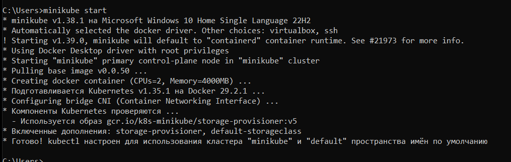
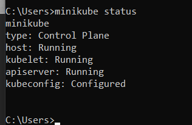

### Загрузка образа в minikube
```bash
  # Для minikube — загрузить образ внутрь кластера
  minikube image load techip-tasks:0.1
  
  # Для kind
  kind load docker-image techip-tasks:0.1
```

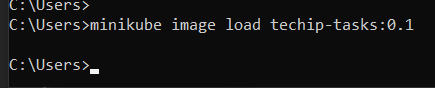


## Применение манифестов

```bash
  kubectl apply -f deploy/k8s/configmap.yaml
  kubectl apply -f deploy/k8s/deployment.yaml
  kubectl apply -f deploy/k8s/service.yaml
```

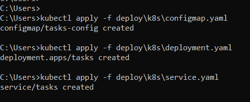

## Проверка

```bash
  # Состояние Pod
  kubectl get pods
  kubectl describe pod <pod-name>
```

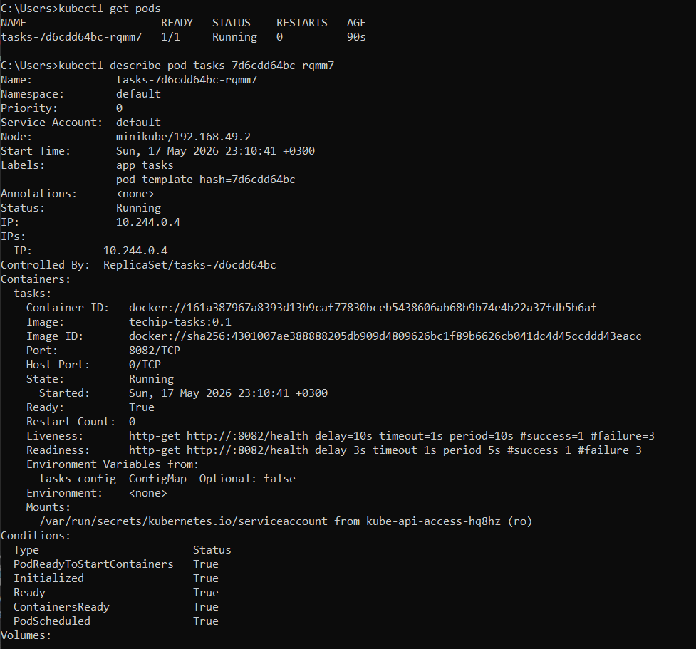

```bash
  # Deployment
  kubectl get deployment
  kubectl describe deployment tasks
```

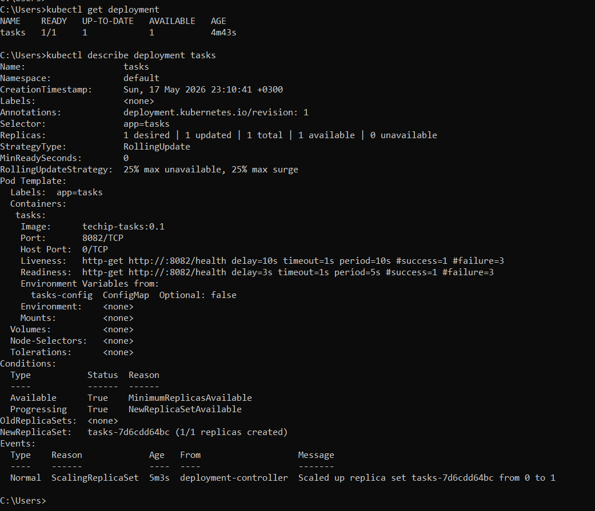

```bash
  # Service
  kubectl get svc
  kubectl describe svc tasks
```

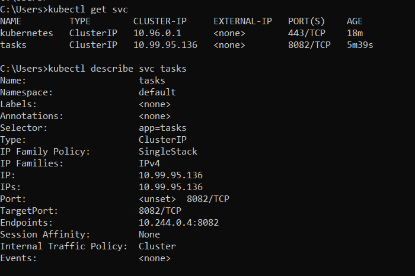

```bash
  # Логи контейнера
  kubectl logs <pod-name>
```

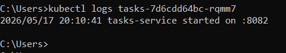

```bash
  # Доступ к сервису через port-forward
  kubectl port-forward svc/tasks 8082:8082
  # В другом терминале:
  curl -i http://localhost:8082/health
```

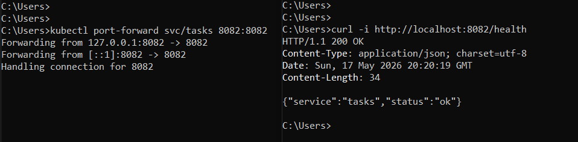

## Масштабирование

```bash
  # Увеличить до 2 реплик
  kubectl scale deployment tasks --replicas=2
  kubectl get pods
```

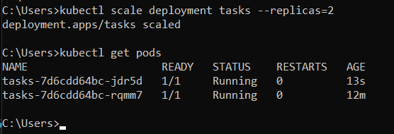


```bash
  # Вернуть 1 реплику
  kubectl scale deployment tasks --replicas=1
```

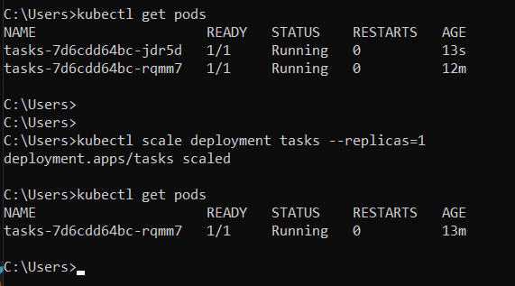

## Очистка

```bash
  kubectl delete -f deploy/k8s/service.yaml
  kubectl delete -f deploy/k8s/deployment.yaml
  kubectl delete -f deploy/k8s/configmap.yaml
```

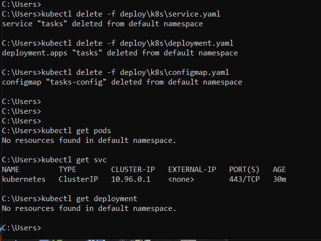

---

## Ответы на контрольные вопросы

### 1. Что такое Kubernetes и для чего он используется?

Kubernetes — система оркестрации контейнеров. Она управляет запуском, масштабированием и сопровождением приложений в контейнерах. Kubernetes автоматически поддерживает нужное число работающих экземпляров, перезапускает упавшие контейнеры, распределяет трафик, управляет конфигурацией и секретами, обеспечивает rolling updates без простоя.

### 2. Чем Pod отличается от Deployment?

**Pod** — минимальная единица развёртывания: один или несколько контейнеров с общей сетью. Pod существует самостоятельно и если он упадёт — никто его не пересоздаст.

**Deployment** — высокоуровневый объект, который управляет набором Pod. Он описывает желаемое состояние (сколько реплик, какой образ) и следит за его выполнением: пересоздаёт упавшие Pod, управляет обновлениями, поддерживает нужное число реплик.

### 3. Почему приложение в Kubernetes обычно публикуют через Deployment а не через одиночный Pod?

Одиночный Pod не восстанавливается после сбоя — при падении его нужно создавать вручную. Deployment автоматически поддерживает нужное число Pod: при падении создаёт новый, при обновлении образа плавно заменяет старые Pod новыми (rolling update). Deployment также позволяет легко масштабировать приложение изменением `replicas`.

### 4. Зачем нужен Service и почему нельзя строить обращение к приложению напрямую через Pod?

IP-адрес Pod нестабилен: при пересоздании Pod получает новый IP. При масштабировании появляются несколько Pod с разными IP. Service предоставляет стабильный DNS-адрес и IP (ClusterIP) который не меняется. Service автоматически находит подходящие Pod по label selector и балансирует трафик между ними.

### 5. Что такое ConfigMap?

ConfigMap — объект Kubernetes для хранения несекретной конфигурации в виде пар ключ-значение. Конфигурация передаётся в контейнер как переменные окружения (через `envFrom`) или монтируется как файлы. Это позволяет использовать один образ в разных средах с разными настройками, не встраивая конфигурацию в образ.

### 6. Чем ConfigMap отличается от Secret?

**ConfigMap** — для несекретных данных: порты, URL, уровни логирования. Значения хранятся в открытом виде, видны через `kubectl get configmap`.

**Secret** — для чувствительных данных: пароли, токены, ключи. Значения кодируются в base64 (не шифруются, но не отображаются открыто в командах kubectl). Доступ к Secret можно ограничить через RBAC.

### 7. Для чего используется readiness probe?

Readiness probe проверяет готовность Pod принимать трафик. Пока probe не пройдёт успешно, Kubernetes не включает Pod в ротацию Service. Это важно при запуске: приложению может потребоваться время для инициализации (соединение с БД, загрузка конфигурации). Клиенты не получат ошибок — трафик направляется только на готовые Pod.

### 8. Для чего используется liveness probe?

Liveness probe проверяет что приложение не зависло. Если probe стабильно проваливается, Kubernetes считает контейнер неработоспособным и перезапускает его. Это важно для обнаружения deadlock-ов и других состояний когда процесс жив, но не обрабатывает запросы. В учебной работе для обоих probe используется `/health`.

### 9. Почему важно использовать фиксированный тег образа а не только latest?

Тег `latest` не позволяет понять какую версию кода содержит образ. При обновлении `latest` в registry Kubernetes может не перезапустить Pod если имя образа не изменилось (`imagePullPolicy: IfNotPresent`). Фиксированный тег (например `techip-tasks:0.1` или `techip-tasks:abc1234`) точно идентифицирует версию, позволяет откатиться к конкретной версии и воспроизвести развёртывание.

### 10. Зачем нужен kubectl port-forward?

`kubectl port-forward svc/tasks 8082:8082` создаёт временный тоннель между локальной машиной и Service внутри кластера. Это позволяет обратиться к приложению через `localhost:8082` без открытия внешнего доступа. Удобно для отладки и демонстрации: не нужно настраивать Ingress или NodePort — достаточно одной команды.

### 11. Что делает команда kubectl scale deployment ...?

```bash
kubectl scale deployment tasks --replicas=2
```
Команда изменяет желаемое число реплик в Deployment. Kubernetes немедленно начинает создавать дополнительные Pod (или удалять лишние). Scaling происходит без перезапуска существующих Pod — это быстрая и безопасная операция. Новые Pod проходят через readiness probe перед включением в трафик.

### 12. Почему публикация приложения в Kubernetes считается декларативной?

В Kubernetes разработчик описывает **желаемое состояние** (3 реплики, образ v2, порт 8082) в YAML-манифестах, а не даёт команды что делать. Kubernetes сам определяет как достичь этого состояния и поддерживает его непрерывно: если Pod упадёт — создаст новый, если реплик меньше нужного — добавит. Это отличается от императивного подхода где нужно вручную указывать каждое действие.
