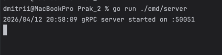
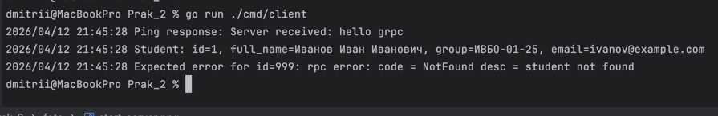

# Практическое занятие №2 — gRPC: создание простого микросервиса, вызовы методов

## Описание

gRPC-микросервис **StudentService** на Go с двумя методами:
- `Ping` — проверка доступности сервиса
- `GetStudentByID` — получение данных студента по ID

## Структура проекта

```
Prak_2/
├── proto/
│   └── student.proto          # Контракт сервиса (Protocol Buffers)
├── gen/
│   └── studentpb/             # Сгенерированный код (после protoc)
│       ├── student.pb.go
│       └── student_grpc.pb.go
├── cmd/
│   ├── server/main.go         # Точка входа gRPC-сервера
│   └── client/main.go         # Тестовый клиент
├── internal/student/
│   ├── data.go                # Репозиторий с данными в памяти
│   └── service.go             # Реализация gRPC-сервиса
└── go.mod
```

## Установка зависимостей

```bash
go get google.golang.org/grpc
go get google.golang.org/protobuf
```

## Установка инструментов генерации

```bash
go install google.golang.org/protobuf/cmd/protoc-gen-go@latest
go install google.golang.org/grpc/cmd/protoc-gen-go-grpc@latest
```

> Убедитесь, что `$GOPATH/bin` (обычно `~/go/bin`) добавлен в переменную `PATH`.

## Генерация кода из proto

```bash
protoc --proto_path=proto --go_out=. --go-grpc_out=. proto/student.proto
```

После этого в `gen/studentpb/` появятся `student.pb.go` и `student_grpc.pb.go`.

## Запуск

### Терминал 1 — сервер

```bash
go run ./cmd/server
# gRPC server started on :50051
```




### Терминал 2 — клиент

```bash
go run ./cmd/client
```

Ожидаемый вывод:
```
Ping response: Server received: hello grpc
Student: id=1, full_name=Иванов Иван Иванович, group=ИВБО-01-25, email=ivanov@example.com
Expected error for id=999: rpc error: code = NotFound desc = student not found
```



## API (proto-контракт)

| Метод           | Запрос               | Ответ                  | Описание                      |
|-----------------|----------------------|------------------------|-------------------------------|
| Ping            | PingRequest          | PingResponse           | Проверка доступности сервиса  |
| GetStudentByID  | GetStudentRequest    | GetStudentResponse     | Получить студента по ID       |

## gRPC-коды ошибок

| Ситуация              | gRPC код          |
|-----------------------|-------------------|
| Неверный ID (<=0)     | `InvalidArgument` |
| Студент не найден     | `NotFound`        |

## Ключевые концепции

- **Protocol Buffers** — язык описания контракта, типизированные сообщения
- **Генерация кода** — `protoc` создаёт Go-код клиента и сервера из `.proto`
- **UnimplementedStudentServiceServer** — встраивается в сервис для forward compatibility
- **insecure credentials** — используются для локальной учебной среды (в production — TLS)
