# Практическая работа № 3 - Чебыкин Д.К. ПИМО-01-21

## Описание проекта
Проект направлен на обучение основам golang

Цели:
- Освоить базовую работу со стандартной библиотекой net/http без сторонних фреймворков.
- Научиться поднимать HTTP-сервер, настраивать маршрутизацию через http.ServeMux.
- Научиться обрабатывать параметры запроса (query, path), тело запроса (JSON/form-data) и формировать корректные ответы (код статуса, заголовки, JSON).
- Научиться базовому логированию запросов и обработке ошибок.

Требования:
- Установленный Go
- Установленный Git
- Установленный curl или аналог


##	Структура проекта

```
pz3-http/
├── cmd/
│   └── server/
│       └── main.go
├── internal/
│   ├── api/
│   │   ├── handlers.go
│   │   ├── handlers_test.go
│   │   ├── middlewares.go
│   │   └── responses.go
│   └── storage/
│   │   └── memory.go
│   └── test/
│       └── api/
│           └── handlers_test
```

## Установка, запуск и тестирование

### Запуск
Запуск проекта
```
go run ./cmd/server
```

### Билд
Билд проекта
```
go build -o app ./cmd/server
```
Запуск билда
```
./app
```
### Тесты
Запуск тестов
```
go test ./... -v
```
"./..." (запуск всех тестов) \
"-v" (подробный вывод тестов)

## Конфигурация
Переменные окружения:
- PORT - порт сервера (по-умолчанию 8080)

## Тестовые запросы (Mac)
### 1. Проверка работы сервера
```
curl http://localhost:8080/health
```
Результат:

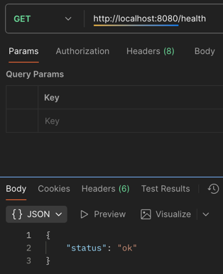

### 2. Создание нового дела
```
curl -Method POST http://localhost:8080/tasks -Body '{"title":"Read Scott Meyers Effective C++"}' -Headers @{"Content-Type"="application/json"}
```

Результат:

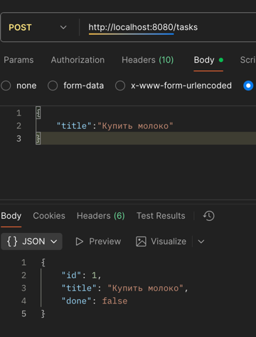

### 3. Создание ещё одного нового дела
```
curl -Method POST http://localhost:8080/tasks -Body '{"title":"Translate english scientific article"}' -Headers @{"Content-Type"="application/json"}
```
Результат:

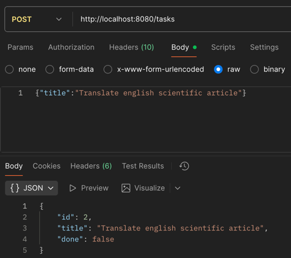

### 4. Получение списка дел
```
curl http://localhost:8080/tasks
```
Результат:

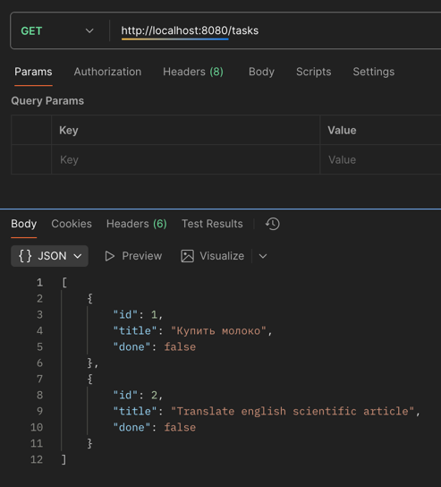

### 5. Получение списка дел с фильтрацией по названию
```
curl http://localhost:8080/tasks?q=article
```
Результат:

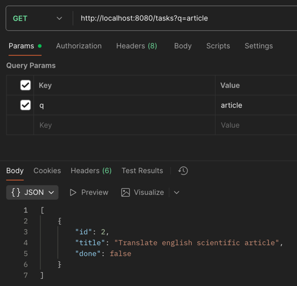

### 6. Обновление статуса выполнения дела
```
curl -Method PATCH http://localhost:8080/tasks/1 -Body '{"done":true}' -Headers @{"Content-Type"="application/json"}
```
Результат:

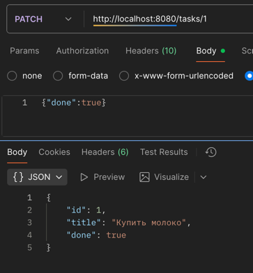

### 7. Получение списка дел для проверки изменений
```
curl http://localhost:8080/tasks
```
Результат:

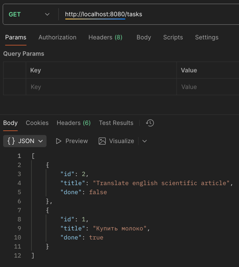

### 8. Удаление дела
```
curl -Method DELETE http://localhost:8080/tasks/1
```
Результат:

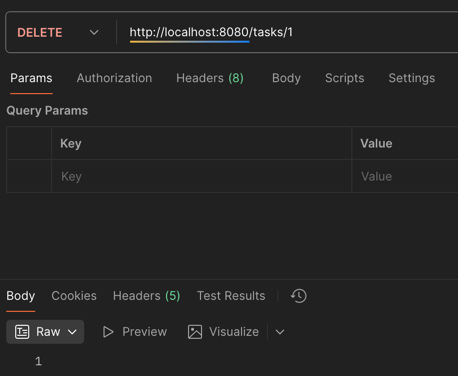

### 9. Получение списка дел для проверки изменений
```
curl http://localhost:8080/tasks
```
Результат:

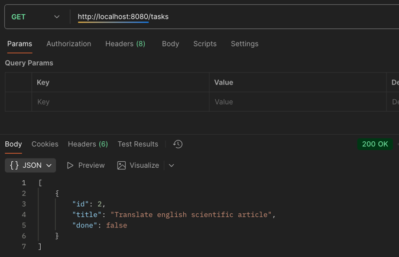


### 10. Попытка получение дела по несуществующему id (после удаления уже не существует такой задаи)
```
curl http://localhost:8080/tasks/27
```
Результат:

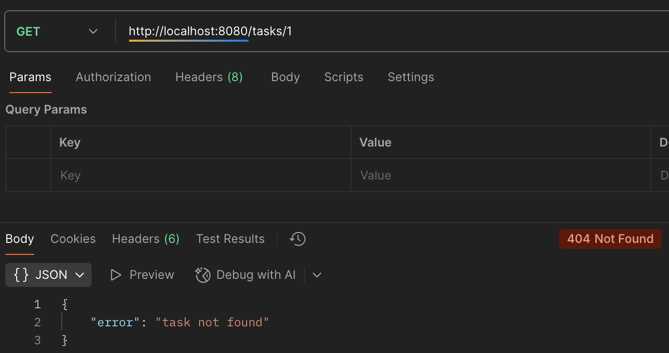


### 11. Создание нового дела с недопустимым количеством символов в названии
```
curl -Method POST http://localhost:8080/tasks -Body '{"title":"h"}' -Headers @{"Content-Type"="application/json"}
```
Результат:

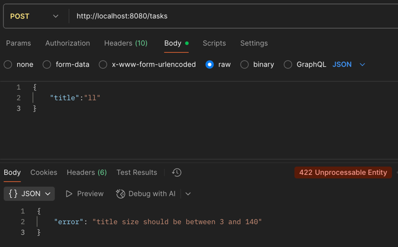

### 12. Привер CORS для запросса

Результат:

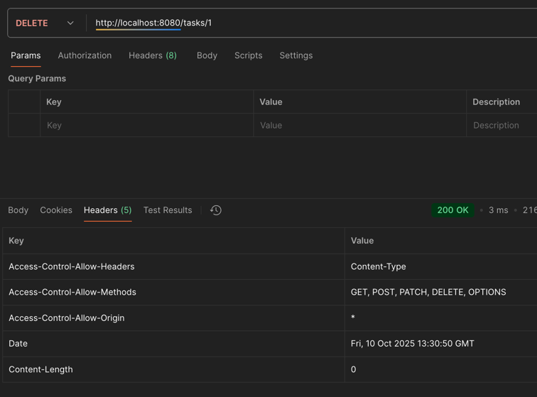

### Логи сервера

В логах сервера отображаются: HTTP-метод, путь, статус ответа и время обработки запроса.

Если сервер получает сигнала завершения (например, через Ctrl+C), он ждёт завершения активных запросов и после выключается (Graceful shutdown).

Пример логов:

