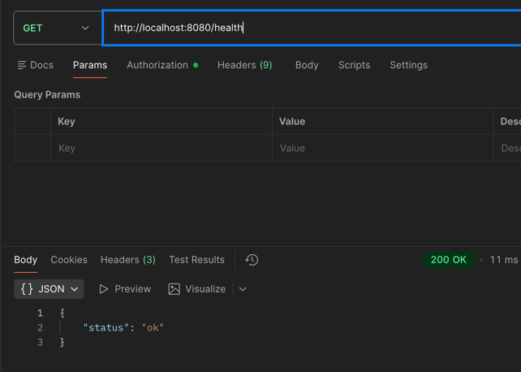
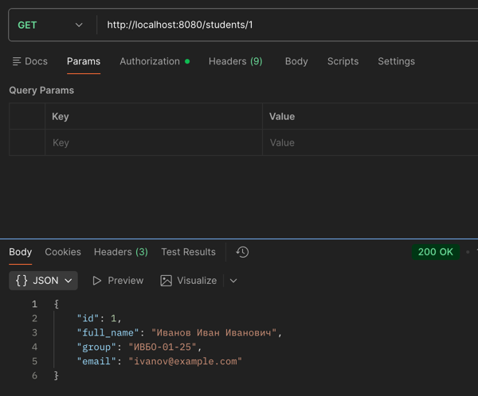
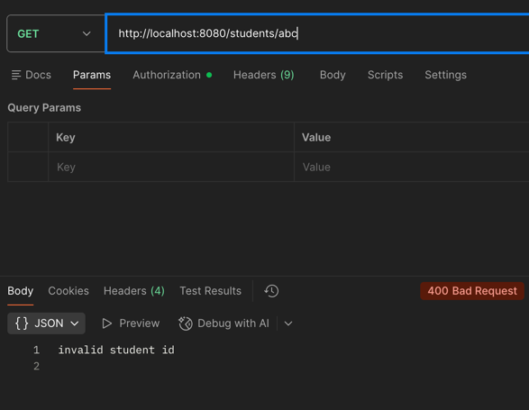
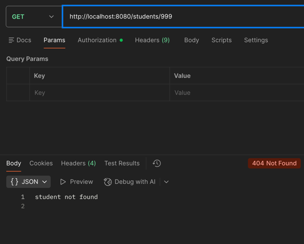
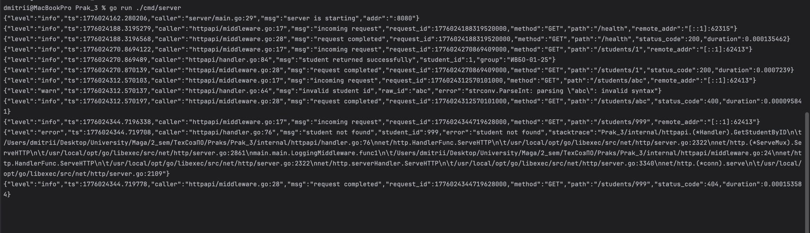

# Практическое занятие №3 — Логирование с помощью zap. Ведение структурированных логов

## Описание

HTTP-сервис на Go с интегрированным структурированным логированием через библиотеку **go.uber.org/zap**. Все события приложения (запросы, ошибки, бизнес-операции) записываются в формате JSON с именованными полями.

## Структура проекта

```
Prak_3/
├── cmd/server/main.go                   # Точка входа
├── internal/
│   ├── httpapi/
│   │   ├── handler.go                   # HTTP-обработчики с логированием
│   │   ├── middleware.go                # Middleware логирования запросов
│   │   └── response_writer.go          # Обёртка для захвата HTTP-статуса
│   └── student/
│       ├── model.go                     # Модель студента
│       └── repo.go                      # Репозиторий (данные в памяти)
├── pkg/logger/
│   └── logger.go                        # Инициализация zap-логгера
└── go.mod
```

## Установка зависимостей

```bash
go get go.uber.org/zap
```

## Запуск

```bash
go run ./cmd/server
```

## Проверка

```bash
# Маршрут проверки здоровья — 200 OK
curl http://localhost:8080/health
```



```bash
# Существующий студент — 200 OK + лог info
curl http://localhost:8080/students/1
```



```bash
# Неверный ID — 400 Bad Request + лог warn
curl http://localhost:8080/students/abc
```



```bash
# Несуществующий студент — 404 Not Found + лог error
curl http://localhost:8080/students/999
```



## Логи




## API

| Метод | Путь           | Описание                    | Уровень лога при успехе |
|-------|----------------|-----------------------------|-------------------------|
| GET   | /health        | Проверка работоспособности  | debug                   |
| GET   | /students/{id} | Получить студента по ID     | info                    |

## Уровни логирования

| Уровень | Когда используется                              |
|---------|-------------------------------------------------|
| debug   | Обращение к /health, начало поиска студента     |
| info    | Старт сервера, входящий запрос, успешный ответ  |
| warn    | Неверный метод, невалидный ID                   |
| error   | Студент не найден в репозитории                 |

## Ключевые концепции

- **Структурированные логи** — каждое событие содержит именованные поля (method, path, status_code, duration, student_id)
- **Middleware** — логирование всех запросов централизовано, без дублирования в каждом обработчике
- **LoggingResponseWriter** — обёртка над `http.ResponseWriter` для перехвата HTTP-статуса
- **zap.Logger vs SugaredLogger** — используется строгий Logger для лучшей производительности
