# Практическая работа № 4 - Чебыкин Д.К. ПИМО-01-25

## Описание проекта

Цели:

1. Освоить базовую маршрутизацию HTTP-запросов в Go на примере роутера chi.
2. Научиться строить REST-маршруты и обрабатывать методы GET/POST/PUT/DELETE.
3. Реализовать небольшой CRUD-сервис «ToDo» (без БД, хранение в памяти).
4. Добавить простое middleware (логирование, CORS).
5. Научиться тестировать API запросами через curl/Postman/HTTPie.

Требования:

- Установленный Go
- Установленный Git
- Установленный curl или аналог

## Структура проекта

```
Prak_4/
├── main.go
├── internal/
│   └── task/
│       ├── handler.go
│       ├── model.go
│       └── repo.go
├── pkg/
│   └── middleware/
│       ├── cors.go
│       └── logger.go
├── sources/
│   └── tasks.json
```

## Установка и запуск

### Запуск

Запуск проекта

```
go run .
```

### Билд

Билд проекта

```
go build -o todo .
```

Запуск билда

```
./todo
```

## Конфигурация

Переменные окружения:

- PORT - порт, на котором работает сервер (необязательно, по-умолчанию 8080)

## Фрагменты кода

Роутер задач

```
func (h *Handler) Routes() chi.Router {
    r := chi.NewRouter()
    r.Get("/", h.list)          // GET /tasks
    r.Post("/", h.create)       // POST /tasks
    r.Get("/{id}", h.get)       // GET /tasks/{id}
    r.Put("/{id}", h.update)    // PUT /tasks/{id}
    r.Delete("/{id}", h.delete) // DELETE /tasks/{id}
    return r
}
```

Middleware для логирования запросов

```
func Logger(next http.Handler) http.Handler {
    return http.HandlerFunc(func(w http.ResponseWriter, r *http.Request) {
        start := time.Now()
        next.ServeHTTP(w, r)
        log.Printf("%s %s %s", r.Method, r.URL.Path, time.Since(start))
    })
}
```

Обработчик маршрута для обновления задачи

```
type updateReq struct {
    Title string `json:"title"`
    Done  bool   `json:"done"`
}

func (h *Handler) update(w http.ResponseWriter, r *http.Request) {
    id, bad := parseID(w, r)
    if bad {
        return
    }

    var req updateReq
    if err := json.NewDecoder(r.Body).Decode(&req); err != nil || req.Title == "" {
        httpError(w, http.StatusBadRequest, "invalid json: require non-empty title")
        return
    }

    if !validateTitle(w, req.Title) {
        return
    }

    t, err := h.repo.Update(id, req.Title, req.Done)
    if err != nil {
        httpError(w, http.StatusNotFound, err.Error())
        return
    }
    writeJSON(w, http.StatusOK, t)
}
```

## Примеры запросов

### 1. Проверка работы сервера

```
curl -X GET "http://localhost:8080/health"
```

Результат:

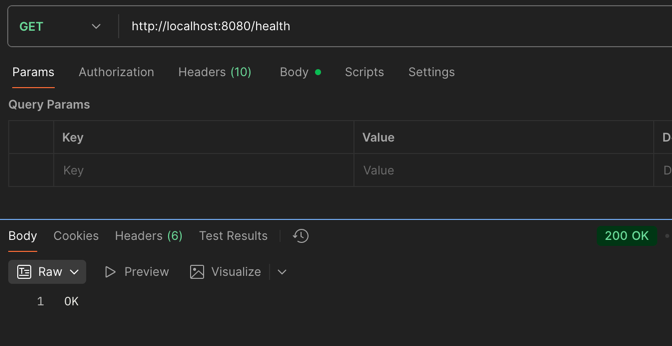

### 2. Получение списка задач

```
curl -X GET "http://localhost:8080/api/v1/tasks"
```

Результат (список задач был предзаполнен):
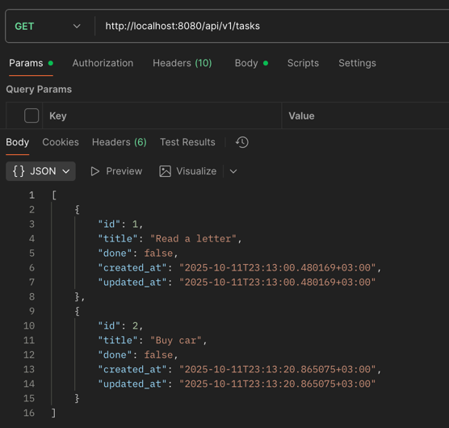


### 3. Получение списка задач с пагинацией

```
curl -X GET "http://localhost:8080/api/v1/tasks?page=1&limit=1"
```

Результат:
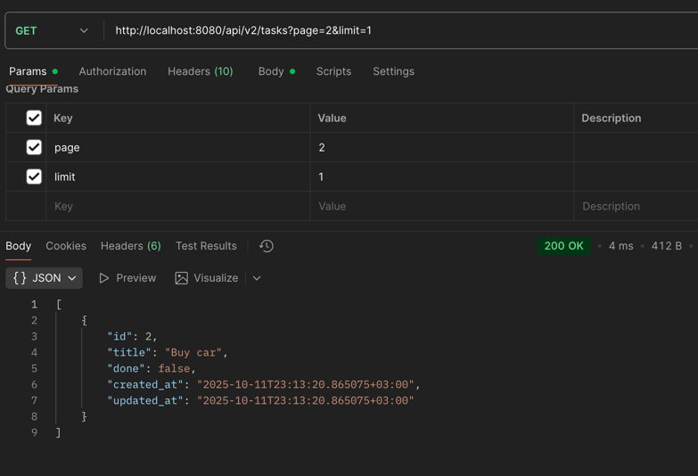

### 4. Получение списка задач с фильтром

```
curl -X GET "http://localhost:8080/api/v1/tasks?done=false"
```

Результат:
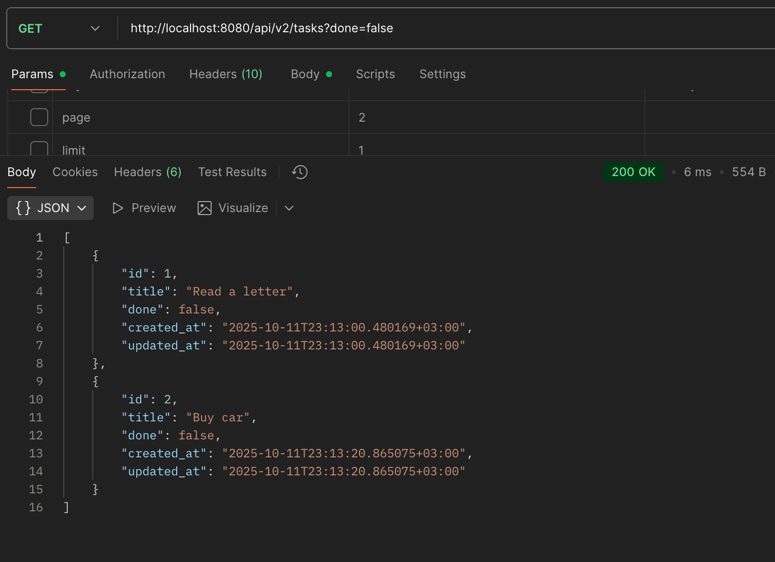

### 5. Создание задачи

```
curl -X POST "http://localhost:8080/api/v1/tasks" -H "Content-Type: application/json" -d "{\"title\":\"Some new task\"}"
```

Результат:

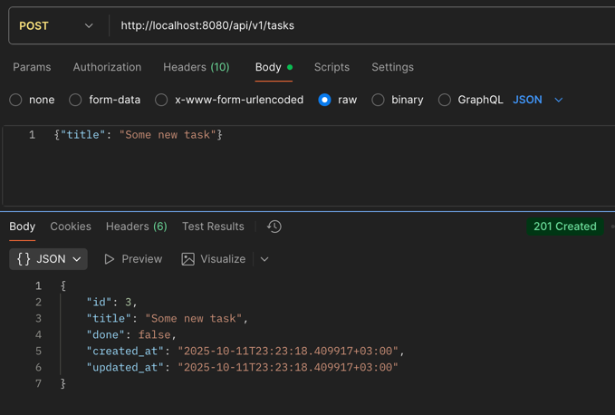

### 6. Попытка создания задачи с пустым title

```
curl -X POST "http://localhost:8080/api/v1/tasks" -H "Content-Type: application/json" -d "{}"
```

Результат:

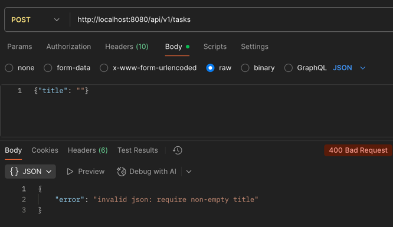

### 7. Создание задачи с title некорректной длины

```
curl -X POST "http://localhost:8080/api/v1/tasks" -H "Content-Type: application/json" -d '{\"title\":\"h\"}'
```

Результат:

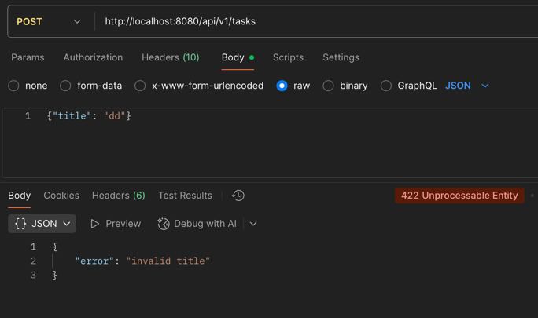

### 8. Получение задачи по ID

```
curl -X GET "http://localhost:8080/api/v1/tasks/1"
```

Результат:

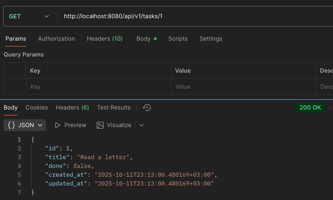

### 9. Попытка получения несуществующей задачи

```
curl -X GET "http://localhost:8080/api/v1/tasks/11"
```

Результат:

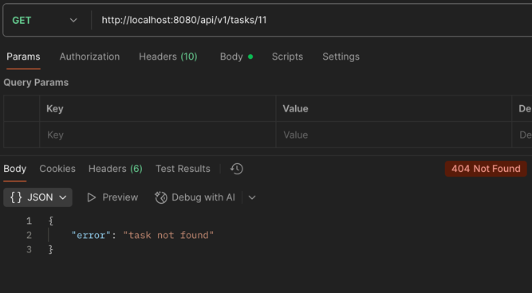

### 10. Обновление задачи

```
curl -X PUT "http://localhost:8080/api/v1/tasks/1" -H "Content-Type: application/json" -d "{\"title\":\"buy home\",\"done\":true }"
```

Результат:

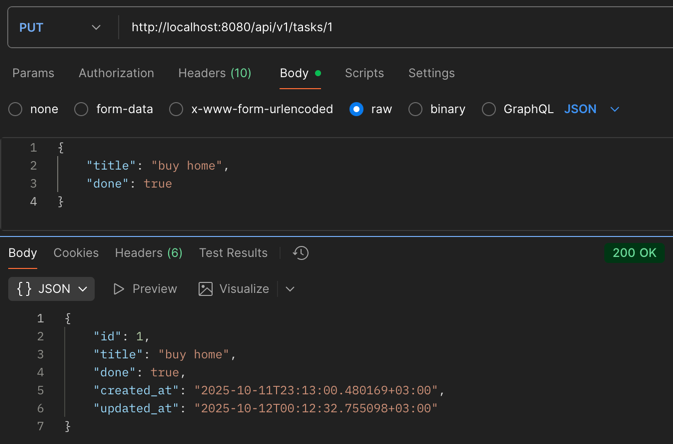

### 11. Попытка обновления задачи с пустым title

```
curl -X PUT "http://localhost:8080/api/v1/tasks/1" -H "Content-Type: application/json" -d "{\"title\": \"\",\"done\": true}"
```

Результат:

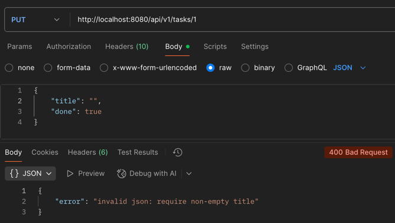

### 12. Попытка обновления задачи с title некорректной длины

```
curl -X PUT "http://localhost:8080/api/v1/tasks/1" -H "Content-Type: application/json" -d "{\"title\":\"\",\"done\":true }"
```

Результат:

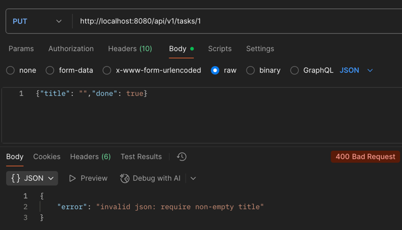

### 13. Попытка обновления несуществующей задачи

```
curl -X PUT "http://localhost:8080/api/v1/tasks/11" -H "Content-Type: application/json" -d "{\"title\":\"title\",\"done\":true }"
```

Результат:

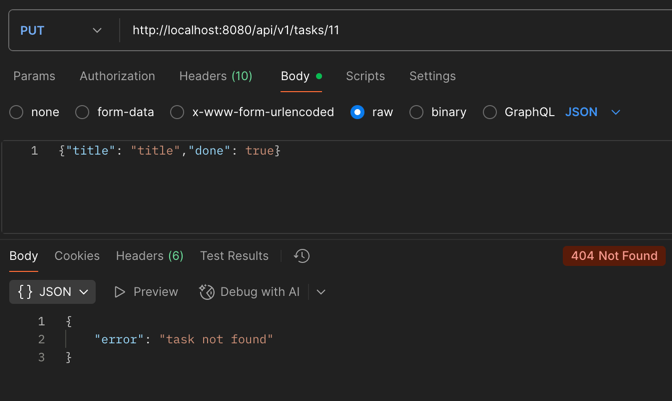

### 14. Удаление задачи

```
curl -X DELETE "http://localhost:8080/api/v1/tasks/1"
```

Результат:
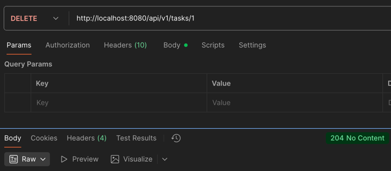

### 15. Попытка удаления несуществующей задачи

```
curl -X DELETE "http://localhost:8080/api/v1/tasks/27"
```

Результат:


### Логи сервера

Логи сервера представлены ниже

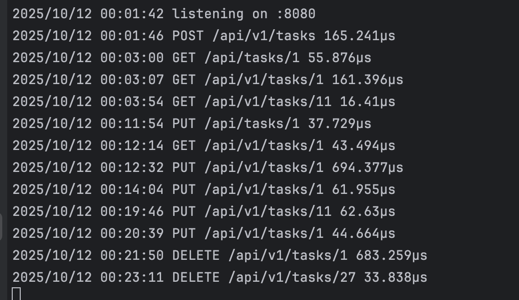

## Обработка ошибок и кодов ответа

Ошибки и коды ответов обрабатываются с помощью универсальных функций writeJSON и httpError.

Хендлер выполняет проверку входных данных — JSON, параметров пути, а также корректности полей title и id. При обнаружении ошибки он вызывает httpError, которая формирует JSON-ответ с полем error и устанавливает соответствующий HTTP-код (например, 400 — при некорректном запросе, 404 — если задача не найдена).

В случае успешной обработки данных используется writeJSON: она задаёт нужный код ответа (200 — при получении или обновлении, 201 — при создании, 204 — при удалении) и возвращает клиенту JSON с результатом операции.

## Результаты тестирования

| Маршрут                                              | Метод  | Запрос                              | Ожидаемый ответ                       | Фактический ответ |
| ---------------------------------------------------- | ------ |-------------------------------------| ------------------------------------- | ----------------- |
| `/health`                                            | GET    | —                                   | `"OK"`                                | Совпадает (п.1)   |
| `/api/v1/tasks`                                      | GET    | —                                   | первые 10 задач                       | Совпадает (п.2)   |
| `/api/v1/tasks`                                      | GET    | `page=1&limit=1`                    | задачи с 6 по 10                      | Совпадает (п.4)   |
| `/api/v1/tasks`                                      | GET    | `done=true&page=1&limit=1`          | первые 3 задачи с "project"           | Совпадает (п.5)   |
| `/api/v1/tasks`                                      | POST   | `{"title":"New task"}`              | созданная задача с id                 | Совпадает (п.6)   |
| `/api/v1/tasks`                                      | POST   | `{}`                                | invalid json: require non-empty title | Совпадает (п.7)   |
| `/api/v1/tasks`                                      | POST   | `{"title":"h"}`                     | too short title                       | Совпадает (п.8)   |
| `/api/v1/tasks/809e6197-06ea-40ea-a636-582816181bcb` | GET    | —                                   | задача с указанным id                 | Совпадает (п.9)   |
| `/api/v1/tasks/27`                                   | GET    | —                                   | task not found                        | Совпадает (п.10)  |
| `/api/v1/tasks/809e6197-06ea-40ea-a636-582816181bcb` | PUT    | `{"title":"test task","done":true}` | обновлённая задача                    | Совпадает (п.11)  |
| `/api/v1/tasks/809e6197-06ea-40ea-a636-582816181bcb` | PUT    | `{}`                                | invalid json: require non-empty title | Совпадает (п.12)  |
| `/api/v1/tasks/809e6197-06ea-40ea-a636-582816181bcb` | PUT    | `{"title":"a","done":false}`        | too short title                       | Совпадает (п.13)  |
| `/api/v1/tasks/27`                                   | PUT    | `{"title":"title","done":true}`     | task not found                        | Совпадает (п.14)  |
| `/api/v1/tasks/809e6197-06ea-40ea-a636-582816181bcb` | DELETE | —                                   | —                                     | Совпадает (п.15)  |
| `/api/v1/tasks/27`                                   | DELETE | —                                   | task not found                        | Совпадает (п.16)  |

## Выводы

Все цели практической работы были достигнуты, была освоена базовая маршрутизация HTTP-запросов на примере роутера chi, получены навыки построения REST-маршрутов и обработки методов GET/POST/PUT/DELETE, реализован CRUD-сервис, а также добавлен middleware слой.