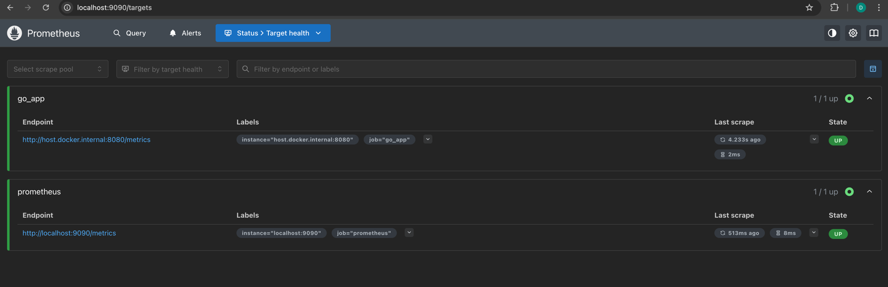
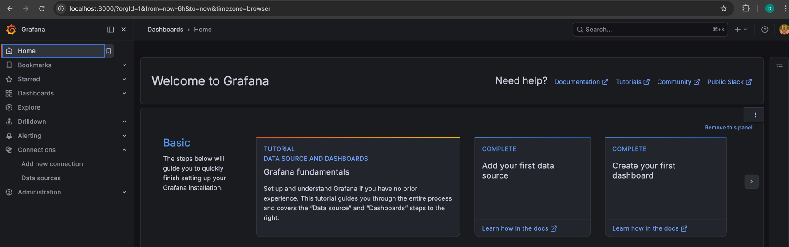
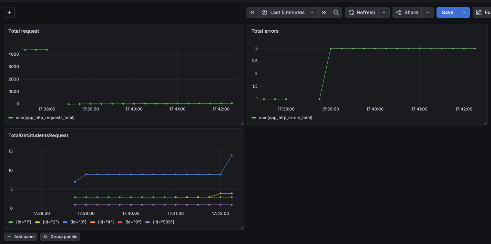

# Практическое занятие №4 — Настройка Prometheus + Grafana для метрик. Интеграция с приложением

## Описание

Go HTTP-сервис с интеграцией **Prometheus** для сбора метрик и **Grafana** для их визуализации.

Инфраструктура:
- **Go-приложение** — порт `8080`
- **Prometheus** — порт `9090`
- **Grafana** — порт `3000`

## Структура проекта

```
Prak_4/
├── cmd/server/main.go               # Точка входа
├── internal/
│   ├── httpapi/
│   │   ├── handler.go               # HTTP-обработчики
│   │   ├── middleware.go            # Middleware для записи метрик
│   │   └── response_writer.go      # Обёртка для захвата HTTP-статуса
│   ├── metrics/
│   │   └── metrics.go              # Определение Prometheus-метрик
│   └── student/
│       ├── model.go                 # Модель студента
│       └── repo.go                  # Репозиторий (данные в памяти)
├── monitoring/
│   └── prometheus.yml              # Конфигурация Prometheus
└── go.mod
```

## Установка зависимостей

```bash
go get github.com/prometheus/client_golang/prometheus
go get github.com/prometheus/client_golang/prometheus/promauto
go get github.com/prometheus/client_golang/prometheus/promhttp
```

## Запуск

### 1. Go-приложение

```bash
go run ./cmd/server
# server started on :8080
```

Проверьте метрики в браузере: http://localhost:8080/metrics

### 2. Prometheus

```bash
prometheus --config.file=monitoring/prometheus.yml
```
или через Docker
```
docker run --rm \
-p 9090:9090 \
-v $(pwd)/monitoring/prometheus.yml:/etc/prometheus/prometheus.yml \
prom/prometheus
```
(для docker нужно поменять в файле prometheus.yml "localhost:8080" на "host.docker.internal:8080")

Откройте: http://localhost:9090  
Перейдите в **Status → Targets** и убедитесь, что `go_app` имеет статус **UP**.



### 3. Grafana

```bash
# Локальный бинарный файл:
grafana-server

# Или через Docker (с -d или -rm флагом):
docker run -d -p 3000:3000 grafana/grafana
```

Откройте: http://localhost:3000 (логин: `admin` / пароль: `admin`)



## API

| Метод | Путь           | Описание                        |
|-------|----------------|---------------------------------|
| GET   | /health        | Проверка работоспособности      |
| GET   | /students/{id} | Получить студента по ID         |
| GET   | /metrics       | Метрики в формате Prometheus    |

## Метрики приложения

| Метрика                             | Тип       | Лейблы                        | Описание                          |
|-------------------------------------|-----------|-------------------------------|-----------------------------------|
| `app_http_requests_total`           | Counter   | method, path                  | Общее число HTTP-запросов         |
| `app_http_errors_total`             | Counter   | method, path, status_code     | Число ошибочных запросов (≥ 400)  |
| `app_http_request_duration_seconds` | Histogram | method, path                  | Время обработки запросов          |

## Подключение Prometheus в Grafana

1. Откройте **Connections → Data sources → Add new data source**
2. Выберите **Prometheus**
3. URL: `http://localhost:9090`
4. Нажмите **Save & test**

## PromQL-запросы для дашборда

```promql
# Панель 1 — Общее число запросов
sum(app_http_requests_total)

# Панель 2 — Число ошибок
sum(app_http_errors_total)

# Панель 3 — Число запросов по получению студента
app_http_get_student_request_total
```


## Генерация тестовых данных

```bash
# PowerShell
1..20 | ForEach-Object { curl http://localhost:8080/health }
1..15 | ForEach-Object { curl http://localhost:8080/students/1 }
1..5  | ForEach-Object { curl http://localhost:8080/students/999 }

# bash/zsh
for i in $(seq 1 20); do curl -s http://localhost:8080/health > /dev/null; done
for i in $(seq 1 15); do curl -s http://localhost:8080/students/1 > /dev/null; done
for i in $(seq 1 5);  do curl -s http://localhost:8080/students/999 > /dev/null; done
```


## Ключевые концепции

- **Prometheus scraping** — Prometheus сам опрашивает `/metrics` с заданным интервалом (pull-модель)
- **Counter** — монотонно возрастающий счётчик (запросы, ошибки)
- **Histogram** — распределение значений по бакетам (время обработки)
- **promauto** — автоматическая регистрация метрик в реестре по умолчанию
- **MetricsMiddleware** — централизованная запись метрик для всех маршрутов
- **Grafana** — подключается к Prometheus как источник данных и строит дашборды


## Ответы на контрольные вопросы

### 1. Что такое метрики приложения?

Метрики — это числовые измерения состояния приложения, собираемые в реальном времени. Примеры: количество HTTP-запросов, время обработки, число ошибок, использование памяти. В отличие от логов, метрики агрегированы и подходят для построения графиков и алертов.

### 2. Чем метрики отличаются от логов?

| | Метрики | Логи |
|---|---|---|
| Формат | Числа | Текстовые строки |
| Цель | Наблюдение за трендами | Диагностика конкретных событий |
| Хранение | Агрегируются (мало места) | Хранятся целиком (много места) |
| Пример | `requests_total = 1500` | `2026-01-01 GET /students/1 200 1ms` |

Метрики отвечают на вопрос «сколько», логи — на вопрос «что именно произошло».

### 3. Какую роль выполняет Prometheus?

Prometheus — система мониторинга и хранения временных рядов. Он по расписанию опрашивает (scrape) маршрут `/metrics` у зарегистрированных приложений, сохраняет полученные данные и предоставляет язык запросов PromQL для их анализа.

### 4. Что такое scraping в Prometheus?

Scraping — это процесс периодического HTTP-запроса Prometheus к маршруту `/metrics` целевого приложения. Prometheus сам инициирует запросы (pull-модель), в отличие от push-модели, где приложение само отправляет данные. Интервал scraping задаётся параметром `scrape_interval` в `prometheus.yml`.

### 5. Зачем приложению маршрут /metrics?

Маршрут `/metrics` — это точка сбора метрик в формате Prometheus (text exposition format). По этому адресу Prometheus обращается при каждом scrape. Без этого маршрута Prometheus не может получить данные от приложения.

### 6. Что делает promhttp.Handler()?

`promhttp.Handler()` возвращает стандартный HTTP-обработчик, который при GET-запросе собирает все зарегистрированные метрики из реестра Prometheus по умолчанию и отдаёт их в текстовом формате. Достаточно одной строки чтобы подключить экспорт метрик:

```go
mux.Handle("/metrics", promhttp.Handler())
```

### 7. Для чего нужна Grafana?

Grafana — инструмент визуализации данных. Она подключается к Prometheus как источнику данных и позволяет строить графики, дашборды и настраивать алерты на основе PromQL-запросов. Prometheus хранит данные, Grafana их отображает.

### 8. Какие три основные метрики реализованы в этой работе?

| Метрика | Тип | Описание |
|---|---|---|
| `app_http_requests_total` | Counter | Общее число HTTP-запросов (лейблы: method, path) |
| `app_http_errors_total` | Counter | Число ошибочных ответов ≥ 400 (лейблы: method, path, status_code) |
| `app_http_request_duration_seconds` | Histogram | Время обработки запросов в секундах (лейблы: method, path) |

### 9. Что показывает Histogram?

Histogram показывает распределение значений по бакетам (диапазонам). Для каждого бакета хранится количество наблюдений, не превысивших его границу. Например, для времени ответа бакеты `le="0.005"`, `le="0.01"`, `le="0.025"` показывают сколько запросов уложилось в 5 мс, 10 мс, 25 мс соответственно. Это позволяет вычислять перцентили (p50, p95, p99).

### 10. Почему мониторинг важен для сопровождения backend-приложений?

Без мониторинга проблемы обнаруживаются только когда пользователи уже жалуются. Мониторинг позволяет:

- **Обнаруживать деградацию заранее** — рост времени ответа, увеличение числа ошибок
- **Планировать масштабирование** — видеть пиковую нагрузку и тренды роста
- **Быстро локализовать проблему** — метрики показывают какой конкретно маршрут или сервис деградировал
- **Проверять результат деплоя** — убедиться что после обновления метрики не ухудшились
- **Соблюдать SLA** — отслеживать доступность и время ответа в реальном времени