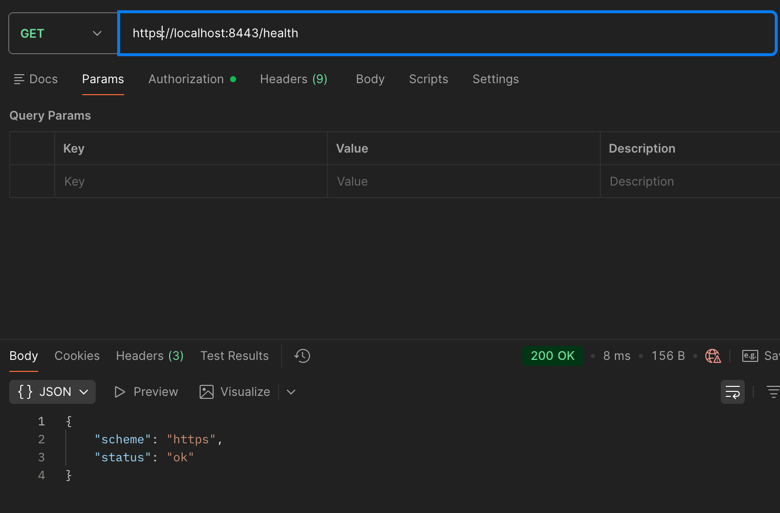
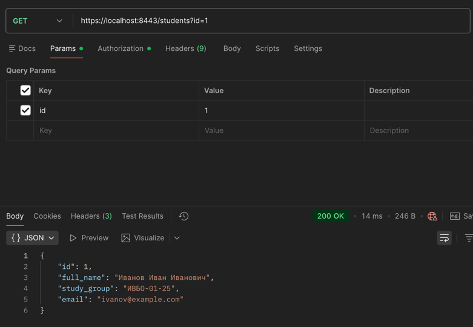
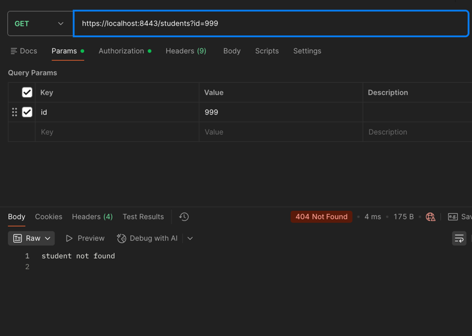
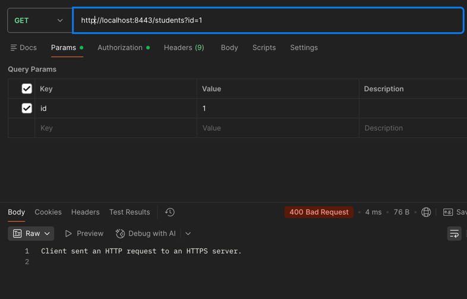
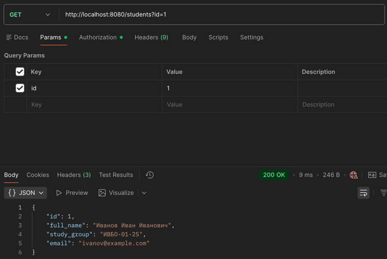

# Практическое занятие №5 — HTTPS (TLS-сертификаты). Защита от SQL-инъекций

## Структура проекта

```
Prak_5/
├── cmd/server/main.go
├── certs/                     # сюда генерируется сертификат (не в git)
│   ├── server.crt
│   └── server.key
├── internal/
│   ├── config/config.go
│   ├── httpapi/handler.go
│   └── student/
│       ├── model.go
│       └── repo.go
├── sql/init.sql
└── go.mod
```

## Зависимости

```bash
go get github.com/lib/pq
```

## Генерация самоподписанного TLS-сертификата

```bash
openssl req -x509 -newkey rsa:2048 -nodes \
  -keyout certs/server.key \
  -out certs/server.crt \
  -days 365 \
  -subj "/CN=localhost"
```

## Подготовка БД

Создайте базу `study_security` в PostgreSQL и выполните:

```bash
psql -U postgres -d study_security -f sql/init.sql
```

## Запуск

```bash
go run ./cmd/server
# HTTPS server started on https://localhost:8443
```

## Проверка

```bash
# Health-check
curl -k https://localhost:8443/health
```


```bash
# Получить студента
curl -k "https://localhost:8443/students?id=1"
```


```bash
# 404 Not Found
curl -k "https://localhost:8443/students?id=999"
```


Флаг `-k` нужен для самоподписанного сертификата.

```bash
# Запрос без сертификата
curl "http://localhost:8443/students?id=1"
```


## SQL-инъекции

### Опасный пример (НЕ использовать!)

```go
query := "SELECT ... WHERE id = " + rawID
// если rawID = "1 OR 1=1" — вернёт все записи
```

### Безопасный параметризованный запрос

```go
row := db.QueryRow("SELECT ... WHERE id = $1", id)
```

### Prepared statement

```go
stmt, _ := db.Prepare("SELECT ... WHERE id = $1")
defer stmt.Close()
row := stmt.QueryRow(id)
```

### Дополнительное задание (Вариант №1)

запрос без сертификата на порт 8080

```bash
# Получить студента
curl "http://localhost:8080/students?id=1"
```


## Ключевые концепции

- `tls.LoadX509KeyPair` — загружает PEM-сертификат и ключ
- `server.ListenAndServeTLS("", "")` — пустые аргументы: сертификат уже в `TLSConfig`
- Параметризованные запросы — значение передаётся отдельно от SQL-текста
- `$1` — placeholder для PostgreSQL (в MySQL используется `?`)


## Ответы на контрольные вопросы

### 1. Чем HTTP отличается от HTTPS?

HTTP (HyperText Transfer Protocol) передаёт данные в открытом виде — любой, кто находится на пути между клиентом и сервером, может прочитать или подменить содержимое запроса и ответа. HTTPS (HTTP Secure) — это HTTP поверх TLS-шифрования. Данные шифруются на стороне клиента и расшифровываются только на сервере, что исключает перехват и подмену.

### 2. Какую роль выполняет TLS в защищённом соединении?

TLS (Transport Layer Security) выполняет три функции:

- **Шифрование** — данные между клиентом и сервером передаются в зашифрованном виде
- **Аутентификация** — клиент убеждается что общается именно с нужным сервером (через сертификат)
- **Целостность** — гарантирует что данные не были изменены в пути (через MAC-коды)

### 3. Что такое TLS-сертификат?

TLS-сертификат — это криптографический документ, содержащий открытый ключ сервера и информацию о его владельце (домен, организация, срок действия). Сертификат подписывается удостоверяющим центром (CA), которому доверяет браузер. При подключении сервер предъявляет сертификат клиенту, и тот проверяет его подлинность.

### 4. Что делает tls.LoadX509KeyPair?

`tls.LoadX509KeyPair(certFile, keyFile)` загружает пару файлов в формате PEM — сертификат (`.crt`) и приватный ключ (`.key`) — и возвращает структуру `tls.Certificate`. Эта структура затем передаётся в `tls.Config` для настройки HTTPS-сервера:

```go
cert, err := tls.LoadX509KeyPair("certs/server.crt", "certs/server.key")
tlsConfig := &tls.Config{Certificates: []tls.Certificate{cert}}
```

### 5. Почему self-signed certificate подходит для локальной учебной среды, но не для публичного production-сервиса?

Самоподписанный сертификат создаётся и подписывается самим разработчиком, а не доверенным удостоверяющим центром (CA). Браузеры и HTTP-клиенты не доверяют таким сертификатам и показывают предупреждение «Ваше соединение не защищено». В учебной среде это приемлемо — можно добавить исключение или использовать флаг `-k` в curl. В production пользователи не будут принимать такие предупреждения, поэтому нужен сертификат от доверенного CA (например, Let's Encrypt — бесплатно).

### 6. Что такое SQL-инъекция?

SQL-инъекция — это атака, при которой злоумышленник вставляет произвольный SQL-код в пользовательский ввод, который затем выполняется базой данных. Например, если приложение строит запрос конкатенацией строк:

```go
query := "SELECT * FROM students WHERE id = " + userInput
```

То при `userInput = "1 OR 1=1"` запрос вернёт все записи таблицы. При `userInput = "1; DROP TABLE students"` — удалит таблицу.

### 7. Почему конкатенация строки SQL с пользовательским вводом опасна?

Потому что пользовательский ввод становится частью SQL-команды и интерпретируется базой данных как код, а не как данные. Злоумышленник может:

- Получить данные которые не должен видеть
- Обойти авторизацию (`WHERE password = '' OR '1'='1'`)
- Изменить или удалить данные
- Выполнить системные команды (в некоторых СУБД)

### 8. Что такое parameterized query?

Параметризованный запрос — это SQL-запрос, в котором пользовательские значения передаются отдельно от текста запроса через специальные плейсхолдеры. База данных получает структуру запроса и данные раздельно, поэтому данные никогда не интерпретируются как SQL-код:

```go
row := db.QueryRow(
    "SELECT * FROM students WHERE id = $1",
    userInput, // передаётся отдельно, не вставляется в строку
)
```

### 9. Что такое prepared statement?

Prepared statement — это заранее скомпилированный параметризованный запрос. Сервер БД разбирает и оптимизирует SQL один раз при создании (`db.Prepare`), а затем при каждом выполнении только подставляет новые значения параметров. Это даёт два преимущества: защиту от SQL-инъекций (как у обычного параметризованного запроса) и повышение производительности при многократном выполнении одного запроса:

```go
stmt, err := db.Prepare("SELECT * FROM students WHERE id = $1")
defer stmt.Close()

row := stmt.QueryRow(1) // первый вызов
row  = stmt.QueryRow(2) // второй вызов — запрос уже скомпилирован
```

### 10. Почему placeholder syntax может отличаться в разных СУБД и драйверах?

Каждая СУБД исторически выработала свой синтаксис плейсхолдеров:

| СУБД | Синтаксис | Пример |
|---|---|---|
| PostgreSQL | `$N` (нумерованные) | `WHERE id = $1 AND email = $2` |
| MySQL / SQLite | `?` (позиционные) | `WHERE id = ? AND email = ?` |
| Oracle | `:name` (именованные) | `WHERE id = :id` |

Go-драйвер (`lib/pq` для PostgreSQL, `go-sql-driver/mysql` для MySQL) транслирует плейсхолдеры в формат конкретной СУБД. Поэтому при смене СУБД нужно обновлять не только строку подключения, но и синтаксис запросов.