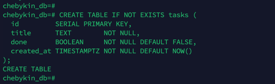
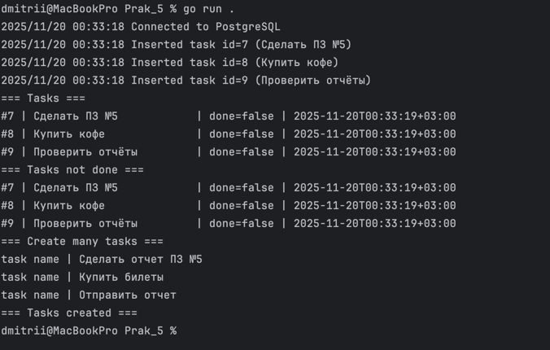
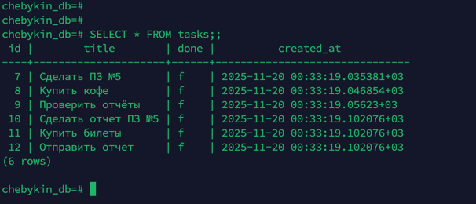

# Чебыкин Дмитрий Константинович ПИМО-01-25
# Практическое задание 5 - Подключение к PostgreSQL

Подключение к PostgreSQL через database/sql и выполнение параметризованных запросов (INSERT, SELECT, UPDATE, Транзакции).

## Цель Работы
Реализовать стабильное соединение с локальной базой данных PostgreSQL из Go-приложения, используя пакет database/sql и драйвер pgx/v5.
Проверить корректность работы с пулом соединений, контекстом и транзакциями.

# 1. Настройка и Запуск Проекта

## 1.1 Требования
- Go: Версия 1.21+
- PostgreSQL: Версия 14+ (Желательно 17, для этого выполните:
```bash
brew list --versions | grep postgresql
brew install postgresql@17
brew link --force postgresql@17
```
- ОС: macOS / Linux / Windows

## 1.2 Структура проекта
```bash
pz5_db/ 
├── foto                # Скриншоты
├── .env                  # Файл с переменной DATABASE_URL
├── README.md             # Файл с отчетом и инструкциями
├── db.go                 # Код для открытия БД и настройки пула соединений 
├── go.mod                # Определения модуля Go 
├── go.sum                # Хеши зависимостей
├── main.go               # Точка входа, логика запуска и тестирования 
└── repository.go         # Модели данных и методы репозитория (ListTasks, CreateTask, FindByID, CreateMany и т.д.)
```

## 1.3 Подготовка Базы Данных
- Убедитесь, что PostgreSQL запущен на порту 8000 (как указано в логах дампа) и у вас есть база данных todo.
- Подключитесь к psql и создайте таблицу tasks:

```bash
psql -U postgres -p 8000
\c todo

-- Создание таблицы
CREATE TABLE IF NOT EXISTS tasks (
    id         SERIAL PRIMARY KEY,
    title      TEXT        NOT NULL,
    done       BOOLEAN     NOT NULL DEFAULT FALSE,
    created_at TIMESTAMPTZ NOT NULL DEFAULT NOW()
);
```
## 1.4 Конфигурация Go
1. Создайте файл .env в корне папки проекта (Pract5) и укажите DSN (строку подключения).
   Обязательно используйте порт 5432 и ваш пароль!
```bash
# Файл: .env
DATABASE_URL=postgres://postgres:ВАШ_ПАРОЛЬ@(host):5432/chebykin_db?sslmode=disable
```

2. Установите необходимые Go-зависимости:
```bash
go mod tidy
go get github.com/jackc/pgx/v5/stdlib
go get github.com/joho/godotenv
```

## 1.5 Запуск
Запустите основную программу (go run .) . Программа выполнит:
Подключение к БД с настройкой пула.
Создание нескольких задач.
Тестирование FindByID, ListDone и CreateMany.

# 2. Визуализация.

## 2.1. Создание БД/таблицы в psql


## 2.2. Успешный вывод go run .
Успешное подключение, вставку новых задач, поиск по ID и вывод списка выполненных/невыполненных задач, создание нескольких задач.


## 2.3. Вывод SELECT * FROM tasks; в psql


## 2.4. Дополнительный функционал
1. func (r *Repo) ListDone(ctx context.Context, done bool) ([]Task, error);
2. func (r *Repo) FindByID(ctx context.Context, id int) (*Task, error);
3. Массовая вставква CreateMany(ctx, titles []string) error через транзакцию

```go
func (r *Repo) ListDone(ctx context.Context, done bool) ([]Task, error) {
	const query = "SELECT id, title, done, created_at FROM tasks WHERE done = $1;"
	rows, err := r.DB.QueryContext(ctx, query, done)
	if err != nil {
		return nil, err
	}
	defer rows.Close()
	var out []Task
	for rows.Next() {
		var t Task
		if err := rows.Scan(&t.ID, &t.Title, &t.Done, &t.CreatedAt); err != nil {
			return nil, err
		}
		out = append(out, t)
	}
	return out, rows.Err()
}

func (r *Repo) FindByID(ctx context.Context, id int) (*Task, error) {
	const query = "SELECT id, title, done, created_at FROM tasks WHERE id = $1;"
	rows, err := r.DB.QueryContext(ctx, query, id)
	if err != nil {
		return nil, err
	}
	defer rows.Close()
	var out *Task
	if err := rows.Scan(&out.ID, &out.Title, &out.Done, &out.CreatedAt); err != nil {
		return nil, err
	}
	return out, rows.Err()
}

func (r *Repo) CreateMany(ctx context.Context, titles []string) error {
	// 1. Начинаем транзакцию
	tx, err := r.DB.BeginTx(ctx, nil)
	if err != nil {
		return err
	}
	// Eсли функция завершится с ошибкой (до Commit),
	// транзакция будет автоматически отменена.
	defer func() {
		if r := recover(); r != nil {
			tx.Rollback()
			panic(r)
		} else if err != nil {
			tx.Rollback()
		}
	}()

	// Выполняем INSERT для каждой задачи внутри транзакции
	const q = `INSERT INTO tasks (title) VALUES ($1);`
	for _, title := range titles {
		_, err = tx.ExecContext(ctx, q, title)
		if err != nil {
			return err
		}
	}

	// Фиксируем изменения (если все успешно)
	err = tx.Commit()
	return err
}
```


# 3. Объяснение настроек пула + Краткие ответы.

1. Что такое пул соединений *sql.DB и зачем его настраивать?
    - Пул соединений (*sql.DB) — это кэш готовых к использованию соединений с базой данных.
      Его настройка (SetMaxOpenConns, SetMaxIdleConns) необходима для оптимизации производительности:
      вместо того чтобы тратить время на установку и разрыв TCP-соединения при каждом запросе,
      пул повторно использует существующие, контролируя при этом нагрузку на сервер БД.
2. Почему используем плейсхолдеры $1, $2?
    - Плейсхолдеры ($1, $2, ...) используются для параметризованных запросов.
      Они отделяют команду SQL от передаваемых данных. Это ключевая защита от SQL-инъекций, так как Go-драйвер гарантирует,
      что данные будут обработаны как значения, а не как часть исполняемого SQL-кода.
3. Чем Query, QueryRow и Exec отличаются?
    - ExecContext: Запросы, не возвращающие строк (INSERT, UPDATE, DELETE, CREATE). Результат выполнения (sql.Result) и ошибка.
    - QueryContext: Запросы, возвращающие ноль или более строк (SELECT списка). Итератор строк (*sql.Rows) и ошибка. Требует закрытия (defer rows.Close()).
    - QueryRowContext: Запросы, возвращающие не более одной строки (SELECT по ID).Одна строка (*sql.Row), данные из которой считываются через .Scan().

4. Обоснование транзакций и настроек пула
    - Транзакции (CreateMany): Используются для обеспечения атомарности (принцип ACID).
      В случае массовой вставки задач, транзакция гарантирует, что либо все задачи будут вставлены успешно,
      либо ни одна (при ошибке происходит ROLLBACK), что критически важно для целостности данных.

    - Настройки Пула: Настройки (MaxOpenConns=10, MaxIdleConns=5) выбраны для баланса.
      Они позволяют обрабатывать до 10 одновременных запросов, сохраняя 5 соединений в простое для быстрого отклика,
      не перегружая локальный сервер БД.


