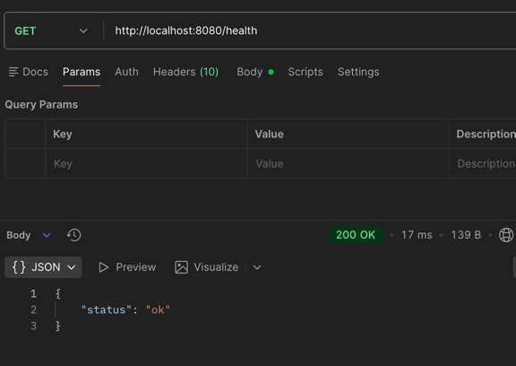
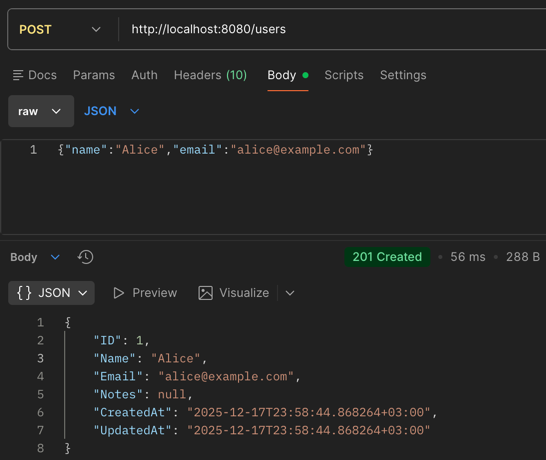
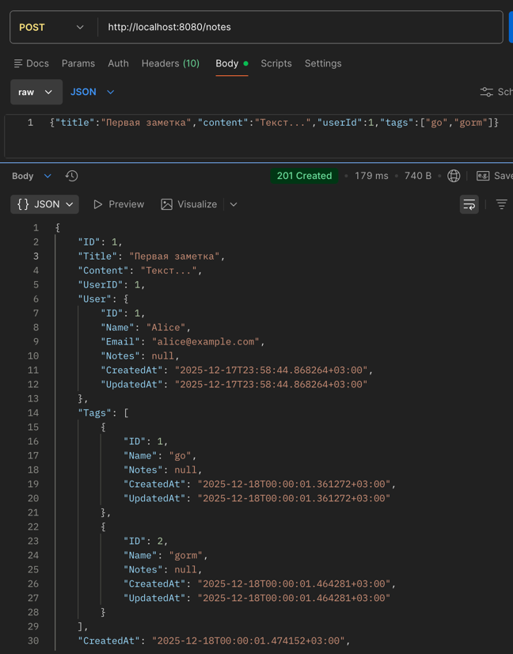
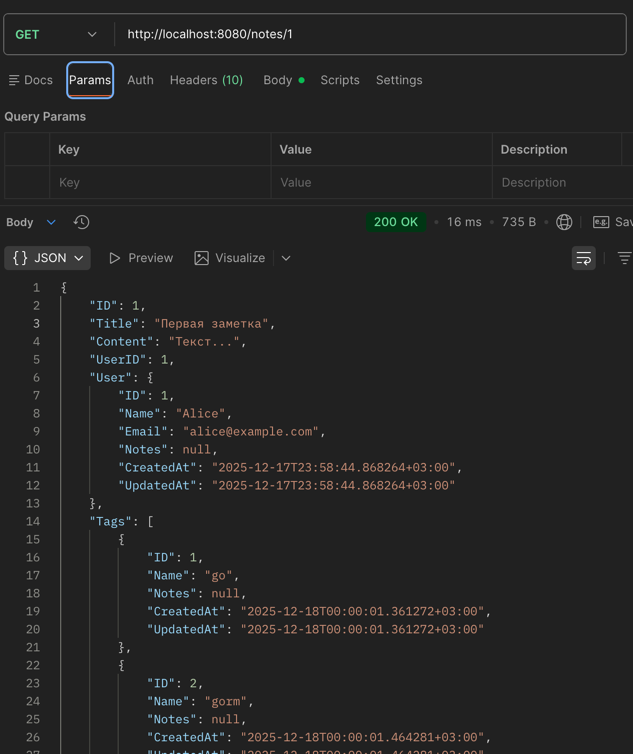

# Практическая работа №6 — ORM GORM, Чебыкин Д.К, ПИМО-0125 


---

## Описание проекта

Цели:

1. Освоить работу с ORM GORM для Go.
2. Создать PostgreSQL базу данных и подключиться к ней через GORM.
3. Научиться строить модели с отношениями 1:N и M:N.
4. Реализовать минимальный REST API для пользователей и заметок с тегами.
5. Использовать авто-миграции и загружать связанные данные через `Preload`.

**Требования:**

- Go 1.20+
- PostgreSQL
- Git
- curl или Postman для тестирования API

---

## Структура проекта

```
Prak_6/
├── cmd/
│ └── server/
│ └── main.go
├── internal/
│ ├── db/
│ │ └── postgres.go
│ ├── models/
│ │ └── models.go
│ └── httpapi/
│ ├── handlers.go
│ └── router.go
└── go.mod
```


---

## Установка и запуск

### Подключение к базе

Создаём базу данных PostgreSQL:

```sql
CREATE DATABASE prak_6;
Устанавливаем переменную окружения с DSN подключения:
```

Windows PowerShell:
```
setx DB_DSN "host=127.0.0.1 user=postgres password=postgres dbname=prak_6 port=5432 sslmode=disable"
```

macOS/Linux (bash/zsh):
```
export DB_DSN='host=127.0.0.1 user=postgres password=postgres dbname=prak_6 port=5432 sslmode=disable'
```

Запуск проекта
bash
```
go run ./cmd/server
```
Сервер будет доступен на порту 8080.

### Роуты и обработчики

| Маршрут         | Метод | Описание                                      |
|-----------------|-------|-----------------------------------------------|
| `/health`       | GET   | Проверка здоровья сервера                     |
| `/users`        | POST  | Создание нового пользователя                 |
| `/notes`        | POST  | Создание новой заметки с тегами              |
| `/notes/{id}`   | GET   | Получение заметки с автором и тег


## Примеры запросов
### 1. Проверка сервера
bash
```
curl http://localhost:8080/health
```
Результат:



### 2. Создание пользователя
```
curl -X POST http://localhost:8080/users \
  -H "Content-Type: application/json" \
  -d '{"name":"Alice","email":"alice@example.com"}'
```
Результат:



### 3. Создание заметки с тегами
```
curl -X POST http://localhost:8080/notes \
  -H "Content-Type: application/json" \
  -d '{"title":"Первая заметка","content":"Текст...","userId":1,"tags":["go","gorm"]}'
```
Результат:



### 4. Получение заметки по ID
```
curl http://localhost:8080/notes/1
```
Результат:




Авто-миграции
GORM метод AutoMigrate создаёт таблицы и колонки под модели:

```go
db.AutoMigrate(&models.User{}, &models.Note{}, &models.Tag{})
```
Недостаток: не выполняет сложные миграции (изменение типа поля, удаление колонки), для этого нужны внешние инструменты миграции.


## Контрольные вопросы

---

### 1. Что такое ORM и зачем она нужна?

**ORM (Object-Relational Mapping)** — инструмент для работы с базой данных через объекты.

**Плюсы:**
- Упрощает CRUD-операции
- Автоматическая работа со связями между таблицами
- Более читаемый и поддерживаемый код

**Минусы:**
- Накладные расходы на производительность
- Сложнее оптимизировать сложные или специфические запросы

---

### 2. Как в GORM описать связи 1:N и M:N?

- **1:N (один ко многим):**  
  В модели `User` поле `Notes []Note` создаёт связь один пользователь → много заметок.

- **M:N (многие ко многим):**  
  В модели `Note` поле `Tags []Tag 'gorm:"many2many:note_tags;"'` и в модели `Tag` поле `Notes []Note 'gorm:"many2many:note_tags;"'` создают связь много заметок ↔ много тегов через таблицу `note_tags`.

**Пример моделей:**

```go
type User struct {
    ID    uint
    Name  string
    Email string
    Notes []Note
}

type Note struct {
    ID      uint
    Title   string
    Content string
    UserID  uint
    User    User
    Tags    []Tag `gorm:"many2many:note_tags;"`
}

type Tag struct {
    ID    uint
    Name  string
    Notes []Note `gorm:"many2many:note_tags;"`
}
```

### 3. Что делает `AutoMigrate` и когда его недостаточно?

- `AutoMigrate` создаёт таблицы и колонки под модели.
- **Недостаток:** не выполняет сложные миграции, такие как изменение типа поля или удаление колонки. Для этого нужны внешние инструменты миграции.

```go
db.AutoMigrate(&models.User{}, &models.Note{}, &models.Tag{})
```

### 4. Чем `Preload` отличается от обычного `Find`/`First`?

- Обычные методы `Find` и `First` возвращают только данные основной таблицы.
- `Preload` позволяет загружать связанные данные сразу (через JOIN), что удобно для получения связанных объектов без дополнительных запросов.

Пример использования:

```go
var note Note
db.Preload("User").Preload("Tags").First(&note, id)
```

### 5. Как в GORM обработать ошибку нарушения уникального индекса?

При нарушении уникального ограничения база данных возвращает ошибку с кодом unique_violation.

В GORM можно проверить err.Error() и вернуть клиенту HTTP 409 Conflict:
```go
if err := db.Create(&user).Error; err != nil {
    if strings.Contains(err.Error(), "unique") {
        // вернуть HTTP 409
    }
}
```


## Выводы
Все цели практической работы выполнены:

 - Создана база PostgreSQL и подключена через GORM.
 - Реализованы модели User, Note, Tag с 1:N и M:N связями.
 - Написан минимальный REST API.
 - Освоен механизм авто-миграций и Preload для загрузки связанных данных.