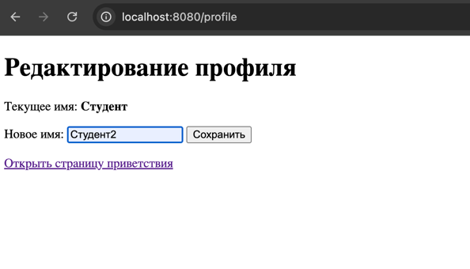
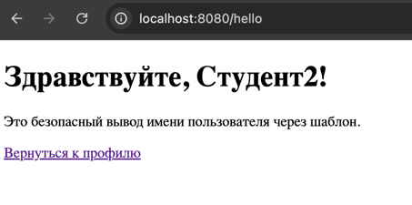
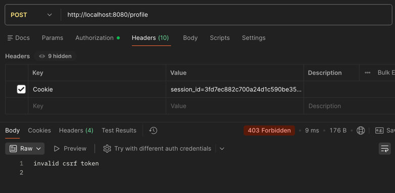
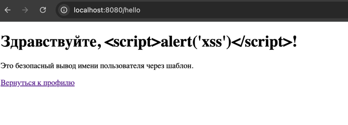
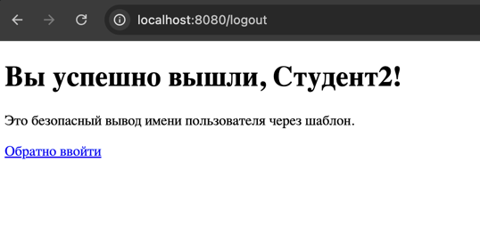

# Отчёт по практическому занятию №6
# Реализация защиты от CSRF/XSS. Работа с secure cookies

## Тема и цель работы

**Тема:** Реализация защиты от CSRF/XSS. Работа с secure cookies.

**Цель:** Освоить базовые практические подходы к защите web-приложения на Go от CSRF- и XSS-угроз, а также научиться безопасно использовать cookies для аутентификации и хранения пользовательского состояния.


---

## Теоретическая часть

### Что такое CSRF?

CSRF (Cross-Site Request Forgery) — это атака, при которой браузер пользователя отправляет запрос от его имени на целевой сайт без осознанного намерения самого пользователя. Это возможно потому, что браузер автоматически прикладывает cookies к запросу, если сайт и политика браузера это позволяют.

Сценарий атаки:
1. Пользователь авторизован на сайте, в браузере есть cookie сессии
2. Злоумышленник заставляет браузер пользователя открыть специальную страницу или отправить форму
3. Браузер автоматически прикладывает cookie
4. Сервер видит «авторизованный» запрос и выполняет действие

### Почему наличие cookie не гарантирует что запрос инициировал пользователь?

Браузер отправляет cookies автоматически при каждом запросе к домену — независимо от того, откуда исходит запрос. Злоумышленник может с другого сайта заставить браузер пользователя отправить запрос, и браузер приложит cookie сессии. Сервер не может по одной лишь cookie определить было ли это сознательное действие пользователя или атака.

### Что такое XSS?

XSS (Cross-Site Scripting) — это внедрение вредоносного JavaScript в страницу, которую увидит пользователь в браузере.

Сценарий атаки:
1. Пользователь отправляет имя или комментарий
2. Сервер сохраняет текст и выводит его в HTML без экранирования
3. Браузер интерпретирует содержимое как HTML или script
4. Вредоносный код выполняется в браузере пользователя

### Чем CSRF отличается от XSS?

| | CSRF | XSS |
|---|---|---|
| Что атакуется | Доверие сервера к браузеру | Доверие браузера к данным от сервера |
| Механизм | Запрос с чужого сайта с автоматической cookie | Вредоносный скрипт в HTML-странице |
| Цель | Выполнить действие от имени пользователя | Украсть данные, подменить интерфейс |

### Роль атрибутов cookie

**HttpOnly** — запрещает доступ к cookie из JavaScript в браузере (`document.cookie`). Снижает риск кражи cookie через XSS.

**Secure** — говорит браузеру отправлять cookie только по HTTPS. В локальной учебной среде установлен в `false`, в production — обязательно `true`.

**SameSite=Lax** — ограничивает передачу cookie в межсайтовых сценариях. Cookie не отправляется при cross-site POST-запросах, что снижает риск CSRF.

### Почему нельзя вставлять пользовательский ввод в HTML через конкатенацию строк?

Пользовательский ввод становится частью HTML и интерпретируется браузером как разметка. Если ввод содержит `<script>alert('xss')</script>` — скрипт выполнится. Шаблоны экранируют специальные символы (`<`, `>`, `&`) автоматически, поэтому данные выводятся как текст, а не как код.

---

## Структура проекта

```
Prak_6/
├── cmd/server/main.go
├── internal/
│   ├── auth/
│   │   ├── cookie.go        # Secure cookie: HttpOnly, SameSite
│   │   └── csrf.go          # Генерация случайных токенов
│   ├── httpapi/handler.go   # Login, Profile, Hello
│   └── store/store.go       # In-memory хранилище сессий
├── templates/
│   ├── profile.html         # Форма с CSRF-токеном
│   └── hello.html           # Безопасный вывод имени
└── go.mod
```

## Запуск

```bash
go run ./cmd/server
```

Откройте в браузере: http://localhost:8080/login

## Сценарий работы

1. `/login` — создаёт сессию, устанавливает cookie, редиректит на `/profile`
2. `/profile GET` — форма редактирования имени с CSRF-токеном в скрытом поле
3. `/profile POST` — проверяет CSRF-токен, обновляет имя, редиректит на `/hello`
4. `/hello` — отображает имя через HTML-шаблон (безопасно)


## Реализация

### Установка cookie

```go
func SetSessionCookie(w http.ResponseWriter, value string) {
    http.SetCookie(w, &http.Cookie{
        Name:     "session_id",
        Value:    value,
        Path:     "/",
        HttpOnly: true,              // запрет доступа из JS
        Secure:   false,             // true при HTTPS
        SameSite: http.SameSiteLaxMode, // базовая CSRF-защита
        MaxAge:   3600,
    })
}
```

### Генерация CSRF-токена

```go
func RandomToken(size int) (string, error) {
    buf := make([]byte, size)
    if _, err := rand.Read(buf); err != nil {
        return "", err
    }
    return hex.EncodeToString(buf), nil
}
```

Токен генерируется через `crypto/rand` — криптографически стойкий источник случайных байтов. Предсказать такой токен невозможно.

### Проверка CSRF-токена

```go
tokenFromForm := r.FormValue("csrf_token")
if tokenFromForm == "" || tokenFromForm != profile.CSRFToken {
    http.Error(w, "invalid csrf token", http.StatusForbidden)
    return
}
```

Сервер сравнивает токен из формы с токеном из серверного хранилища. Если они не совпадают — возвращает `403 Forbidden`.

### Безопасный HTML-шаблон

```html
<h1>Здравствуйте, {{.Name}}!</h1>
```

Пакет `html/template` автоматически экранирует специальные символы. Если `Name = "<script>alert('xss')</script>"`, браузер отобразит это как текст, скрипт не выполнится.

### Опасный XSS-пример (только для понимания, НЕ использовать)

```go
func unsafeHello(w http.ResponseWriter, name string) {
    html := "<html><body><h1>Здравствуйте, " + name + "!</h1></body></html>"
    w.Header().Set("Content-Type", "text/html; charset=utf-8")
    _, _ = w.Write([]byte(html))
}
// если name = "<script>alert('xss')</script>" — скрипт выполнится
```


## Результаты проверки

### 1. Переход на /login

При открытии `http://localhost:8080/login` сервер создаёт сессию, устанавливает cookie `session_id` и перенаправляет на `/profile`.

```
HTTP/1.1 302 Found
Set-Cookie: session_id=...; Path=/; Max-Age=3600; HttpOnly; SameSite=Lax
Location: /profile
```

### 2. Отображение формы профиля

На странице `/profile` отображается форма со скрытым полем CSRF-токена:

```html
<input type="hidden" name="csrf_token" value="a3f9e2...">
```




### 3. Успешное изменение имени

После ввода имени `Студент2` и нажатия «Сохранить» сервер проверяет CSRF-токен, обновляет имя и перенаправляет на `/hello`:

```
HTTP/1.1 302 Found
Location: /hello
```

На странице `/hello` отображается: **Здравствуйте, Студент2!**


### 4. Ошибка при неверном CSRF-токене

При отправке POST без токена или с неверным токеном:

```bash
curl -X POST http://localhost:8080/profile \
  -H "Cookie: session_id=<id>" \
  -d "name=Тест"
```

Ответ сервера:
```
403 Forbidden
invalid csrf token
```


### 5. Безопасное отображение строки со script-тегом

При вводе `<script>alert('xss')</script>` в поле имени страница `/hello` отображает:

```
Здравствуйте, <script>alert('xss')</script>!
```


Как обычный текст — скрипт не выполняется. Шаблон экранировал `<` → `&lt;` и `>` → `&gt;`.


### Дополнительное задание (Вариант №1)
Сделать /logout

При открытии `http://localhost:8080/logout` сервер удаляет сессию




## Атрибуты cookie

| Атрибут    | Значение         | Назначение                                      |
|------------|------------------|-------------------------------------------------|
| HttpOnly   | true             | Запрет доступа из JavaScript                    |
| Secure     | false (учебный)  | true — только при HTTPS                         |
| SameSite   | Lax              | Базовая защита от межсайтовых запросов          |
| MaxAge     | 3600             | Срок жизни cookie — 1 час                       |

## Опасный XSS-пример (НЕ использовать!)

```go
html := "<html><body><h1>Здравствуйте, " + name + "!</h1></body></html>"
w.Write([]byte(html))
// если name = "<script>alert('xss')</script>" — скрипт выполнится
```

## Ключевые концепции

- **CSRF** — сервер должен проверять не только cookie, но и дополнительный токен из формы
- **XSS** — `html/template` экранирует `<`, `>`, `&` автоматически
- **HttpOnly** — cookie недоступна через `document.cookie` в JavaScript
- **SameSite=Lax** — cookie не отправляется в cross-site POST-запросах


## Вывод

В ходе практической работы реализовано учебное web-приложение с защитой от CSRF и XSS:

- Cookie настроена с атрибутами `HttpOnly` и `SameSite=Lax` — JavaScript не может прочитать cookie, межсайтовые POST-запросы не передают её автоматически
- CSRF-токен генерируется криптографически стойким способом, передаётся в скрытом поле формы и проверяется на сервере — наличия одной только cookie недостаточно для выполнения действия
- Имя пользователя выводится через `html/template` — все специальные символы экранируются автоматически, XSS-атака через ввод script-тегов не работает

---

## Контрольные вопросы

### 1. Что такое CSRF?

CSRF (Cross-Site Request Forgery) — атака, при которой злоумышленник заставляет браузер авторизованного пользователя отправить нежелательный запрос на сервер. Браузер автоматически прикладывает cookie сессии, и сервер воспринимает запрос как легитимный.

### 2. Почему наличие cookie не гарантирует что запрос инициировал пользователь?

Браузер отправляет cookies автоматически при любом запросе к домену, в том числе инициированном с чужого сайта. Злоумышленник не читает cookie, но может заставить браузер пользователя отправить запрос с этой cookie без ведома пользователя.

### 3. Что такое XSS?

XSS (Cross-Site Scripting) — атака, при которой злоумышленник внедряет вредоносный JavaScript в HTML-страницу. Когда другой пользователь открывает эту страницу, браузер выполняет вредоносный код — скрипт может красть данные, читать cookies (если нет HttpOnly), подменять интерфейс.

### 4. Чем CSRF отличается от XSS?

CSRF эксплуатирует доверие сервера к браузеру — сервер ошибочно считает запрос легитимным из-за cookie. XSS эксплуатирует доверие браузера к данным от сервера — браузер выполняет вредоносный код, считая его частью страницы.

### 5. Для чего нужен CSRF-токен?

CSRF-токен — дополнительный секрет, который сервер вкладывает в форму и проверяет при POST-запросе. Злоумышленник с другого сайта не может прочитать содержимое формы (политика same-origin), значит не знает токен и не может его подделать. Наличие правильного токена доказывает что запрос инициирован именно со страницы сервера.

### 6. Что делает атрибут HttpOnly у cookie?

`HttpOnly` запрещает доступ к cookie из JavaScript через `document.cookie`. Даже если на странице выполнится XSS-скрипт, он не сможет прочитать cookie сессии и отправить её злоумышленнику.

### 7. Для чего нужен атрибут Secure?

`Secure` указывает браузеру отправлять cookie только по HTTPS-соединению. Это предотвращает перехват cookie при передаче по незашифрованному HTTP (man-in-the-middle атака).

### 8. Какую роль играет SameSite?

`SameSite` ограничивает в каких cross-site сценариях браузер прикладывает cookie. При `SameSite=Lax` cookie не отправляется в cross-site POST-запросах, что нейтрализует большинство CSRF-атак через формы на сторонних сайтах.

### 9. Почему нельзя вставлять пользовательский ввод в HTML через конкатенацию строк?

Конкатенация превращает данные в часть HTML-кода. Браузер не отличает «текст от пользователя» от «разметки страницы» — он интерпретирует всё содержимое как HTML. Если ввод содержит теги или скрипты, браузер выполнит их как часть страницы.

### 10. Почему шаблоны безопаснее ручной сборки HTML?

Пакет `html/template` автоматически экранирует специальные символы перед подстановкой данных в шаблон: `<` → `&lt;`, `>` → `&gt;`, `&` → `&amp;`. Браузер отобразит их как текст, а не как HTML-теги. Разработчику не нужно помнить об экранировании вручную в каждом месте вывода.
