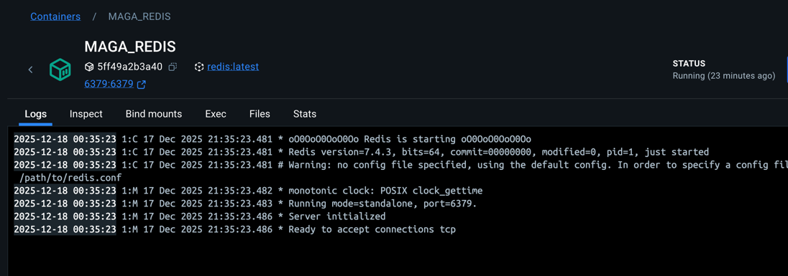
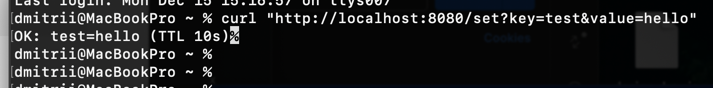
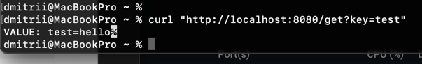
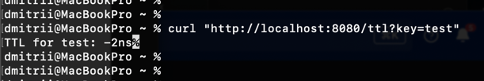

# Практическая работа №7 — Подключение и работа с Redis, Чебыкин Д.К, ПИМО-01-25


---

## Описание проекта

Цели:

1.  Освоить базовые операции работы с Redis из Go-приложения.
2.	Научиться использовать команды SET, GET, задавать время жизни ключей (TTL).
3.	Реализовать кэширование данных для ускорения работы API.
4.  Понять, в каких случаях кэш помогает снизить нагрузку на базу данных.


**Требования:**

- Go 1.20+
- Redis
- Git
- curl или Postman для тестирования API

---

## Структура проекта

```
Prak_6/
├── cmd/
│ └── server/
│ └── main.go
├── internal/
│ ├── db/
│ │ └── postgres.go
│ ├── models/
│ │ └── models.go
│ └── httpapi/
│ ├── handlers.go
│ └── router.go
└── go.mod
```


---


## Запуск проекта

### 1. Запуск Redis

Можно запустить Redis локально через Docker:

```bash
docker run --name MAGA_REDIS -p 6379:6379 redis
```



Запуск проекта
```bash
go run ./cmd/server
```
Сервер будет доступен на порту 8080.


## Проверка работы

### 1. Установка ключа

```bash
curl "http://localhost:8080/set?key=test&value=hello"
```
Результат:



2. Получение значения ключа
```bash
curl "http://localhost:8080/get?key=test"
```
Результат:



3. Проверка TTL ключа
```bash
curl "http://localhost:8080/ttl?key=test"
```

Результат:




## Краткое описание

Redis — это высокопроизводительная in-memory база данных, которая хранит данные в оперативной памяти для быстрого доступа.  
Поддерживает TTL (Time To Live) для ключей, что позволяет автоматически удалять устаревшие данные. TTL полезен для кэширования, временных сессий, счетчиков и других данных, которые имеют ограниченный срок жизни.

---

## Контрольные вопросы

1. **Чем Redis отличается от реляционной БД?**
    - Redis хранит данные в памяти, реляционные БД — на диске.
    - Redis не требует схемы таблиц, поддерживает структуры данных, а реляционные БД используют таблицы и SQL.
    - Redis очень быстрый для операций чтения/записи, но менее надёжен при хранении больших объёмов данных без настройки persistence.

2. **Какие типы данных поддерживает Redis кроме строк?**
    - Списки (Lists)
    - Множества (Sets)
    - Отсортированные множества (Sorted Sets)
    - Хэши (Hashes)
    - Битовые поля (Bitmaps)
    - Гиперлоглоги (HyperLogLog)
    - Потоки (Streams)

3. **Зачем нужен TTL? Приведите примеры.**
    - TTL позволяет автоматически удалять устаревшие ключи.
    - Примеры:
        - Кэширование результатов запросов к базе данных.
        - Сессионные данные пользователя на веб-сайте.
        - Временные токены для подтверждения email или одноразовые пароли.

4. **Как Redis помогает снизить нагрузку на PostgreSQL?**
    - Хранит часто запрашиваемые данные в памяти, уменьшая количество обращений к PostgreSQL.
    - Позволяет реализовать кэширование страниц, результатов запросов и сессий.

5. **Что произойдёт, если ключ в Redis «протух» по TTL, а приложение попытается его прочитать?**
    - Redis вернёт `nil` или пустое значение, так как ключ автоматически удалён.
    - Приложение должно обработать этот случай, например, заново получить данные из основной БД и обновить кэш.
