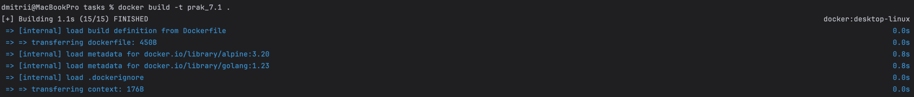
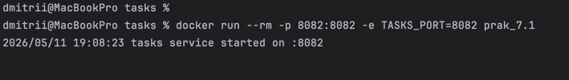
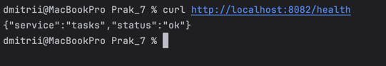
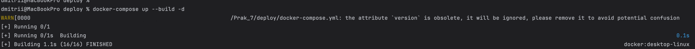
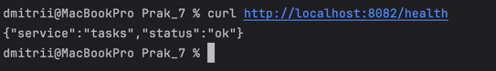

# Практическое занятие №7 — Написание Dockerfile и сборка контейнера

## Структура проекта

```
Prak_7/
├── services/tasks/
│   ├── cmd/tasks/main.go
│   ├── go.mod
│   ├── Dockerfile
│   └── .dockerignore
└── deploy/
    └── docker-compose.yml
```

## Шаги

### 1. Инициализация модуля (если нужно)

```bash
cd services/tasks
go mod init example.com/tasks
go mod tidy
```

### 2. Сборка образа

```bash
cd services/tasks
docker build -t prak_7.1 .
```




### 3. Запуск контейнера напрямую

```bash
docker run --rm -p 8082:8082 -e TASKS_PORT=8082 techip-tasks:0.1
```




### 4. Проверка

```bash
curl http://localhost:8082/health
# {"service":"tasks","status":"ok"}
```




### 5. Запуск через Docker Compose

```bash
cd deploy
docker-compose up --build -d
```




### 6. Проверка

```bash
curl http://localhost:8082/health
# {"service":"tasks","status":"ok"}
```




## Dockerfile — ключевые моменты

```dockerfile
# Стадия 1: сборка
FROM golang:1.23 AS builder
RUN CGO_ENABLED=0 GOOS=linux go build -o /app/bin/tasks ./cmd/tasks

# Стадия 2: минимальный runtime
FROM alpine:3.20
COPY --from=builder /app/bin/tasks /app/tasks
CMD ["/app/tasks"]
```

**Multi-stage build** — итоговый образ содержит только бинарник (~10 МБ вместо ~1 ГБ с Go-тулчейном).

## Флаги запуска

| Флаг               | Назначение                         |
|--------------------|------------------------------------|
| `--rm`             | Удалить контейнер после остановки  |
| `-p 8082:8082`     | Пробросить порт host:container     |
| `-e TASKS_PORT=8082` | Передать переменную окружения    |

## Ключевые концепции

- **Образ (image)** — шаблон, результат `docker build`
- **Контейнер (container)** — запущенный процесс на основе образа
- **Multi-stage build** — сборка в одном образе, запуск в другом (меньшем)
- **.dockerignore** — исключает лишние файлы из build context
- **ENV через `-e`** — конфигурация не должна быть зашита в образ


## Ответы на контрольные вопросы — Практическое занятие №7

### 1. Чем Docker-образ отличается от контейнера?

**Образ (image)** — это неизменяемый шаблон, результат выполнения `docker build`. Он содержит файловую систему, бинарник приложения, зависимости и метаданные (точка входа, переменные окружения). Образ хранится на диске и не запускается сам по себе.

**Контейнер (container)** — это запущенный процесс на основе образа. При запуске Docker создаёт изолированную среду, добавляет к образу записываемый слой и запускает указанную команду. Из одного образа можно запустить сколько угодно контейнеров одновременно.

Аналогия: образ — это класс, контейнер — это экземпляр класса.

### 2. Зачем нужен Dockerfile?

Dockerfile — это текстовый файл с инструкциями для сборки Docker-образа. Он описывает:

- какой базовый образ использовать (`FROM`)
- какие файлы скопировать (`COPY`)
- какие команды выполнить при сборке (`RUN`)
- какую команду запускать при старте контейнера (`CMD`)

Dockerfile делает сборку образа воспроизводимой: любой разработчик или CI-сервер выполнив `docker build` получит идентичный образ. Это исключает проблему «у меня работает, у тебя нет».

### 3. Что такое multi-stage build?

Multi-stage build — это техника Dockerfile, при которой сборка разделяется на несколько стадий с помощью нескольких инструкций `FROM`. Каждая стадия может использовать свой базовый образ, а итоговый образ содержит только то, что скопировано из предыдущих стадий:

```dockerfile
# Стадия 1: сборка — тяжёлый образ с Go-тулчейном
FROM golang:1.23 AS builder
RUN go build -o /app/bin/tasks ./cmd/tasks

# Стадия 2: запуск — лёгкий образ только с бинарником
FROM alpine:3.20
COPY --from=builder /app/bin/tasks /app/tasks
CMD ["/app/tasks"]
```

В финальный образ попадает только то, что явно скопировано из стадии `builder`.

### 4. Почему для Go-сервисов удобно использовать multi-stage build?

Go компилирует код в единственный статический бинарник без внешних зависимостей (при `CGO_ENABLED=0`). Это означает:

- **Стадия сборки** требует образ `golang:1.23` (~1 ГБ) с компилятором, стандартной библиотекой и инструментами
- **Стадия запуска** требует только сам бинарник — его можно положить в минимальный `alpine:3.20` (~10 МБ) или даже `scratch` (0 МБ)

Итоговый образ получается в 50–100 раз меньше, чем если бы всё собиралось в одном образе. Это ускоряет передачу образа по сети и уменьшает поверхность атаки.

### 5. Зачем нужен .dockerignore?

`.dockerignore` указывает Docker какие файлы и папки **не** нужно включать в build context — набор файлов, который отправляется Docker daemon при выполнении `docker build`.

Без `.dockerignore` в build context попадут `.git`, `tmp`, `node_modules`, логи и другие ненужные файлы. Это:

- замедляет сборку (больше данных передаётся daemon)
- увеличивает размер образа если эти файлы попадут внутрь
- может случайно включить секреты (`.env`, ключи, пароли)

Типичный `.dockerignore` для Go:
```
.git
bin
tmp
*.log
.env
```

### 6. Для чего используются переменные окружения в контейнере?

Переменные окружения — это стандартный способ конфигурировать приложение в контейнере без изменения образа. Один и тот же образ можно запустить с разными настройками:

```bash
# Локальная разработка
docker run -e APP_PORT=8082 -e DB_HOST=localhost myapp

# Production
docker run -e APP_PORT=80 -e DB_HOST=prod-db.example.com myapp
```

В Go переменные читаются через `os.Getenv("APP_PORT")`. Это позволяет не хранить конфигурацию в коде и не пересобирать образ при смене настроек.

### 7. Что делает флаг -p при запуске контейнера?

Флаг `-p host_port:container_port` пробрасывает порт с хост-машины в контейнер:

```bash
docker run -p 8082:8082 myapp
```

Контейнер изолирован и не доступен снаружи по умолчанию. Без `-p` приложение слушает порт внутри контейнера, но с хост-машины достучаться до него нельзя. Флаг `-p` создаёт маппинг: запрос на `localhost:8082` хост-машины перенаправляется на порт `8082` внутри контейнера.

Можно использовать разные порты:
```bash
docker run -p 9000:8082 myapp
# localhost:9000 → контейнер:8082
```

### 8. Для чего нужен Docker Compose?

Docker Compose — инструмент для запуска нескольких контейнеров как единого стека. Вместо того чтобы запускать каждый контейнер отдельной командой `docker run` с длинными флагами, вся конфигурация описывается в `docker-compose.yml`:

```yaml
services:
  app:
    build: .
    ports:
      - "8082:8082"
  redis:
    image: redis:7
```

Одна команда `docker compose up` поднимает все сервисы, создаёт общую сеть между ними и управляет зависимостями. Это особенно удобно при разработке с несколькими сервисами (приложение + БД + кэш).

### 9. Почему контейнеризация упрощает деплой?

Контейнер включает в себя всё необходимое для работы приложения: бинарник, конфигурацию среды, системные зависимости. Это решает несколько проблем:

- **Воспроизводимость** — образ одинаково работает на ноутбуке разработчика, в CI и на production-сервере
- **Изоляция** — разные сервисы не конфликтуют по версиям библиотек или портам
- **Скорость деплоя** — достаточно скачать новый образ и перезапустить контейнер
- **Откат** — при проблемах можно мгновенно вернуться к предыдущему тегу образа
- **Масштабирование** — запустить ещё одну копию сервиса так же просто как ещё один контейнер

### 10. Почему не стоит вшивать конфигурацию и секреты прямо в образ?

Образ — это артефакт, который хранится в registry и может быть скачан множеством людей и систем. Если конфигурация или секреты зашиты в образ:

- **Безопасность** — любой кто получит образ, получит и секреты (токены, пароли, ключи API). Образы в registry видны всем кто имеет доступ
- **Гибкость** — при смене конфигурации нужно пересобирать и перезаливать образ вместо того чтобы просто передать другое значение переменной
- **Конфликт сред** — один образ должен работать в dev, staging и production с разными настройками

Правильный подход: конфигурация передаётся через переменные окружения (`-e`), секреты — через Docker Secrets или внешние хранилища (Vault, AWS Secrets Manager). В образе хранится только код.