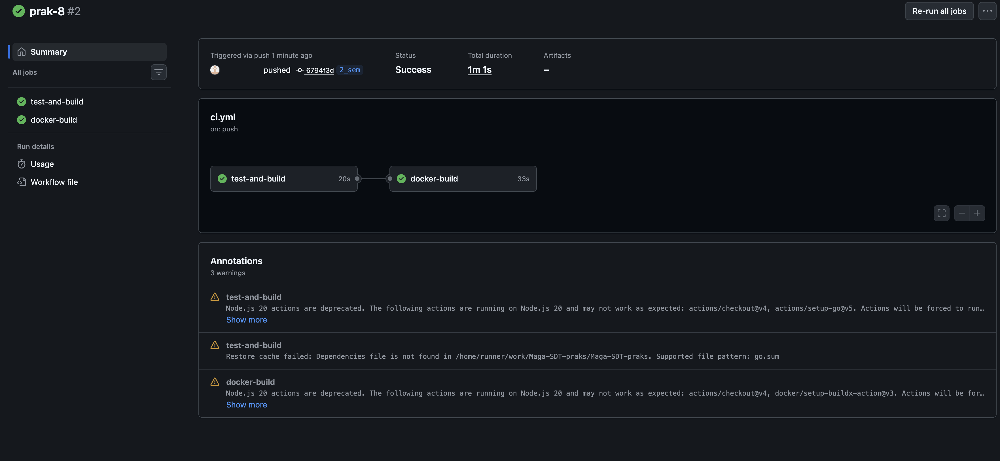

# Практическое занятие №8 — GitHub Actions / GitLab CI для деплоя

## Структура проекта

```
Prak_8/
├── .github/workflows/
│   └── ci.yml              # GitHub Actions pipeline (вынес в корень)
├── .gitlab-ci.yml          # GitLab CI pipeline (вынес в корень)
└── services/tasks/
    ├── cmd/tasks/main.go
    ├── go.mod
    ├── .dockerignore
    └── Dockerfile
```

## GitHub Actions

Файл `.github/workflows/ci.yml` запускается при push/PR в `main`/`master`/`2_sem` и конкретно в папку `./Prak_8`.

### Структура pipeline

```
test-and-build
├── Checkout
├── Setup Go 1.23
├── go mod tidy
├── go test ./...
└── go build ./...

docker-build  (запускается после test-and-build)
├── Checkout
├── Setup Docker Buildx
└── docker build -t techip-tasks:<sha> .
```

## GitLab CI

Файл `.gitlab-ci.yml` содержит 3 стадии: `test → build → docker`.

## Теги Docker-образа

| Платформа      | Переменная               | Пример                     |
|----------------|--------------------------|----------------------------|
| GitHub Actions | `${{ github.sha }}`      | `techip-tasks:abc1234...`  |
| GitLab CI      | `$CI_COMMIT_SHORT_SHA`   | `techip-tasks:abc1234`     |


## Результат работы pipeline



## Публикация в registry (опционально)

Добавить в `docker-build` job (GitHub Actions):

```yaml
- name: Login to registry
  run: echo "${{ secrets.REGISTRY_PASSWORD }}" | docker login -u "${{ secrets.REGISTRY_USERNAME }}" --password-stdin ghcr.io

- name: Build and push
  run: |
    docker build -t ghcr.io/my-org/techip-tasks:${{ github.sha }} .
    docker push ghcr.io/my-org/techip-tasks:${{ github.sha }}
  working-directory: ./Prak_8/services/tasks
```

## Secrets

Чувствительные данные хранятся в:
- **GitHub**: Settings → Secrets and variables → Actions
- **GitLab**: Settings → CI/CD → Variables

**Нельзя** записывать токены и пароли прямо в YAML-файл!

## Ключевые концепции

- **CI** — автоматическая проверка кода после каждого push
- **CD** — автоматическая упаковка и доставка результата
- **needs** — задаёт зависимость между job (docker-build после test-and-build)
- **working-directory** — важен в монорепозитории с несколькими сервисами
- **secrets** — переменные не видны в логах pipeline


## Ответы на контрольные вопросы — Практическое занятие №8

### 1. Чем CI отличается от CD?

**CI (Continuous Integration)** — непрерывная интеграция. Каждый push в репозиторий автоматически запускает сборку и тесты. Цель — как можно раньше обнаружить что новый код ломает существующую функциональность.

**CD (Continuous Delivery / Continuous Deployment)** — непрерывная доставка или развёртывание. После успешного CI автоматически собирается артефакт (Docker-образ) и доставляется до среды развёртывания.

Разница:
| | CI | CD |
|---|---|---|
| Что делает | Проверяет код | Доставляет артефакт |
| Когда | При каждом push | После успешного CI |
| Результат | Отчёт о тестах | Новая версия в среде |

В этой практике реализован CI + начало CD (сборка Docker-образа).

### 2. Почему pipeline должен запускать тесты?

Тесты в pipeline гарантируют что код, попавший в основную ветку, не сломал существующую функциональность. Без автоматических тестов:

- ошибки обнаруживаются только в production, когда их исправление стоит дороже
- разработчики могут забыть прогнать тесты локально перед push
- при работе нескольких человек сложно отследить чей код что сломал

Если тесты падают — pipeline останавливается и код не проходит дальше (не собирается образ, не деплоится).

### 3. Зачем нужен автоматический build?

Автоматический build (`go build ./...`) в CI:

- **Проверяет компилируемость** — код может проходить тесты но не компилироваться из-за синтаксических ошибок в незатронутых тестами пакетах
- **Создаёт артефакт** — собранный бинарник или образ готов к деплою
- **Воспроизводимость** — сборка происходит в чистой изолированной среде CI, а не на локальной машине разработчика с «накопившимися» зависимостями
- **Экономия времени** — разработчик не тратит время на локальную сборку и ручную проверку

### 4. Почему важно собирать Docker-образ в CI, а не только локально?

Если образ собирается только локально:

- **Зависимость от среды** — на разных машинах могут быть разные версии Docker, Go, базовых образов
- **Нет истории** — непонятно какой образ соответствует какому коммиту
- **Риск «забыть»** — разработчик может задеплоить образ с несохранёнными изменениями или без прогона тестов
- **Нет проверки** — образ собирается без предварительного прогона тестов

В CI образ собирается только после успешного прохождения тестов, тегируется SHA коммита и хранится в registry — всегда понятно откуда он взялся.

### 5. Что такое CI secrets?

CI secrets — это переменные с чувствительными данными (токены, пароли, ключи), которые хранятся в зашифрованном виде в настройках CI-системы и передаются в pipeline как переменные окружения.

В GitHub Actions: **Settings → Secrets and variables → Actions → New repository secret**

Использование в pipeline:
```yaml
- name: Login to registry
  run: echo "${{ secrets.REGISTRY_PASSWORD }}" | docker login -u "${{ secrets.REGISTRY_USERNAME }}" --password-stdin
```

Secrets не видны в логах pipeline — они маскируются автоматически.

### 6. Почему нельзя хранить токены и SSH-ключи в репозитории?

Репозиторий доступен множеству людей — текущим и бывшим сотрудникам, а при утечке и злоумышленникам. Даже если токен удалить из файла, он остаётся в истории git и его можно восстановить через `git log`.

Последствия утечки:
- злоумышленник получает доступ к сервисам (registry, облако, БД)
- компрометируются все среды где используется этот токен
- сервис-провайдеры (GitHub, AWS) автоматически сканируют публичные репозитории и отзывают обнаруженные токены

Правило: в репозитории хранится только код. Секреты — в CI secrets, Vault, или переменных окружения на сервере.

### 7. Для чего нужен тег Docker-образа?

Тег — это метка версии образа. Без тега невозможно понять какой именно код внутри образа:

```bash
# Без тега — непонятно что внутри
docker pull myapp:latest

# С тегом SHA — точно известно какой коммит
docker pull myapp:abc1234

# Откат к предыдущей версии
docker pull myapp:abc0000
```

В CI образ тегируется SHA коммита:
```yaml
docker build -t myapp:${{ github.sha }} .
```

Это позволяет:
- точно знать какой коммит соответствует запущенному образу
- откатиться на любую предыдущую версию
- сравнить образы при расследовании инцидентов

### 8. Что делает job docker-build?

Job `docker-build` в нашем pipeline:

1. Ждёт успешного завершения job `test-and-build` (через `needs: test-and-build`)
2. Клонирует репозиторий (`actions/checkout`)
3. Настраивает Docker Buildx для расширенных возможностей сборки
4. Выполняет `docker build` и создаёт образ с тегом из SHA коммита

```yaml
docker-build:
  needs: test-and-build   # запускается только после успешных тестов
  steps:
    - uses: actions/checkout@v4
    - uses: docker/setup-buildx-action@v3
    - run: docker build -t techip-tasks:${{ github.sha }} .
```

Таким образом Docker-образ собирается только если тесты прошли — это гарантирует что в registry не попадёт сломанный код.

### 9. Почему в multi-service проекте важен working-directory?

В монорепозитории с несколькими сервисами каждый сервис находится в своей поддиректории со своим `go.mod`. Без `working-directory` команды выполняются в корне репозитория, где нет `go.mod` нужного сервиса:

```yaml
# Без working-directory — ошибка: go.mod not found
- run: go test ./...

# С working-directory — правильно
- run: go test ./...
  working-directory: ./services/tasks
```

При добавлении нового сервиса `services/users` его тесты и сборка настраиваются отдельно с собственным `working-directory: ./services/users` — сервисы не влияют друг на друга.

### 10. Какие риски возникают при полностью автоматическом деплое?

Полностью автоматический деплой (каждый push сразу уходит в production) несёт ряд рисков:

- **Ошибки в тестах** — если тесты не покрывают все сценарии, сломанный код может попасть в production
- **Нет ручной проверки** — некоторые изменения (миграции БД, изменения API) требуют ручного контроля перед деплоем
- **Накладки при миграциях** — автоматический деплой новой версии при незавершённой миграции БД может сломать сервис
- **Нет паузы для review** — в команде может не быть времени проверить изменения до того как они попадут к пользователям
- **Быстрое распространение проблемы** — если в коде баг, он мгновенно уходит в production без возможности остановить деплой

Поэтому на практике часто используют **Continuous Delivery** — автоматическая доставка до staging, а деплой в production подтверждается вручную.