# Практическое занятие №9 — Распределённый кэш (Redis). Cache-aside

## Структура проекта

```
Prak_9/
├── cmd/server/main.go
├── internal/
│   ├── cache/
│   │   ├── redis.go       # Клиент Redis
│   │   ├── keys.go        # Формирование ключей: tasks:task:<id>
│   │   └── ttl.go         # TTL с jitter
│   ├── config/config.go
│   ├── httpapi/handler.go
│   ├── service/task_service.go  # Cache-aside логика
│   └── task/
│       ├── model.go
│       └── repo.go
├── deploy/redis/
│   └── docker-compose.yml
└── go.mod
```

## Зависимости

```bash
go get github.com/redis/go-redis/v9
```

## Запуск

### 1. Поднять Redis

```bash
cd deploy/redis
docker compose up -d
```

### 2. Запустить сервис

```bash
go run ./cmd/server
```

## Проверка программы


### Проверка №1 - сохранение задачи в кэш
```bash
# Cache miss → запрос в репозиторий → сохранение в Redis
curl http://localhost:8082/v1/tasks/1
```
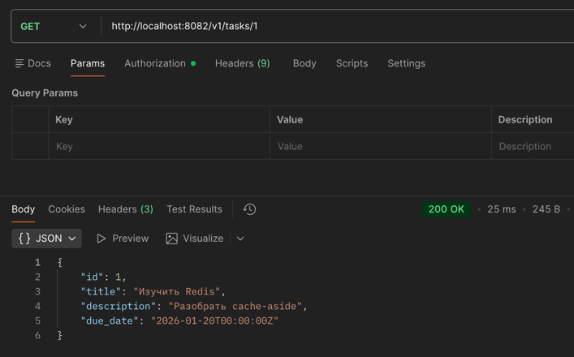
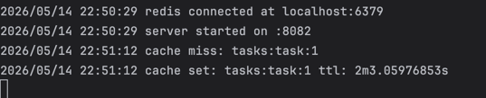


### Проверка №2 - получение задачи из кэша
```bash
# Cache hit → ответ из Redis
curl http://localhost:8082/v1/tasks/1
```
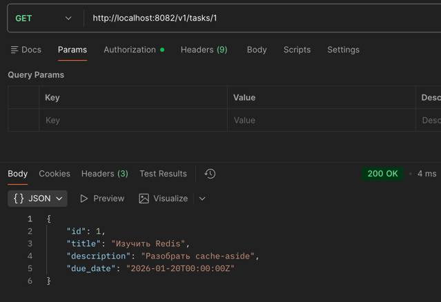
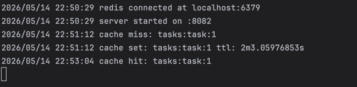


### Проверка №3 - обновление задачи и удаление из кэша
```bash
# Инвалидация кэша при обновлении
curl -X PATCH http://localhost:8082/v1/tasks/1 \
  -H "Content-Type: application/json" \
  -d '{"id":1,"title":"Обновлённая задача","description":"Новый текст","due_date":"2026-01-22T00:00:00Z"}'
```
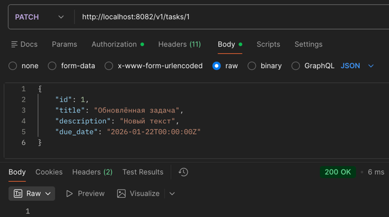


### Проверка №4 - получение после обновления
```bash
# Следующий GET снова пойдёт в репозиторий (cache miss)
curl http://localhost:8082/v1/tasks/1
```
Кладется в кэш
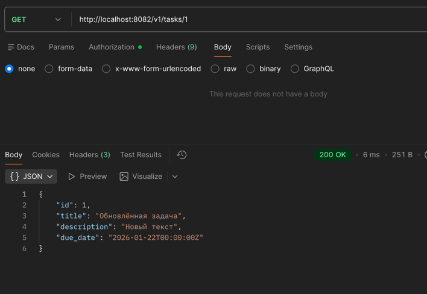
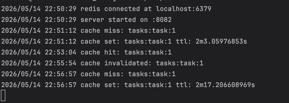
Берется из кэша
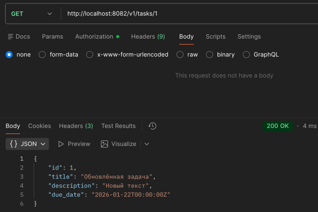
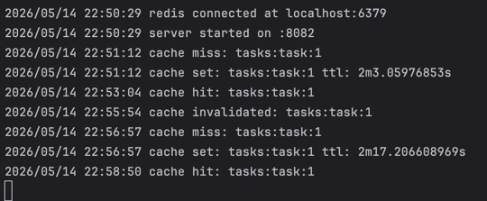


### Проверка №5 - удаление задачи
```bash
# Удаление задачи + инвалидация кэша
curl -X DELETE http://localhost:8082/v1/tasks/1
```
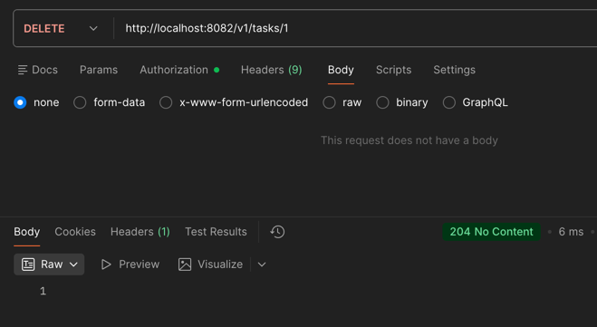
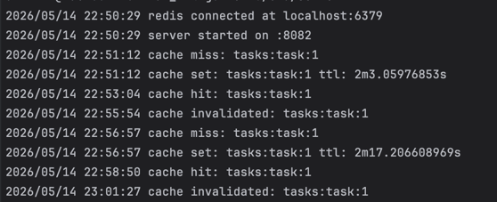


#### Теперь пытаемся получить после удаления
```bash
# Cache hit → ответ из Redis
curl http://localhost:8082/v1/tasks/1
```
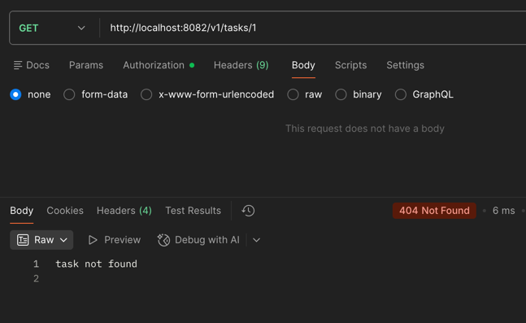
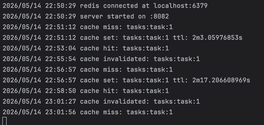


### Проверка №6 - остановка redis
```bash
# Проверка деградации: остановите Redis и повторите запрос
# cd deploy/redis && docker compose stop
curl http://localhost:8082/v1/tasks/2  # сервис всё равно ответит через repo
```
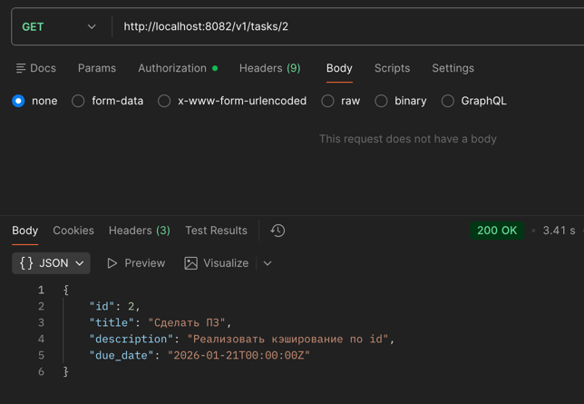
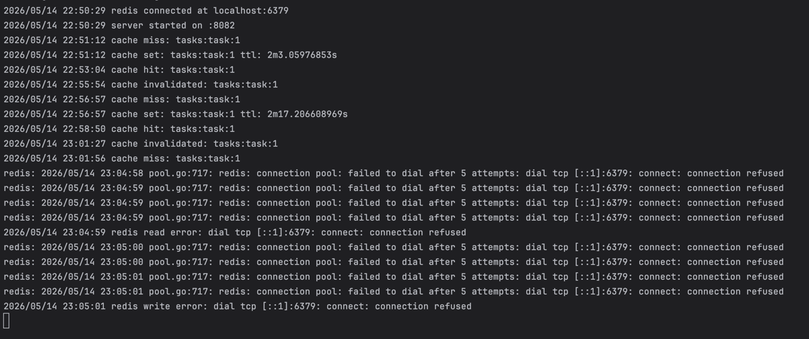


## Дополнительное задание (Вариант 1. Кэширование списка задач)

```bash
# Cache miss → запрос в репозиторий → сохранение в Redis
curl http://localhost:8082/v1/tasks
```
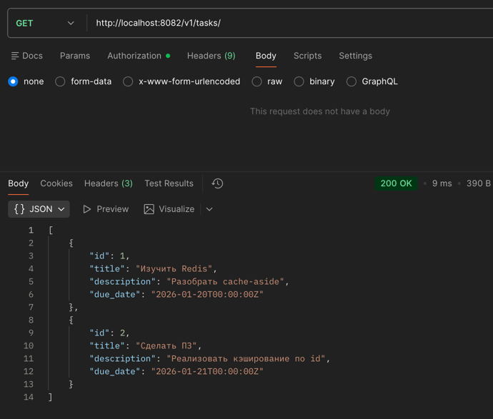
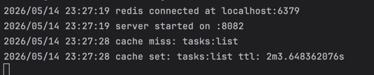

### Проверка работы redis
```bash
# Cache hit → ответ из Redis
curl http://localhost:8082/v1/tasks
```
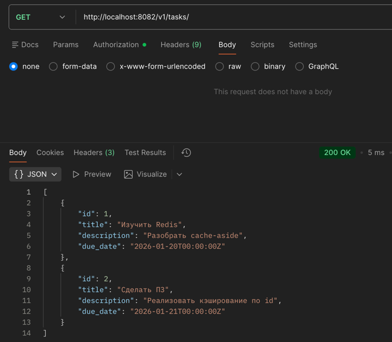
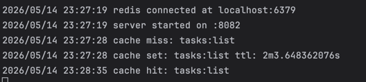

## Cache-aside алгоритм

```
GET /v1/tasks/{id}
  │
  ├─ Redis.Get(key) → hit  → вернуть из кэша
  │
  └─ miss / ошибка Redis
       │
       ├─ repo.GetByID(id)
       │
       └─ Redis.Set(key, data, TTL+jitter)  → вернуть клиенту
```

## Ключи кэша

| Сущность         | Ключ                  |
|------------------|-----------------------|
| Задача по ID     | `tasks:task:<id>`     |
| Список задач     | `tasks:list`          |

## TTL и jitter

```go
// base = 120s, jitter = 0–30s → итоговый TTL = 120–150s
TTLWithJitter(120*time.Second, 30*time.Second)
```

Jitter предотвращает одновременное истечение всех ключей и всплеск нагрузки на БД.

## Деградация при недоступности Redis

Если Redis недоступен:
- ошибка логируется
- сервис продолжает работать через репозиторий
- клиент получает корректный ответ

Redis — ускоритель, **не источник истины**.


## Ответы на контрольные вопросы — Практическое занятие №9

### 1. Что такое cache-aside?

Cache-aside (или lazy loading) — паттерн кэширования, при котором приложение само управляет кэшем. Алгоритм:

1. При запросе данных — сначала проверить кэш
2. Если данные есть в кэше (hit) — вернуть из кэша
3. Если данных нет (miss) — получить из репозитория, сохранить в кэш, вернуть клиенту

```
GET /v1/tasks/1
  │
  ├─ Redis.Get("tasks:task:1") → hit  → вернуть из кэша
  │
  └─ miss
       ├─ repo.GetByID(1)
       └─ Redis.Set("tasks:task:1", data, TTL) → вернуть клиенту
```

В отличие от write-through (данные записываются в кэш и БД одновременно), cache-aside загружает данные в кэш только по запросу — ленивo.

### 2. Почему Redis не должен быть источником истины?

Redis — in-memory хранилище. Это означает:

- **Данные могут исчезнуть** — при перезапуске Redis без persistence данные теряются
- **TTL истекает** — ключи удаляются по расписанию, это нормальное поведение
- **Redis может быть недоступен** — сбой, перезапуск, нехватка памяти

Источник истины — это хранилище, которое гарантирует сохранность данных (PostgreSQL, MongoDB и т.д.). Redis — только ускоритель доступа к данным, которые уже есть в основном хранилище. Если Redis упадёт, сервис должен продолжить работать через репозиторий.

### 3. Зачем нужен TTL?

TTL (Time To Live) — время жизни ключа в кэше. После истечения TTL Redis автоматически удаляет ключ.

TTL нужен по нескольким причинам:

- **Актуальность данных** — данные в кэше могут устареть если их изменили в обход кэша. TTL гарантирует что рано или поздно кэш обновится
- **Управление памятью** — без TTL кэш бесконечно растёт. Редко запрашиваемые данные удалятся сами
- **Защита от утечек** — если инвалидация при обновлении не сработала, TTL является страховкой

### 4. Что такое jitter?

Jitter — случайная добавка к базовому TTL. Вместо фиксированного TTL используется случайное значение в диапазоне:

```go
// base = 120s, jitter = 0–30s → итоговый TTL = 120–150s
func TTLWithJitter(base, jitter time.Duration) time.Duration {
    extra := time.Duration(rand.Int63n(int64(jitter) + 1))
    return base + extra
}
```

Это предотвращает одновременное истечение большого числа ключей и резкий всплеск нагрузки на репозиторий.

### 5. Почему одинаковый TTL для всех ключей может быть проблемой?

Если все ключи имеют одинаковый TTL и были созданы примерно одновременно — например при старте сервиса после прогрева — они истекут одновременно. В этот момент все запросы пойдут в репозиторий разом. Это называется **cache stampede** (лавина кэша).

Последствия:
- резкий всплеск нагрузки на БД
- увеличение времени ответа для всех пользователей
- потенциальный каскадный сбой при высокой нагрузке

Jitter разбивает истечение ключей во времени и сглаживает нагрузку.

### 6. Как должен вести себя сервис при недоступности Redis?

Сервис должен **деградировать gracefully** — продолжать работать, обращаясь напрямую к репозиторию, и логировать проблему:

```go
cached, err := s.redis.Get(ctx, key).Result()
if err != nil && !errors.Is(err, redis.Nil) {
    // Redis недоступен — логируем и идём в репозиторий
    log.Println("redis read error:", err)
}
// Продолжаем: repo.GetByID(id)
```

Redis — инфраструктурная зависимость, а не бизнес-зависимость. Её недоступность не должна делать сервис неработоспособным — только медленнее. Клиент получит корректный ответ, просто без ускорения от кэша.

### 7. Почему кэш нужно инвалидировать после изменения данных?

Если данные в репозитории изменились, а кэш не обновился — клиент получит устаревшие данные. Это называется **cache inconsistency**.

В cache-aside при обновлении или удалении данных кэш инвалидируется (удаляется), а не обновляется:

```go
// После update/delete — удаляем ключ из кэша
s.redis.Del(ctx, cache.TaskByIDKey(id))
```

При следующем GET запросе произойдёт cache miss, данные будут получены из репозитория уже актуальные и снова сохранены в кэш. Это проще и надёжнее чем обновлять кэш напрямую.

### 8. Чем кэширование одной сущности проще, чем кэширование списка?

**Одна сущность** (`tasks:task:1`) — простой случай:
- ключ детерминирован: всегда `tasks:task:<id>`
- инвалидация точечная: изменился объект с id=1 → удалить один ключ
- TTL можно назначить независимо для каждой сущности

**Список** (`tasks:list`) — значительно сложнее:
- список зависит от всех сущностей — любое изменение, добавление или удаление любого элемента делает весь кэшированный список устаревшим
- инвалидация широкая: при изменении любой задачи нужно удалять весь список
- списки с фильтрами, сортировкой и пагинацией порождают множество вариантов ключей

Поэтому на практике сначала кэшируют отдельные сущности, а кэширование списков добавляют только при явной необходимости.

### 9. В чём смысл ключа вида tasks:task:\<id\>?

Иерархическая структура ключа — это соглашение об именовании в Redis. Двоеточие используется как разделитель уровней:

```
tasks:task:1
tasks:task:2
tasks:list
```

Это даёт несколько преимуществ:

- **Читаемость** — по ключу сразу понятно что за данные хранятся
- **Группировка** — в Redis CLI можно найти все ключи группы: `KEYS tasks:task:*`
- **Избежание коллизий** — разные сервисы или сущности не перекрываются: `users:user:1` и `tasks:task:1` — разные ключи
- **Массовая инвалидация** — при необходимости можно удалить все ключи группы по паттерну

### 10. Почему Redis рассматривается как внешняя инфраструктурная зависимость?

Redis — это отдельный процесс, запущенный вне приложения, со своим жизненным циклом, ресурсами и возможностью отказа. Как и база данных или брокер сообщений, он является **инфраструктурой**, а не частью бизнес-логики.

Из этого следует:
- **Сервис не должен падать** при недоступности Redis — нужна деградация
- **Подключение проверяется при старте** но не является блокирующим условием
- **Конфигурация** (адрес, пароль, таймауты) передаётся через переменные окружения, а не зашита в код
- **Тестирование** бизнес-логики не требует запущенного Redis — его можно замокать
- **Мониторинг** Redis ведётся отдельно от мониторинга приложения